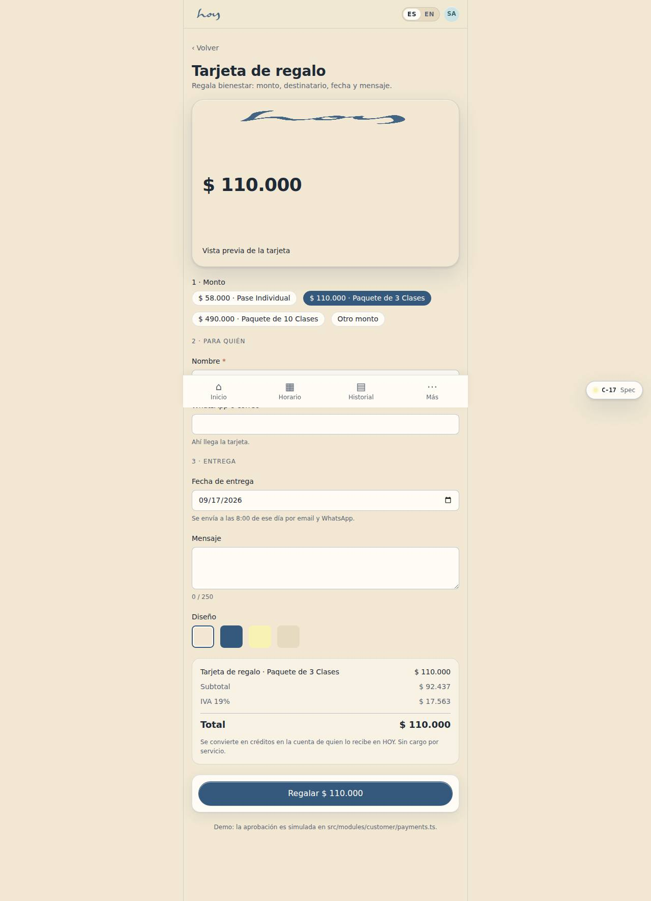
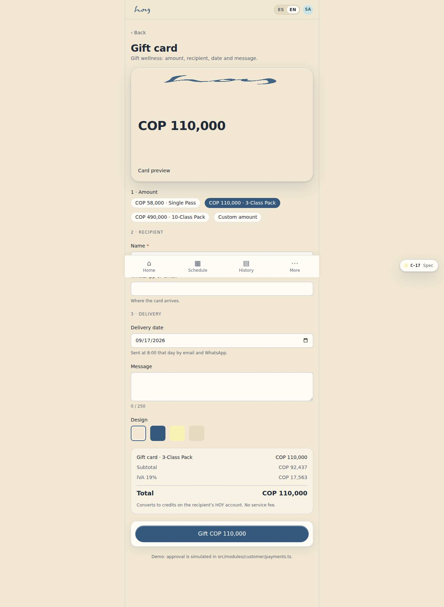

# C-17 — Gift card

**Route** `/#/app/gift` · **Roles** public, customer, front_desk, finance · **Surface** customer · **Spec** `spec.code === 'C-17'` (see `/#/dev/specs`)

## Purpose
Sell wellness as a present: amount, recipient, delivery date, message, design, then pay.

## Screenshots
| ES · mobile | EN · mobile |
| --- | --- |
|  |  |

| ES · desktop | EN · desktop |
| --- | --- |
|  |  |

## Sections (layout order — `useLayout(spec)`)
1. `HeroCard (design preview)`
2. `AmountPicker (+ custom)`
3. `RecipientFields`
4. `DeliveryDate`
5. `MessageField (250 max)`
6. `DesignPicker ×4`
7. `OrderSummary`
8. `BuyCTA`

## Data
| Table | Read / write | Notes |
| --- | --- | --- |
| `gift_cards` | read | |
| `payments` | read / write | |
| `invoices` | read / write | |

## Logic and integrations
- Delivered by email and WhatsApp on the chosen date at 8:00 local time.
- Redemption converts to credits on the recipient's account; never expires below the legal minimum.
- Service fee, if any, is shown in the summary before payment.
- Purchasable without an account.
- Integrations: WhatsApp, Wompi, Email, Supabase Auth, Supabase Realtime

## States
- Custom amount: min/max validation
- Delivery in the past: blocked inline
- Success: preview of what the recipient receives

## Real vs mock
- Real: the page renders from the data layer (`useData()` / `useTable`) over the tables above; every write goes through the `DataProvider` so the Supabase provider replaces the mock unchanged.
- Mock / pending: WhatsApp, Wompi, Email, Supabase Auth, Supabase Realtime are simulated or deferred; data is the browser-local `MockProvider` seed.
- Note: Amounts come from pricing.ts (single / pack3 / pack10) plus a custom amount ≥ the single pass.
- Note: Wompi is simulated in src/modules/customer/payments.ts (wompiCheckout). Manual transfer/cash create pending payments the front desk settles.

## Changelog
- `docs/changelog/0005-final-integration.md` — screenshots and this page doc (v0.3.0)

---
**Resumen (ES).** Tarjeta de regalo. Comprar y programar la entrega de una tarjeta de regalo.
