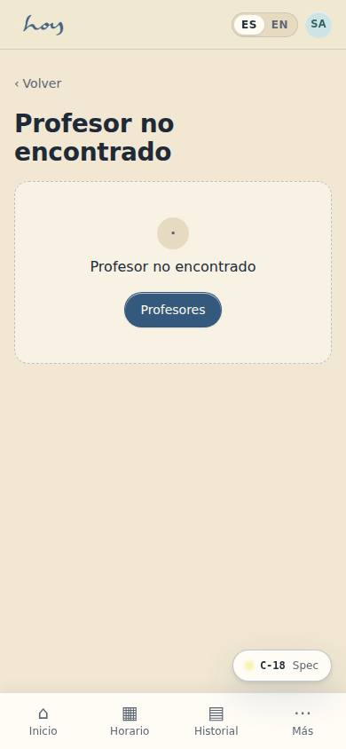
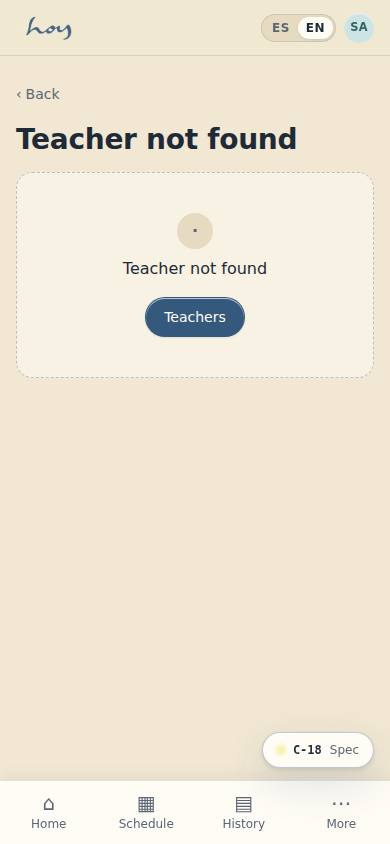
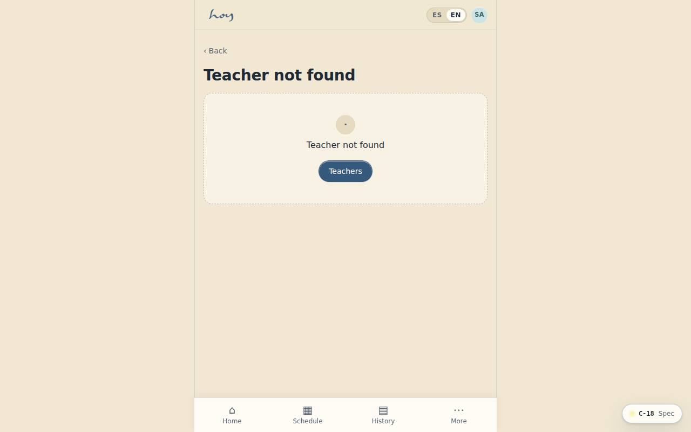

# C-18 — Teacher gallery & profile

**Route** `/#/app/teachers` · `/#/app/teachers/:id` · **Roles** public, customer, coordinator, front_desk · **Surface** customer · **Spec** `spec.code === 'C-18'` (see `/#/dev/specs`)

## Purpose
Let students choose a teacher, not just a time slot. Off the main flow, reachable from class detail and community.

## Screenshots
| ES · mobile | EN · mobile |
| --- | --- |
|  |  |

| ES · desktop | EN · desktop |
| --- | --- |
|  |  |

## Sections (layout order — `useLayout(spec)`)
1. `Grid → TeacherCard`
2. `TeacherProfile (portrait, bio, classes they teach, upcoming schedule)`

## Data
| Table | Read / write | Notes |
| --- | --- | --- |
| `teachers` | read | |
| `modalities` | read | |
| `class_sessions` | read | |

## Logic and integrations
- Teachers maintain their own photo, bio and certifications; the coordinator approves publishing.
- Profiles are public for the website; ratings are hidden unless enabled.
- Deep-linkable per teacher.
- Integrations: Supabase Auth

## States
- No portrait: textured placeholder marked 'teacher portrait'
- Pending approval: staff-only draft badge

## Real vs mock
- Real: the page renders from the data layer (`useData()` / `useTable`) over the tables above; every write goes through the `DataProvider` so the Supabase provider replaces the mock unchanged.
- Mock / pending: Supabase Auth are simulated or deferred; data is the browser-local `MockProvider` seed.
- Note: /app/teachers/:id is the deep-linkable profile.

## Changelog
- `docs/changelog/0005-final-integration.md` — screenshots and this page doc (v0.3.0)

---
**Resumen (ES).** Galería y perfil de profesores. Galería de profesores con perfil, certificaciones, clases y valoraciones.
