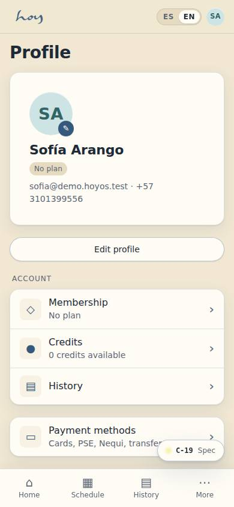
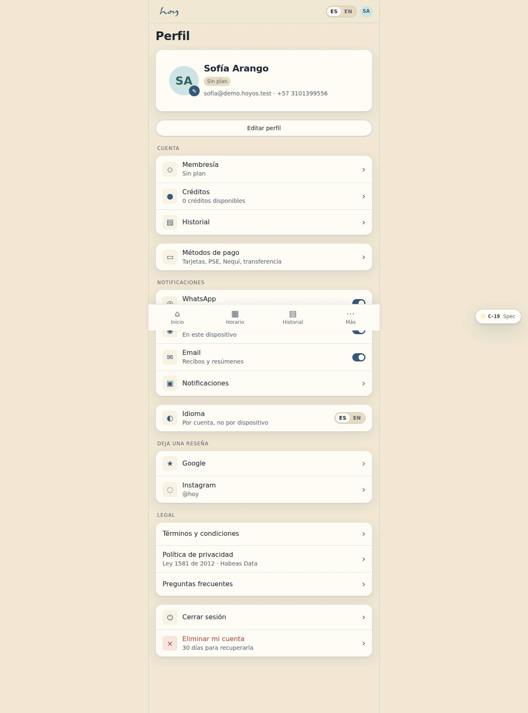
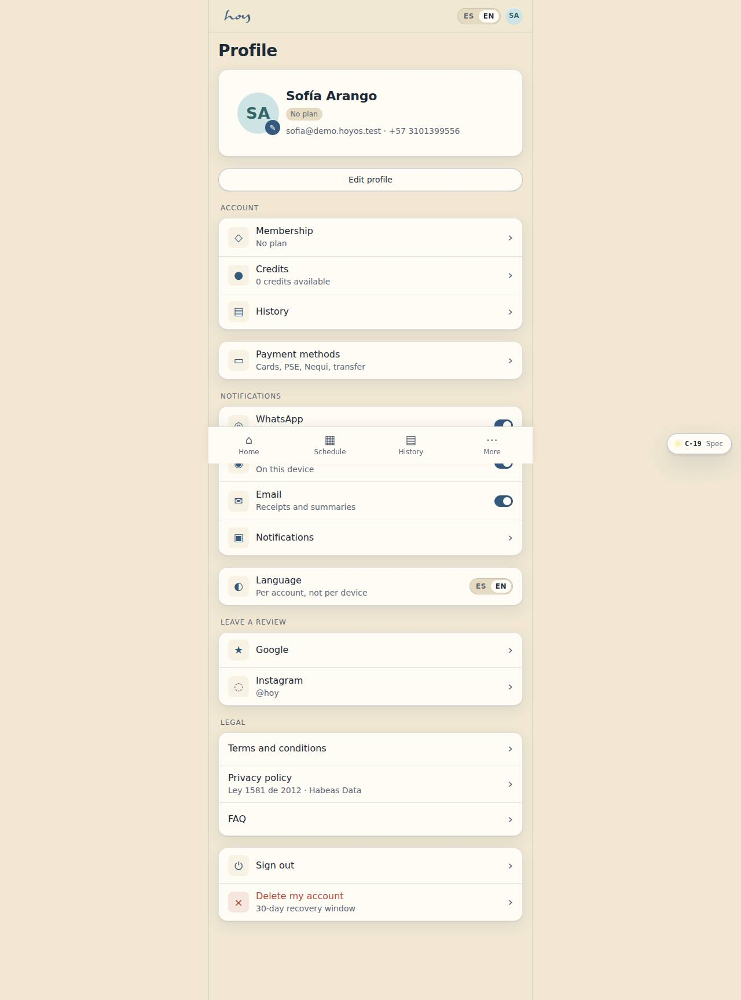

# C-19 — Profile, settings & membership

**Route** `/#/app/profile` · **Roles** customer, super_admin, admin, coordinator, front_desk, finance, teacher, maintenance · **Surface** customer · **Spec** `spec.code === 'C-19'` (see `/#/dev/specs`)

## Purpose
Everything about me and every switch I own, including where to leave a public review.

## Screenshots
| ES · mobile | EN · mobile |
| --- | --- |
|  |  |

| ES · desktop | EN · desktop |
| --- | --- |
|  |  |

## Sections (layout order — `useLayout(spec)`)
1. `Header (photo, name, membership badge)`
2. `EditProfile`
3. `MembershipRow → plan management`
4. `PaymentMethods`
5. `NotificationPrefs (push / email / WhatsApp)`
6. `LanguageToggle (EN / ES)`
7. `LeaveAReview → Google / Instagram`
8. `Legal links`
9. `SignOut / DeleteAccount`

## Data
| Table | Read / write | Notes |
| --- | --- | --- |
| `profiles` | read / write | |
| `users` | read / write | |
| `memberships` | read / write | |
| `plans` | read | |
| `consents` | read / write | |

## Logic and integrations
- Language switch is instant and per account, not per device.
- Notification preferences are per channel and per event type.
- Account deletion honours Ley 1581 with a 30-day recovery window.
- Review links open the studio's Google Business and Instagram.
- Integrations: WhatsApp, Wompi, Email, Supabase Auth, Push notifications

## States
- Loading: header skeleton
- Unverified WhatsApp: verify chip
- Saving: inline confirmation

## Real vs mock
- Real: the page renders from the data layer (`useData()` / `useTable`) over the tables above; every write goes through the `DataProvider` so the Supabase provider replaces the mock unchanged.
- Mock / pending: WhatsApp, Wompi, Email, Supabase Auth, Push notifications are simulated or deferred; data is the browser-local `MockProvider` seed.
- Note: Language uses the real LangToggle and persists users.locale.
- Note: Notification prefs are per user in localStorage until a notification_prefs table exists.

## Changelog
- `docs/changelog/0005-final-integration.md` — screenshots and this page doc (v0.3.0)

---
**Resumen (ES).** Perfil, ajustes y membresía. Perfil, ajustes, idioma, notificaciones, dispositivos y membresía en un solo lugar.
