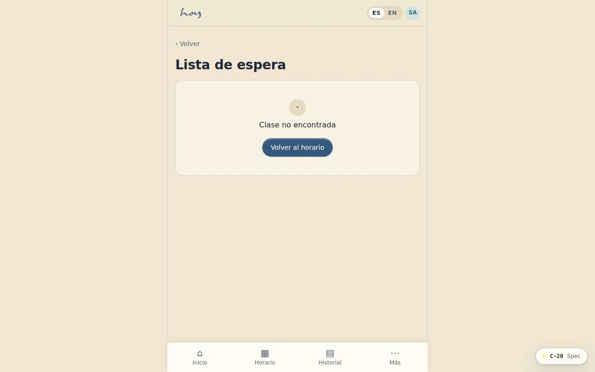
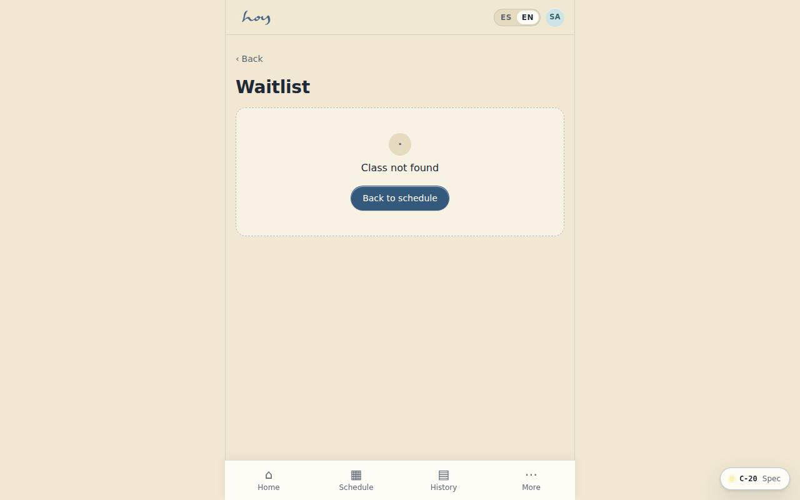

# C-20 — Waitlist & claim window

**Route** `/#/app/waitlist/:id` · **Roles** customer, front_desk, coordinator · **Surface** customer · **Spec** `spec.code === 'C-20'` (see `/#/dev/specs`)

## Purpose
Turn a full class into a queue that actually converts: show the position, explain the rule, and make claiming a released spot a single tap inside a 30-minute window.

## Screenshots
| ES · mobile | EN · mobile |
| --- | --- |
|  |  |

| ES · desktop | EN · desktop |
| --- | --- |
|  |  |

## Sections (layout order — `useLayout(spec)`)
1. `StatusCard (PositionRing + RuleExplainer)`
2. `ReleasedBanner (conditional, ClaimCountdown + ClaimButton)`
3. `AutoClaimToggle`
4. `LeaveWaitlistRow`
5. `PolicyNote`

## Data
| Table | Read / write | Notes |
| --- | --- | --- |
| `waitlist` | read / write | |
| `class_sessions` | read | |
| `modalities` | read | |
| `teachers` | read | |
| `bookings` | read / write | |
| `credits` | read / write | |

## Logic and integrations
- Promotion is strictly by position; the front desk can override with a logged reason.
- A released spot is offered for 30 minutes, then passes to the next person.
- Auto-claim consumes a credit the moment the spot is offered; without a credit the student is asked to pay.
- Joining and leaving are free and never charge.
- Studio-side promotion fires the waitlist WhatsApp template immediately, ignoring quiet hours.
- Integrations: WhatsApp, Supabase Realtime, Push notifications

## States
- Waiting: position + rule
- Offered: banner + live countdown
- Expired: 'the spot passed on' + rejoin
- Class started: row goes read-only

## Real vs mock
- Real: the page renders from the data layer (`useData()` / `useTable`) over the tables above; every write goes through the `DataProvider` so the Supabase provider replaces the mock unchanged.
- Mock / pending: WhatsApp, Supabase Realtime, Push notifications are simulated or deferred; data is the browser-local `MockProvider` seed.
- Note: A cancellation on C-08b promotes the first waiting person to offered with a 30-minute claim_until.

## Changelog
- `docs/changelog/0005-final-integration.md` — screenshots and this page doc (v0.3.0)

---
**Resumen (ES).** Lista de espera y ventana de reclamo. Lista de espera con ventana de reclamo cuando se libera un cupo.
