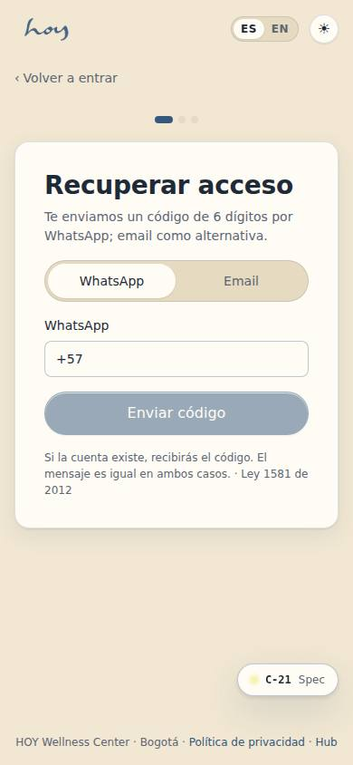
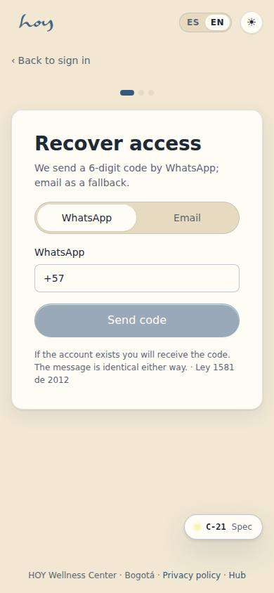
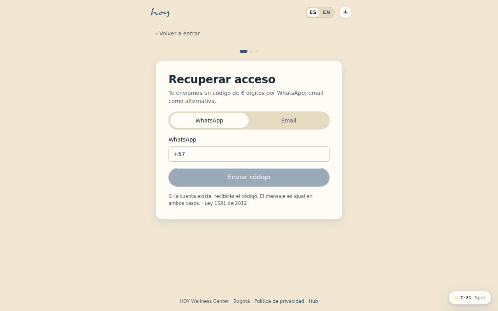
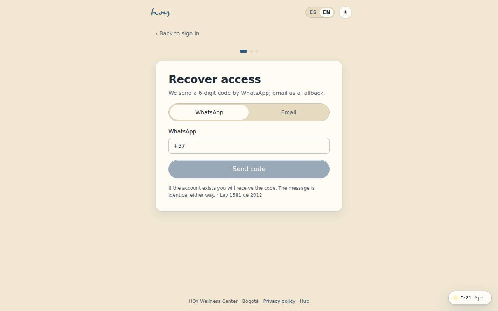

# C-21 — Password recovery (WhatsApp OTP)

**Route** `/#/auth/recover` · **Roles** public · **Surface** public · **Spec** `spec.code === 'C-21'` (see `/#/dev/specs`)

## Purpose
Get a locked-out student back in through the channel they actually verified: a six-digit WhatsApp code, with email as the fallback.

## Screenshots
| ES · mobile | EN · mobile |
| --- | --- |
|  |  |

| ES · desktop | EN · desktop |
| --- | --- |
|  |  |

## Sections (layout order — `useLayout(spec)`)
1. `Step1 · Identify (WhatsApp / email)`
2. `Step2 · Verify (OtpInput ×6, ResendTimer)`
3. `Step3 · New password`
4. `BackToSignIn`

## Data
| Table | Read / write | Notes |
| --- | --- | --- |
| `users` | read / write | |
| `wa_templates` | read | |

## Logic and integrations
- Code is 6 digits, valid 10 minutes, single use.
- Three wrong codes invalidate it and force a resend; five resends in an hour lock recovery for 30 minutes.
- Resend is blocked for 45 seconds and the timer survives a screen re-entry.
- A successful reset signs out every other device and writes to the audit log.
- Never reveal whether an account exists — the confirmation copy is identical either way.
- Integrations: WhatsApp, Email, Supabase Auth

## States
- Sending: button spinner
- Wrong code: cells shake, attempts left shown
- Expired: 'code expired' + resend
- Rate limited: wait time stated

## Real vs mock
- Real: the page renders from the data layer (`useData()` / `useTable`) over the tables above; every write goes through the `DataProvider` so the Supabase provider replaces the mock unchanged.
- Mock / pending: WhatsApp, Email, Supabase Auth are simulated or deferred; data is the browser-local `MockProvider` seed.
- Note: OTP is simulated: the demo code is shown on screen; 3 wrong codes force a resend.

## Changelog
- `docs/changelog/0005-final-integration.md` — screenshots and this page doc (v0.3.0)

---
**Resumen (ES).** Recuperar contraseña (OTP por WhatsApp). Recuperar acceso con un código por WhatsApp, con límites de intentos.
