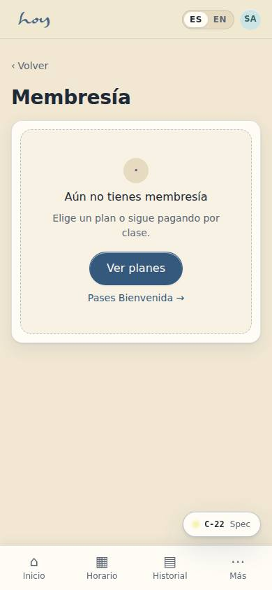
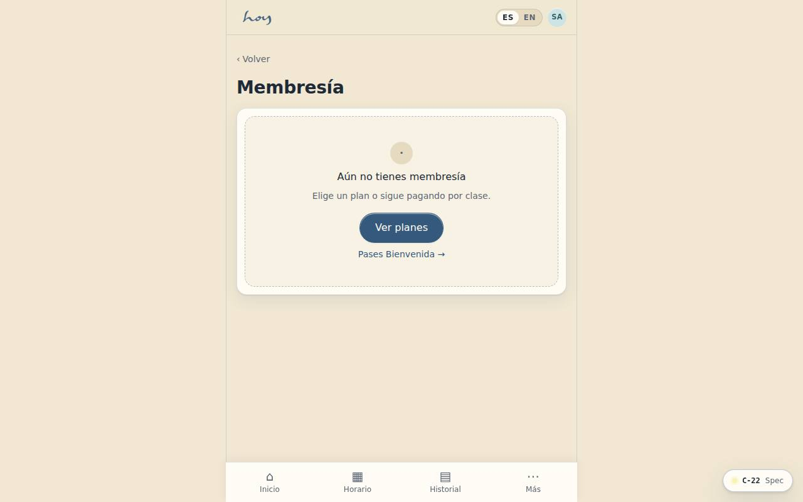
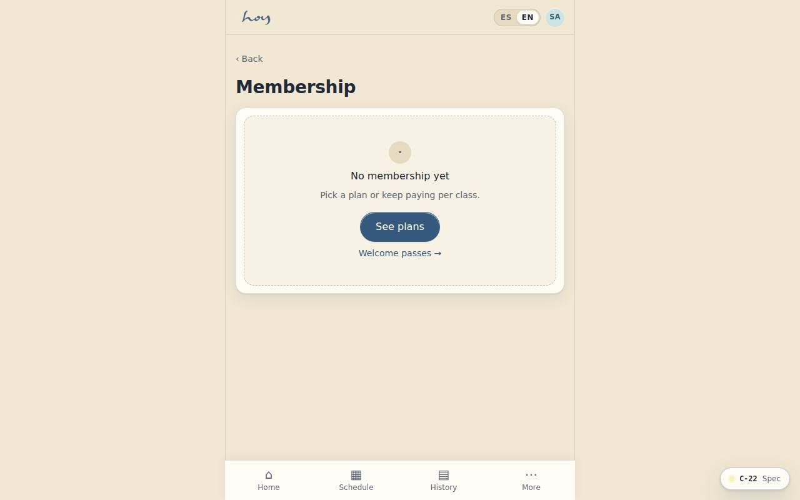

# C-22 — Manage membership

**Route** `/#/app/membership` · **Roles** customer, front_desk, finance, super_admin · **Surface** customer · **Spec** `spec.code === 'C-22'` (see `/#/dev/specs`)

## Purpose
Give members the three controls they actually need — freeze, change, cancel — without a phone call, while keeping the studio's notice periods intact.

## Screenshots
| ES · mobile | EN · mobile |
| --- | --- |
|  |  |

| ES · desktop | EN · desktop |
| --- | --- |
|  |  |

## Sections (layout order — `useLayout(spec)`)
1. `CurrentPlanCard`
2. `PauseRow → date picker (≤ 30 days)`
3. `ChangePlanRow → C-06`
4. `BillingHistoryRow → C-11`
5. `CancelRow (destructive) → reason sheet`

## Data
| Table | Read / write | Notes |
| --- | --- | --- |
| `memberships` | read / write | |
| `plans` | read | |
| `payments` | read / write | |
| `bookings` | read / write | |

## Logic and integrations
- Pause up to 30 days (policy.pauseMaxDays); renewal shifts by the paused days.
- Members are notified 3 days before a charge (policy.chargeNoticeDays).
- Cancellation keeps access until the paid period ends; undo until then.
- Integrations: WhatsApp, Wompi, Email, DIAN e-invoicing

## States
- Frozen: banner with resume date
- Pending cancellation: end date + undo
- No membership: plan picker instead
- Payment failed: fix-payment banner

## Real vs mock
- Real: the page renders from the data layer (`useData()` / `useTable`) over the tables above; every write goes through the `DataProvider` so the Supabase provider replaces the mock unchanged.
- Mock / pending: WhatsApp, Wompi, Email, DIAN e-invoicing are simulated or deferred; data is the browser-local `MockProvider` seed.

## Changelog
- `docs/changelog/0005-final-integration.md` — screenshots and this page doc (v0.3.0)

---
**Resumen (ES).** Gestionar membresía. Pausar, cambiar o cancelar la membresía y ver los ciclos de facturación.
