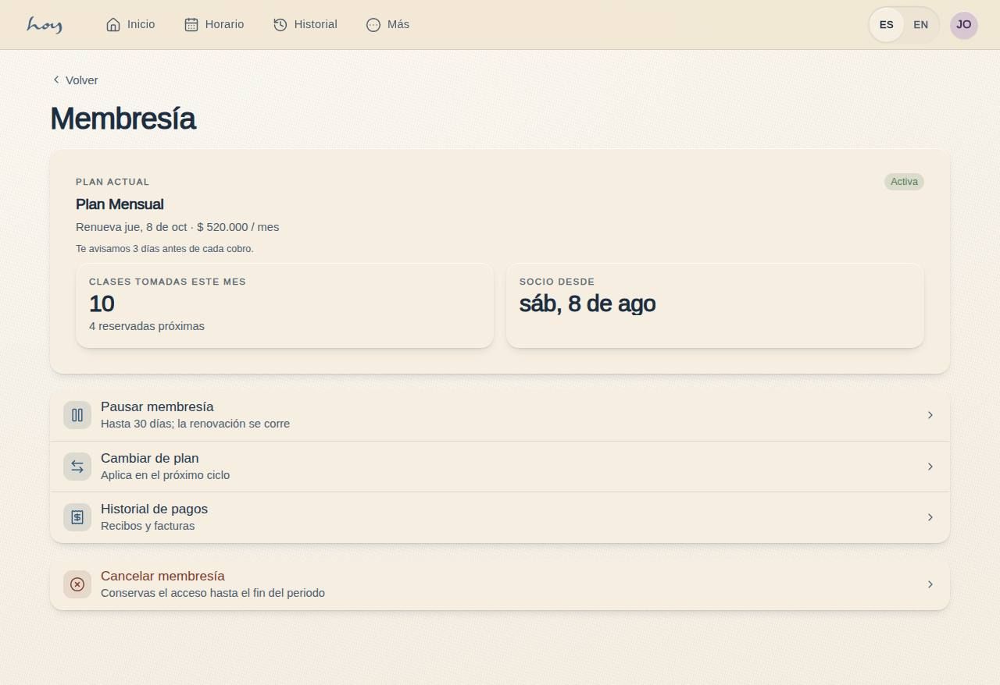
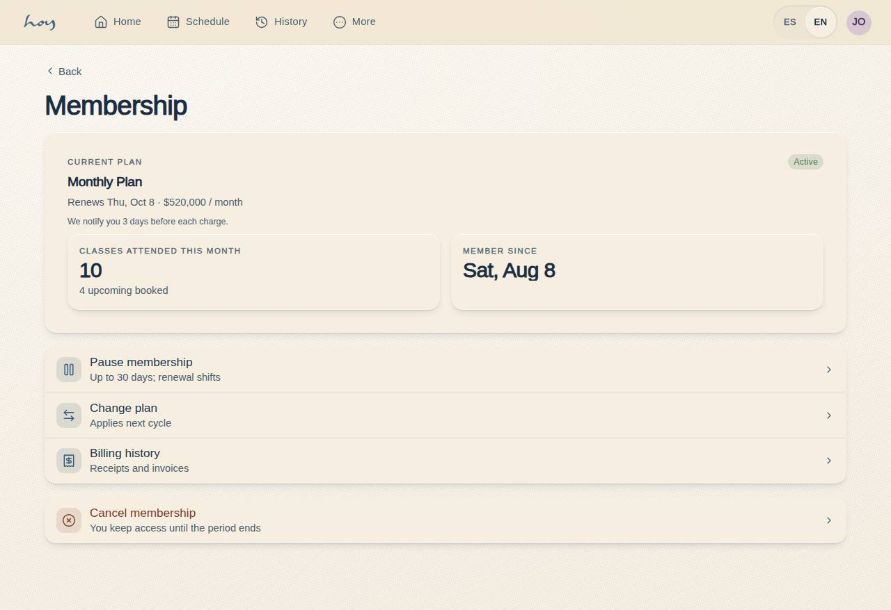

# C-22 — Manage membership

**Route** `/#/app/membership` · **Roles** customer, front_desk, finance, super_admin · **Surface** customer · **Spec** `spec.code === 'C-22'` (see `/#/dev/specs`)

> **Retired in 0051 (v0.22.0, 2026-10-01).** The studio's launch price list has no membership (FAQ and terms: classes
> and the 12-class package, never credits). `/app/membership` redirects to C-07b "Mis clases", where the package is
> frozen once for up to 30 days. The `memberships` table stays dormant and nothing sells one. The sections below
> describe the page as it was; the screenshots are the last ones taken (0.21.3).

## Purpose
Give members the three controls they actually need — freeze, change, cancel — without a phone call, while keeping the studio's notice periods intact.

## Screenshots
| ES · mobile | EN · mobile |
| --- | --- |
|  |  |

| ES · desktop | EN · desktop |
| --- | --- |
|  |  |

## Sections (layout order — `useLayout(spec)`)
1. `CurrentPlanCard` — since 0040 the usage tile reads **Clases tomadas este mes** (hint: {n} reservadas próximas) from `usePracticeStats()`, the same number as C-01 and C-27; the old "Reservadas y asistidas" count by booking date is gone.
2. `PauseRow → date picker (≤ 30 days)`
3. `ChangePlanRow → C-06`
4. `BillingHistoryRow → C-11`
5. `CancelRow (destructive) → reason sheet`

## Data
| Table | Read / write | Notes |
| --- | --- | --- |
| `memberships` | read / write | |
| `plans` | read | |
| `payments` | read / write | |
| `bookings` | read / write | the month count is `checked_in` rows dated by the session (0040) |
| `class_sessions` | read | dates the visits |

## Logic and integrations
- Usage tile (0040) = classes attended this month from `practiceStats()` (checked_in, by session date); hint = upcoming booked.
- Pause up to 30 days (policy.pauseMaxDays); renewal shifts by the paused days. A paused week neither counts nor breaks the member's streak (C-27).
- Members are notified 3 days before a charge (policy.chargeNoticeDays).
- Cancellation keeps access until the paid period ends; undo until then.
- Integrations: WhatsApp, Wompi, Email, DIAN e-invoicing

## States
- Frozen: banner with resume date
- Pending cancellation: end date + undo
- No membership: plan picker instead
- Payment failed: fix-payment banner

## Real vs mock
- Real: the page renders from the data layer (`useData()` / `useTable`) over the tables above; every write goes through the `DataProvider` so the Supabase provider replaces the mock unchanged.
- Mock / pending: WhatsApp, Wompi, Email, DIAN e-invoicing are simulated or deferred; data is the browser-local `MockProvider` seed.

## 0051 — the studio's verified content (2026-10-01)
**Retired in 0.22.0.** The launch price list has no membership, so there is nothing to pause, change or cancel.
`/app/membership` redirects to C-07b "Mis clases", where the 12-class package is frozen once. The `memberships` table
stays dormant; nothing sells one (`src/specs/retired.ts`).

## Changelog
- `docs/changelog/0051-website-verified-content.md` — retired: no membership at launch; /app/membership redirects to C-07b (v0.22.0, 2026-10-01)
- `docs/changelog/0005-final-integration.md` — screenshots and this page doc (v0.3.0)
- `docs/changelog/0040-practice-analytics.md` — the usage tile is "Clases tomadas este mes" from the shared practice stats (v0.16.0, 2026-09-29)

---
**Resumen (ES).** Gestionar membresía. Pausar, cambiar o cancelar la membresía y ver los ciclos de facturación.
