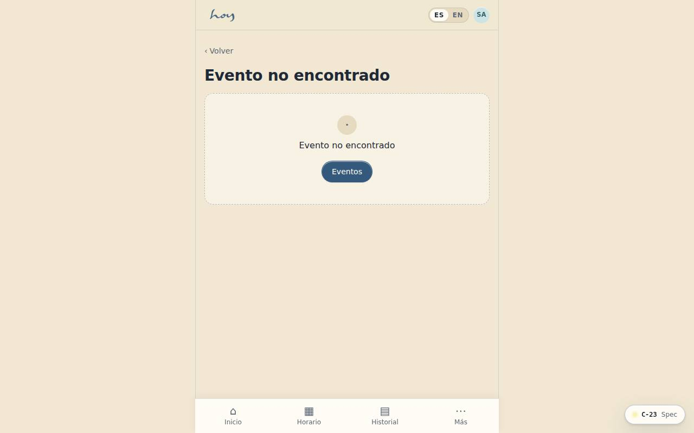
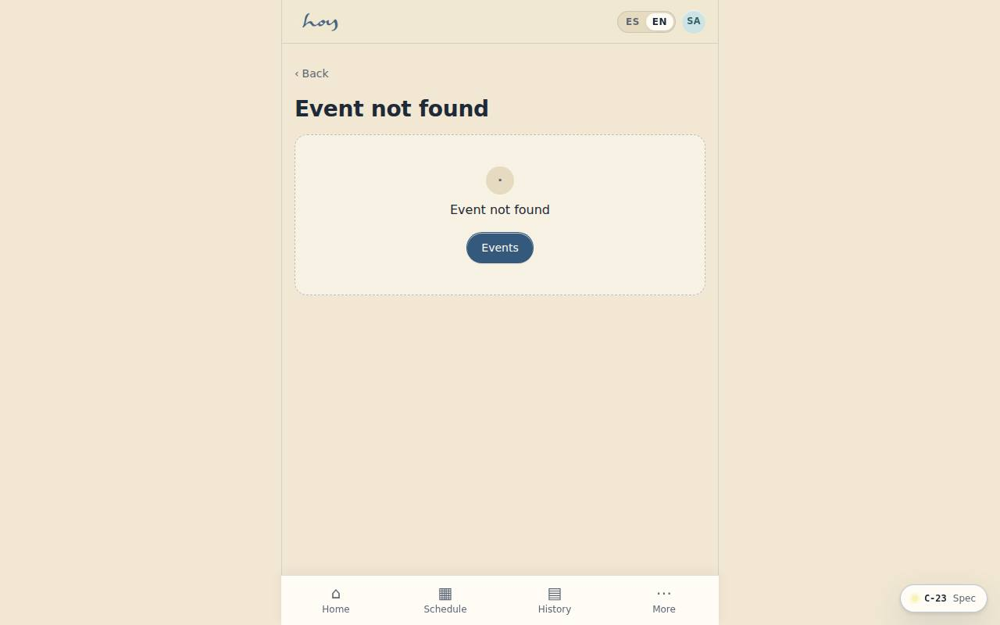

# C-23 — Event detail & RSVP

**Route** `/#/app/events` · `/#/app/events/:id` · **Roles** public, customer, coordinator, front_desk · **Surface** customer · **Spec** `spec.code === 'C-23'` (see `/#/dev/specs`)

## Purpose
Sell the things that are not regular classes — sound baths, workshops, retreats — with their own pricing, capacity and guest rules.

## Screenshots
| ES · mobile | EN · mobile |
| --- | --- |
|  |  |

| ES · desktop | EN · desktop |
| --- | --- |
|  |  |

## Sections (layout order — `useLayout(spec)`)
1. `HeroImage (placeholder)`
2. `WhenWhere`
3. `TitleBlock + hosts`
4. `Body`
5. `PriceRow (public / member)`
6. `CapacityMeter`
7. `StickyCTA · Reserve`
8. `BringAFriendRow → C-16`
9. `AddToCalendar`

## Data
| Table | Read / write | Notes |
| --- | --- | --- |
| `teachers` | read | |
| `memberships` | read / write | |

## Logic and integrations
- Events price separately from classes and never consume class credits unless the coordinator allows it.
- Member price applies automatically to active members.
- Capacity is per event, independent of room capacity.
- Cancellation window is per event and can differ from the class policy.
- Deep-linkable for WhatsApp and Instagram.
- Integrations: WhatsApp, Wompi, Supabase Realtime

## States
- Loading: hero shimmer
- Sold out: waitlist offer
- Past: read-only with gallery
- Cancelled: banner + refund note

## Real vs mock
- Real: the page renders from the data layer (`useData()` / `useTable`) over the tables above; every write goes through the `DataProvider` so the Supabase provider replaces the mock unchanged.
- Mock / pending: WhatsApp, Wompi, Supabase Realtime are simulated or deferred; data is the browser-local `MockProvider` seed.
- Note: No events table yet: two demo events live in content.ts and RSVPs are kept locally (shared-change request). Public price reads pricing single; members included.

## Changelog
- `docs/changelog/0005-final-integration.md` — screenshots and this page doc (v0.3.0)

---
**Resumen (ES).** Detalle de evento y RSVP. Detalle de un evento con RSVP, precio y pases de invitado.
