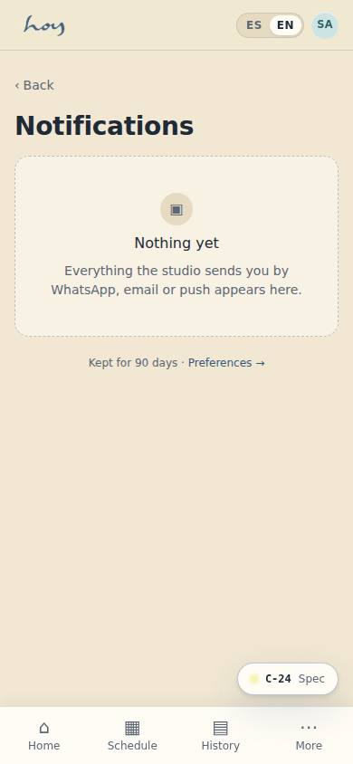
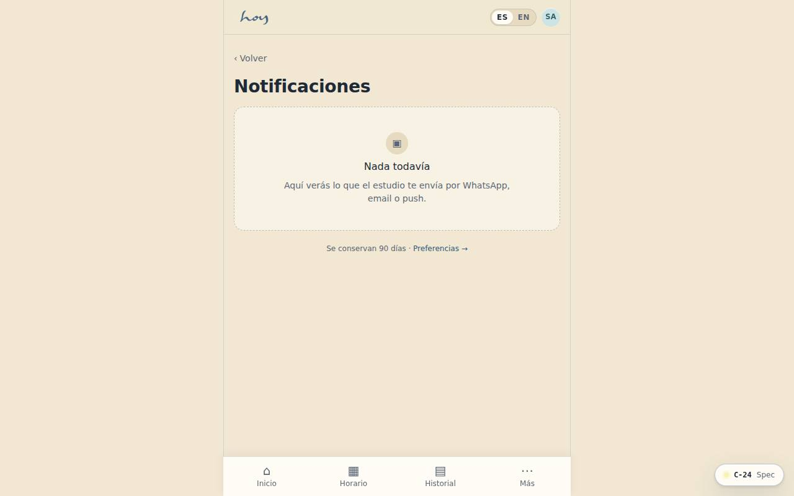
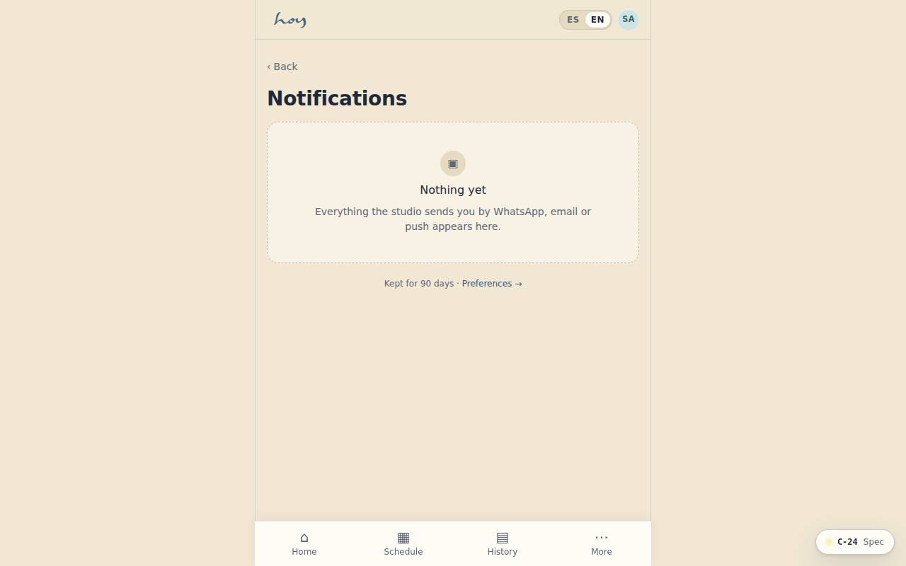

# C-24 — Notifications inbox

**Route** `/#/app/notifications` · **Roles** customer, teacher, super_admin, admin, coordinator, front_desk, finance, maintenance · **Surface** customer · **Spec** `spec.code === 'C-24'` (see `/#/dev/specs`)

## Purpose
One place for everything the studio has sent, so a missed push or a WhatsApp scrolled past is never a lost class.

## Screenshots
| ES · mobile | EN · mobile |
| --- | --- |
|  |  |

| ES · desktop | EN · desktop |
| --- | --- |
|  |  |

## Sections (layout order — `useLayout(spec)`)
1. `Header + MarkAllRead`
2. `TodayGroup → NotificationRow`
3. `EarlierGroup`
4. `EmptyState`
5. `SettingsLink → C-19`

## Data
| Table | Read / write | Notes |
| --- | --- | --- |
| `message_log` | read / write | |
| `waitlist` | read / write | |
| `bookings` | read / write | |
| `class_sessions` | read | |

## Logic and integrations
- Every notification mirrors what went out on push, email or WhatsApp, with the same deep link.
- Actionable items keep their action inline until they expire (claim a spot, rate a class, fix a payment).
- Read state is per account, not per device.
- Retained 90 days, then archived.
- Integrations: WhatsApp, Wompi, Email, Push notifications

## States
- Empty: 'nothing yet'
- Unread: dot + heavier weight
- Expired action: row dims, action removed
- Offline: cached list

## Real vs mock
- Real: the page renders from the data layer (`useData()` / `useTable`) over the tables above; every write goes through the `DataProvider` so the Supabase provider replaces the mock unchanged.
- Mock / pending: WhatsApp, Wompi, Email, Push notifications are simulated or deferred; data is the browser-local `MockProvider` seed.
- Note: Derived inbox: message_log rows + waitlist offers + upcoming bookings. Read state per user in localStorage until a notifications table exists.

## Changelog
- `docs/changelog/0005-final-integration.md` — screenshots and this page doc (v0.3.0)

---
**Resumen (ES).** Bandeja de notificaciones. Bandeja de notificaciones con enlaces profundos y preferencias por canal.
