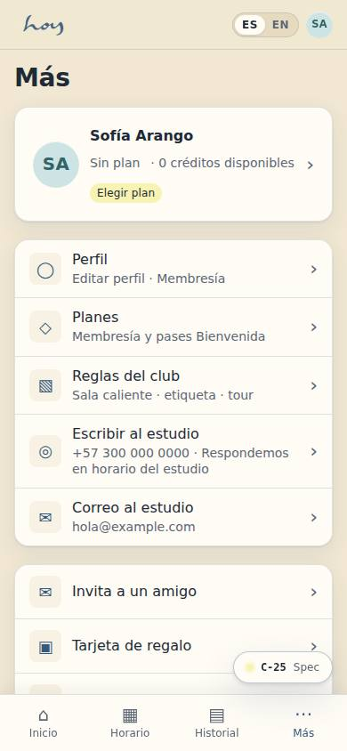
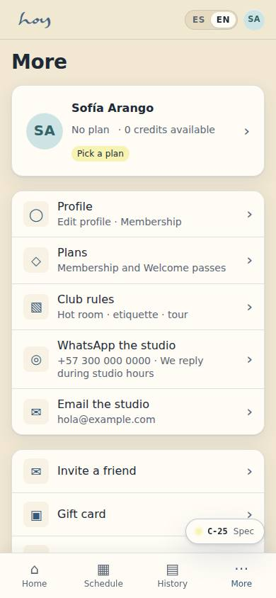
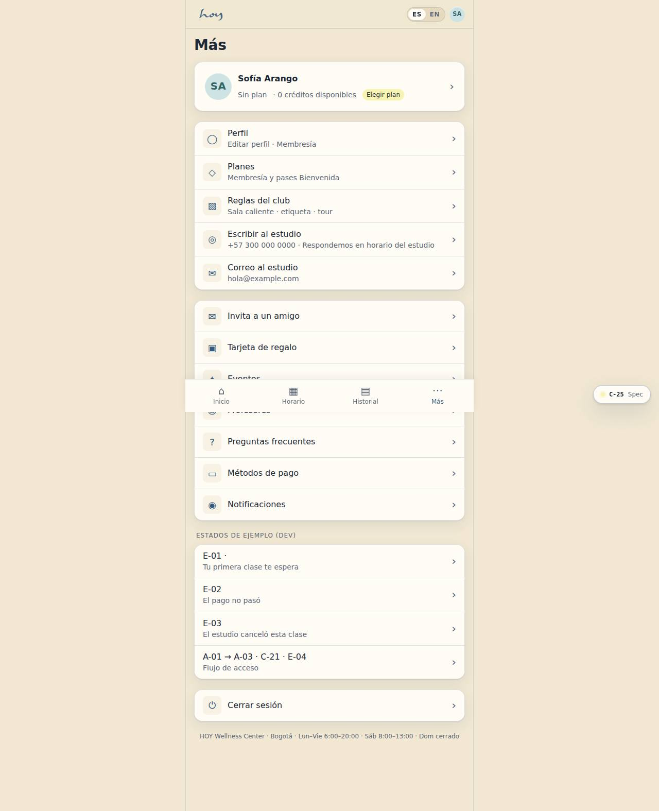
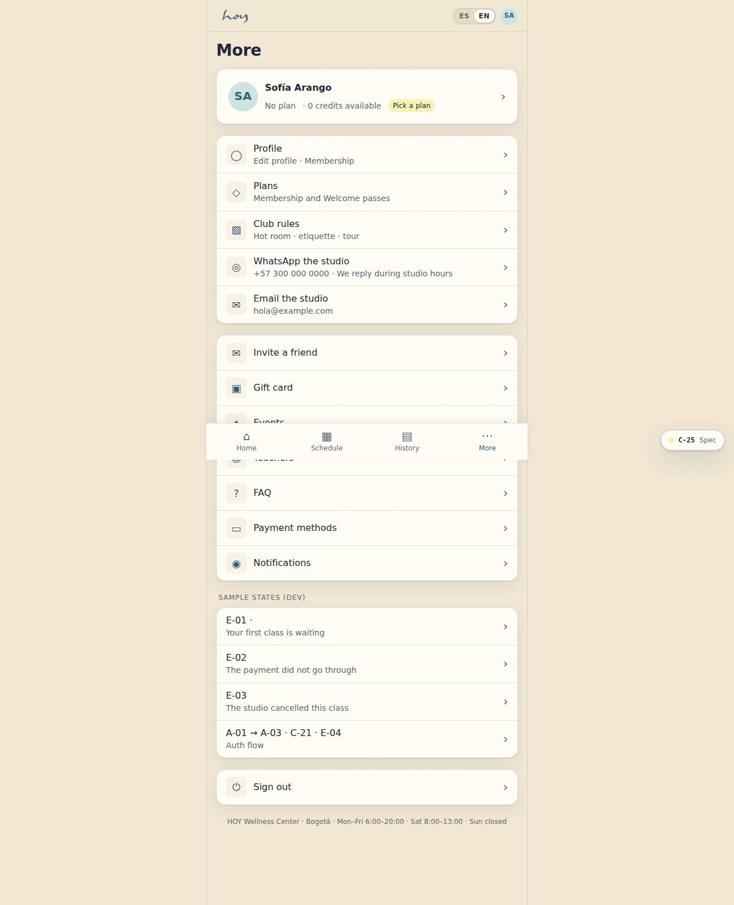

# C-25 — More · profile, rules, contact

**Route** `/#/app/more` · **Roles** customer, teacher · **Surface** customer · **Spec** `spec.code === 'C-25'` (see `/#/dev/specs`)

## Purpose
A fifth destination was one too many for a 340px bar, so profile, club rules and contacting the studio live one level down. Contact moves here from the floating bubble, where it competed with the primary action on every screen.

## Screenshots
| ES · mobile | EN · mobile |
| --- | --- |
|  |  |

| ES · desktop | EN · desktop |
| --- | --- |
|  |  |

## Sections (layout order — `useLayout(spec)`)
1. `IdentityCard → C-19`
2. `PrimaryGroup`
3. `SecondaryGroup`
4. `SignOut`

## Data
| Table | Read / write | Notes |
| --- | --- | --- |
| `profiles` | read / write | |
| `memberships` | read / write | |
| `plans` | read | |
| `credits` | read / write | |

## Logic and integrations
- The dock carries four destinations: Home, Classes, History, More — every remaining screen is reachable from here in one tap.
- Contact is outbound only — the rows open WhatsApp or the mail client. The app carries no inbox of its own; the studio answers where it already works.
- The identity card doubles as the entry to profile, so the row above is not the only path.
- Sign out is last, never adjacent to a destructive-looking row.
- Integrations: WhatsApp, Email, Supabase Auth, Supabase Realtime, Push notifications

## States
- Loading: identity skeleton
- No membership: card shows the plan prompt
- Outside hours: the WhatsApp row states the reply window

## Real vs mock
- Real: the page renders from the data layer (`useData()` / `useTable`) over the tables above; every write goes through the `DataProvider` so the Supabase provider replaces the mock unchanged.
- Mock / pending: WhatsApp, Email, Supabase Auth, Supabase Realtime, Push notifications are simulated or deferred; data is the browser-local `MockProvider` seed.

## Changelog
- `docs/changelog/0005-final-integration.md` — screenshots and this page doc (v0.3.0)

---
**Resumen (ES).** Más · perfil, reglas, contacto. El menú Más: perfil, reglas, horarios, contacto y ajustes.
