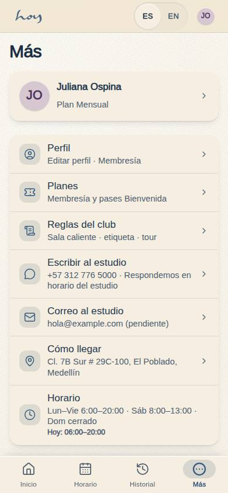
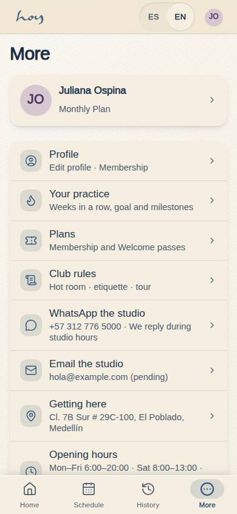
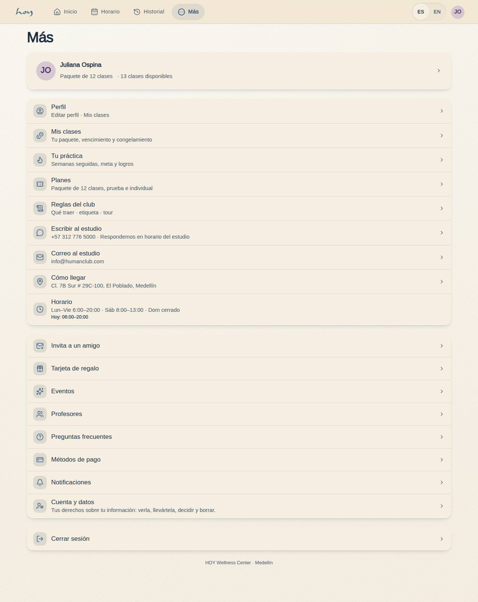
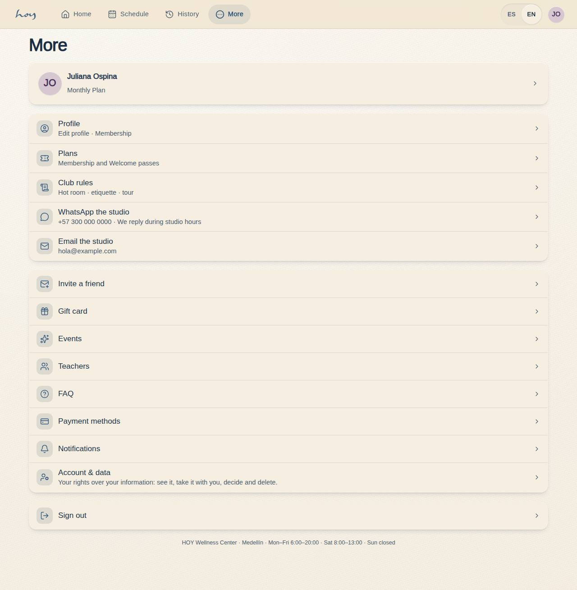
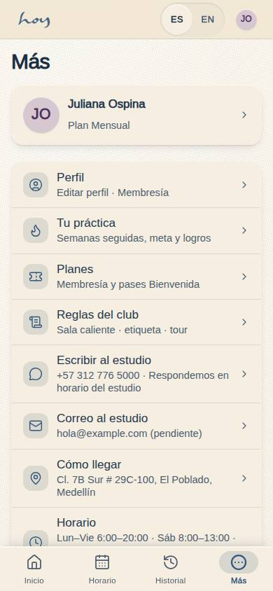

# C-25 — More · profile, rules, contact

**Route** `/#/app/more` · **Roles** customer, teacher · **Surface** customer · **Spec** `spec.code === 'C-25'` (see `/#/dev/specs`)

## Purpose
A fifth destination was one too many for a 340px bar, so profile, club rules and contacting the studio live one level down. Contact moves here from the floating bubble, where it competed with the primary action on every screen.

## Screenshots
| ES · mobile | EN · mobile |
| --- | --- |
|  |  |

| ES · desktop | EN · desktop |
| --- | --- |
|  |  |

## Sections (layout order — `useLayout(spec)`)
1. `IdentityCard → C-19`
2. `PrimaryGroup`
3. `SecondaryGroup`
4. `SignOut`

## Data
| Table | Read / write | Notes |
| --- | --- | --- |
| `profiles` | read / write | |
| `memberships` | read / write | |
| `plans` | read | |
| `credits` | read / write | |
| `tenants` | read | contact (`useContact()`) and, since 0041, the weekly hours (`useOpeningHours()`) |
| `hours_overrides` | read | 0041: today's line under the hours row |

## Logic and integrations
- The dock carries four destinations: Home, Classes, History, More — every remaining screen is reachable from here in one tap.
- Contact is outbound only — the rows open WhatsApp or the mail client. The app carries no inbox of its own; the studio answers where it already works.
- The identity card doubles as the entry to profile, so the row above is not the only path.
- Sign out is last, never adjacent to a destructive-looking row.
- Integrations: WhatsApp, Email, Supabase Auth, Supabase Realtime, Push notifications

## States
- Loading: identity skeleton
- No membership: card shows the plan prompt
- Outside hours: the WhatsApp row states the reply window

## Real vs mock
- Real: the page renders from the data layer (`useData()` / `useTable`) over the tables above; every write goes through the `DataProvider` so the Supabase provider replaces the mock unchanged.
- Mock / pending: WhatsApp, Email, Supabase Auth, Supabase Realtime, Push notifications are simulated or deferred; data is the browser-local `MockProvider` seed.

## 0041 — hours row
A new **Horario** row under “Cómo llegar” shows the M-08a weekly sentence and, in bold, today's line in the studio's time
zone (holidays and special hours from M-08g included). The footer line drops the static hours (legal name · city).

## 0051 — the studio's verified content (2026-10-01)
Más lists **Mis clases** ("Tu paquete, vencimiento y congelamiento") and the plan line shows the classes left.
| Before (0.21.3) | After (0.22.0) |
| --- | --- |
|  |  |

## Changelog
- `docs/changelog/0051-website-verified-content.md` — "Mis clases" row with the package summary (v0.22.0, 2026-10-01)
- `docs/changelog/0047-whatsapp-contact-routing.md` — the WhatsApp row is a `support` handoff (M-08a contacts, D-0022); its subtitle shows the resolved number and, off duty, the "Respondemos el próximo día hábil (…)" note; declares and mounts the read-only `contact.whatsapp` action (v0.21.0, 2026-09-30)
- `docs/changelog/0041-hours-google-keys.md` — hours row with today's status (v0.17.0, 2026-09-29)
- `docs/changelog/0019-app-store-readiness.md` — *Cuenta y datos* row (C-26) in the secondary group (v0.7.0)
- `docs/changelog/0005-final-integration.md` — screenshots and this page doc (v0.3.0)
- `docs/changelog/0030-icons.md` — icon system: lucide glyphs behind the `Icon` atom (a distinct glyph per More row (profile, plans, rules, WhatsApp, email, invite, gift, events, teachers, FAQ, payments, notifications, account, sign out)) (v0.12.0, 2026-09-29)

---
**Resumen (ES).** Más · perfil, reglas, contacto. El menú Más: perfil, reglas, horarios, contacto y ajustes.
