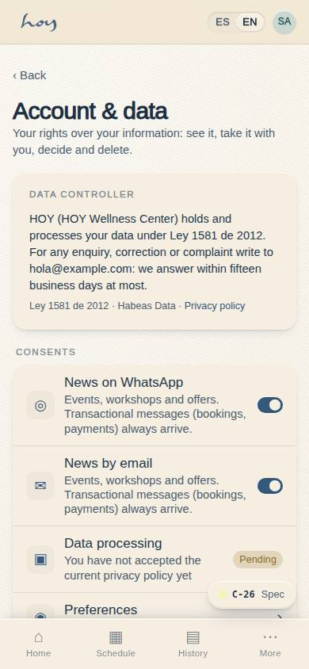
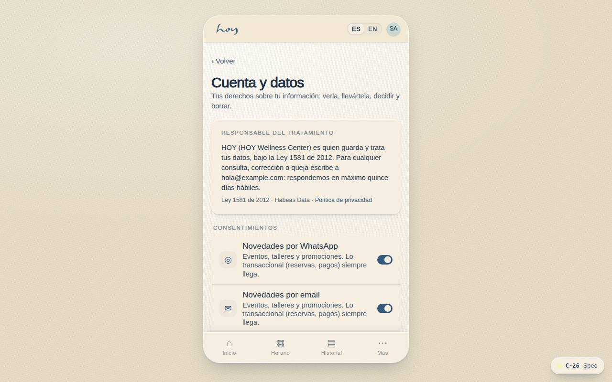
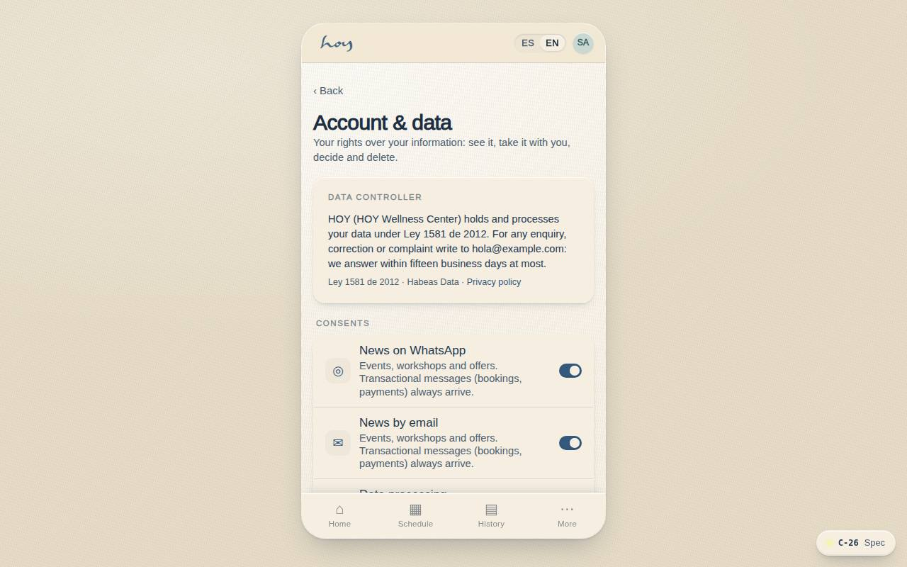
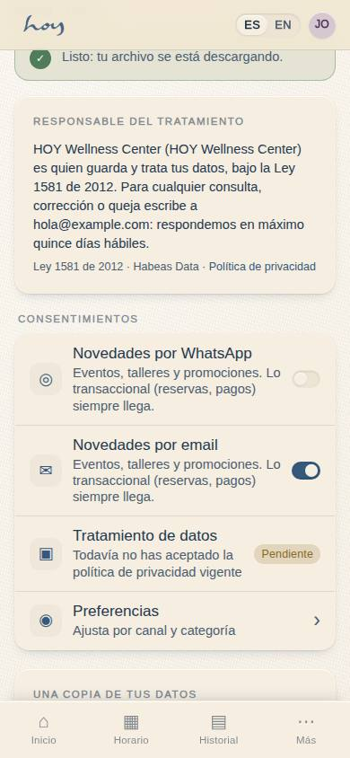

# C-26 — Account & data

**Route** `/#/app/account` · **Roles** customer, teacher · **Surface** customer · **Spec** `src/modules/customer/specs.ts['C-26']` (see `/#/dev/specs`)

## Purpose
Account-level rights in one place: who the data controller is, the consents the member controls, a copy of their own data, the legal documents and the request to delete the account, with what is kept explained in plain words. It is the in-app account deletion Apple (5.1.1(v)) and Google Play require, and the Ley 1581 rights (access, consent, deletion) as a screen.

## Screenshots
| ES · mobile | EN · mobile |
| --- | --- |
|  |  |

| ES · desktop | EN · desktop |
| --- | --- |
|  |  |

| ES · request pending (after the two-step confirm) |
| --- |
|  |

## Sections (layout order — `useLayout(spec)`)
1. `DataController` — who holds the data (display name from M-08, `tenant.legalName`, studio email), Ley 1581 line and the privacy-policy link.
2. `ConsentToggles` — marketing by WhatsApp and by email (`notification_prefs` marketing category, mirrored into `profiles.marketing_optin`), the privacy-policy version accepted (`legal_acceptances`) with a link to A-06, and the C-24 matrix.
3. `ExportData` — *Descargar mis datos*: one JSON with every own row (20 tables + the invoices of own payments); audited as `account.export`.
4. `LegalLinks` — the six A-06 documents.
5. `DeleteAccount` — *Eliminar mi cuenta* (two-step drawer), or, while a request is open, its status card with *Cancelar la solicitud*.

## Data
| Table | Read / write | Notes |
| --- | --- | --- |
| `deletion_requests` | read / write | insert on confirm (`status` requested, `channel` app); update to cancelled |
| `notification_prefs` | read / write | marketing per channel |
| `profiles` | read / write | `marketing_optin` mirror |
| `users` | read | email / phone copied onto the request |
| `legal_acceptances` | read | privacy version accepted |
| `audit_log` | write | `account.deletion_request`, `account.deletion_cancel`, `account.export`, `consent.marketing` |
| `tenants` | read | display name and email through `useSettings()` |
| every own-row table | read | for the export only |

## Logic and integrations
- Deleting is a request, not a client-side delete: the row goes to `deletion_requests`, admin follows it in M-11, and the anonymisation of `profiles` + `users` and the removal of the auth user run server-side once Supabase exists. Nothing here alters the profile.
- Step one explains what is kept (invoices and payment history, anonymised, for the legal retention period) and what ends (access, profile, notifications, future bookings, credits, membership) and requires the "I understand" switch; step two is the destructive button.
- While a request is `requested` the member can cancel it; once `processing` the card says to write to the studio.
- Integrations: Supabase Auth (deferred) — the deletion job.

## States
- No request: delete row available
- Step 1: explanation, switch off → *Continuar* disabled
- Step 2: destructive confirm
- Request pending with cancel
- Request processing (no cancel)
- Privacy policy not accepted yet (badge *Pendiente*)
- Exporting

## Real vs mock
- Real: every write goes through `useData()`; the request, the audit rows, the consent prefs and the export are real rows in the mock DB and will be in Supabase unchanged.
- Mock / pending: the server-side anonymisation job and the confirmation email do not exist yet (`docs/app-store-compliance.md` §4).

## Changelog
- `docs/changelog/0019-app-store-readiness.md` — first version (v0.7.0)

---
**Resumen (ES).** Cuenta y datos: quién trata tus datos, tus consentimientos, una copia de tus datos, los documentos legales y la solicitud de eliminar la cuenta en dos pasos, explicando que las facturas se conservan anonimizadas y el perfil y el acceso se eliminan. La ejecución corre en el servidor; admin la sigue en M-11.
