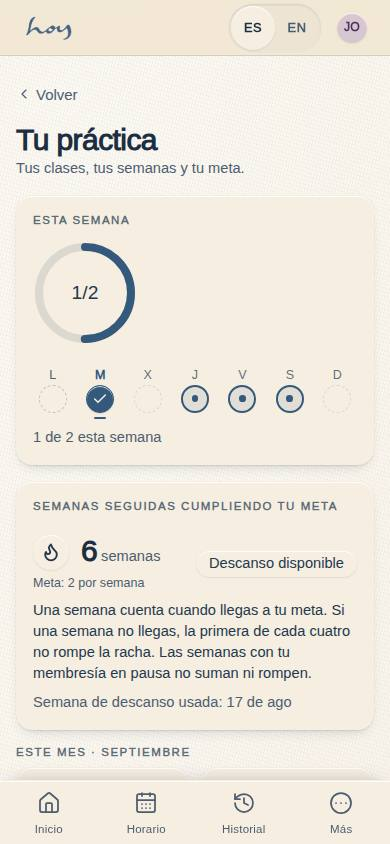
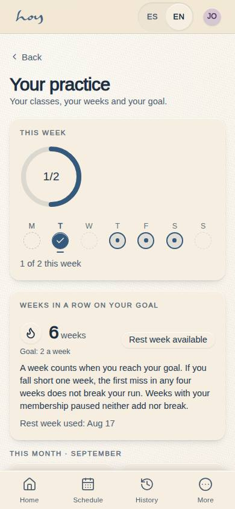
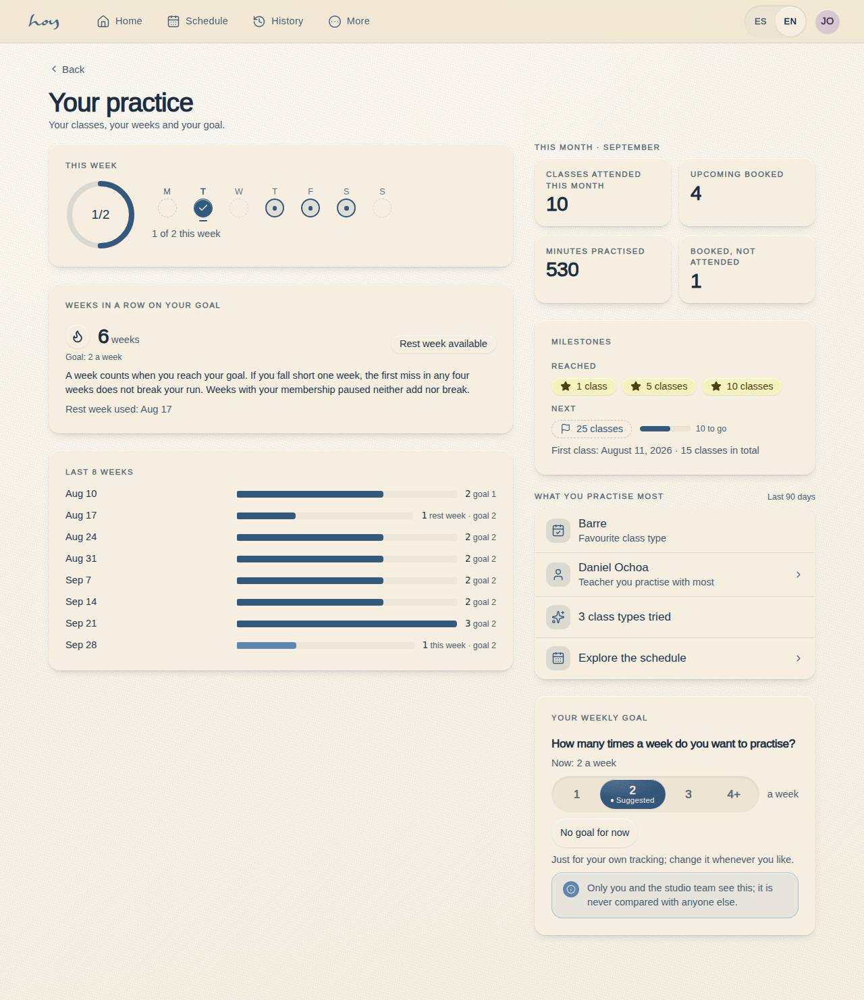

# C-27 — Tu práctica

**Route** `/#/app/practice` · **Roles** customer, teacher · **Surface** customer · **Spec** `src/modules/customer/specs.ts['C-27']` (see `/#/dev/specs`)

## Purpose
The member's practice in plain words: how many classes they attended this week and this month, how many weeks in a row they have met their goal, their milestones and what they practise most, and the weekly goal they choose themselves. Private: never compared with anyone else. Everything comes from `usePracticeStats()` (`src/data/analytics.ts`); the page computes nothing. Reached from the C-01 practice block ("Ver tu práctica"), C-25 More and C-19 Profile.

## Screenshots
| ES · mobile | EN · mobile |
| --- | --- |
|  |  |

| ES · desktop | EN · desktop |
| --- | --- |
|  |  |

Captured 2026-09-29 by `npm run screenshots -- --only=/app/practice` (light only: C-27 is not a `KEY_PAGES` code, so no dark variant) plus `npm run thumbnails` for the hub cards.

## Sections (layout order — `useLayout(spec)`)
1. `WeekHeader` — `ProgressRing` (attended / goal, only with a goal) + `WeekDots` Monday → Sunday with "{attended} de {target} esta semana · Meta de la semana cumplida", or "{n} clases esta semana · Sin meta · elige una abajo".
2. `StreakCard` — "Semanas seguidas cumpliendo tu meta": `StreakBadge` (count, unit, state, best), the "Descanso disponible" chip when a rest week is still available, the rule in one sentence ("Una semana cuenta cuando llegas a tu meta. Si una semana no llegas, la primera de cada cuatro no rompe la racha.") plus the pause sentence, and "Semana de descanso usada: {date}" when one was saved. Without a goal: one line inviting to pick one.
3. `MonthSummary` — "Este mes · {month}": Clases tomadas este mes · Reservadas próximas · Minutos de práctica, plus Reservas sin asistir / Cancelaciones tardías only when > 0.
4. `History12Weeks` — "Últimas {n} semanas": `BarList` of the last weeks, at most 12, starting at the week of the member's first class (a brand-new member still sees the last 4); attended per week, the current week emphasised; hints "esta semana" · "descanso" · "pausa" · "meta {n}" — the target each week was lived under (rule 8), so a raised goal never recolours the past.
5. `Milestones` — `MilestoneList` (reached 1 · 5 · 10 · 25 · 50 · 100 · 250, the next one with a progress bar) + "Primera clase: {date} · {n} clases en total".
6. `Favourites` — "Lo que más practicas · Últimos 90 días": favourite class type, the teacher practised with most (→ C-18), "{n} tipos de clase probados", "Explorar el horario" → C-02.
7. `GoalSection` — "¿Cuántas veces por semana quieres practicar?" (`GoalPicker` 1 · 2 · 3 · 4+ · Sin meta por ahora, the history's suggestion marked Sugerido; manual activation — arrows and Home / End only move focus, Enter / Space / click / tap save once, so browsing writes nothing; current value or "Según tus últimas semanas te sugerimos {n}") and the privacy `Notice`: "Solo tú y el equipo del estudio ven esto; nunca se compara con otras personas."

## Responsive layout
**Shell** `AppShell` (D-0006). Below 900 px the sections render flat in the layout editor's order inside the 560 px column. From 900 px (`SplitSections`): `WeekHeader`, `StreakCard` and `History12Weeks` on the left (1.5fr); `MonthSummary`, `Milestones`, `Favourites` and `GoalSection` on the right. The tiles grid drops from three to two columns under 560 px (`@container app`), the streak stamp taking the full row so "6 semanas" never clips. Verified by the build at 390 · 1280 · 3840 (spec `checkedAt` pending the QA matrix); a tablet (768) layout is a kanban follow-up.

## Actions (WebMCP)
| id | Intent (ES) | Params | Permission |
| --- | --- | --- | --- |
| `app.setGoal` | Quiero practicar {target} veces por semana | `target: number 0–7 (0 = sin meta)` | `bookings.write` |
| `app.openPractice` | Muéstrame mi práctica | — | — |
| `app.goHome` | Llévame al inicio de la app | — | — |
| `app.openSchedule` | Muéstrame el horario de clases | — | `classes.read` |

Declared in `src/modules/customer/actions.ts` (`CUSTOMER_ACTIONS['C-27']`), handlers in `practice.tsx` (`usePracticeHandlers`) and `actions.ts` (`useAppNavHandlers`), mounted with `useActions()`. `app.setGoal` answers `goal N/week` (or `(no goal)`) and rejects anything that is not a whole number 0–7.

## Data
| Table | Read / write | Notes |
| --- | --- | --- |
| `bookings` | read | the member's own rows; a visit = `checked_in`, dated by the session |
| `class_sessions` | read | the join that dates every visit and gives minutes (`ends_at − starts_at`) |
| `practice_goals` | read / write | every row of the member, ended ones included — each past week is graded by the goal in force when it closed (rule 8); `GoalSection` ends the active row and inserts a new one starting today |
| `activity_events` | write | `goal.set` on every goal change (`usePracticeGoal`) |
| `memberships` | read | paused weeks (`status paused`, `paused_until`) neither count nor break |
| `credits` | read | via the spec; balances are shown on C-01, not here |
| `modalities`, `teachers` | read | names for Favourites |

## Logic and integrations
- A visit is a `checked_in` booking counted by the **session** start date (local, America/Bogota), never the booking's `created_at`. "Clases tomadas este mes" = visits in the current calendar month; "Reservadas próximas" = `booked` with the session in the future.
- Weeks run Monday–Sunday. A week counts when visits ≥ the goal; the current week never breaks the run and counts once met; **at risk** = current week not met on Saturday or Sunday.
- **Rest week**: one missed week per rolling 4 is forgiven ("descanso") when the run is alive and there was a visit in the 4 weeks before; a saved week keeps the run but does not add. Weeks with the membership paused neither add nor break.
- Two missed weeks in a row, or a miss with no rest week left, reset the run; **best** = the longest run under the same rules and is always shown when it beats the current one — a broken run never shows a red zero.
- Each past week is graded against the goal that was in force when it closed (the latest `practice_goals` row, ended ones included, with `starts_on` ≤ that week's Sunday; weeks before the first goal use the first goal's target). Raising or lowering the goal never rewrites past weeks (D-0015, `analytics.ts` rule 8).
- Goal 0 ("Sin meta por ahora") hides the ring and the streak; counts, history and milestones stay. The suggestion is the median of the last 8 full weeks clamped 1–4, or 2 with less than two weeks of history.
- Milestones 1 · 5 · 10 · 25 · 50 · 100 · 250 lifetime visits; C-01 writes the `milestone` / `streak.saved` events once (`useMilestoneRecorder`); this page only shows them. Favourites = most-attended modality and teacher over the last 90 days.
- The rules are `src/data/analytics.ts` (header comment) and are proven by `npm run test:analytics`. Full rationale: `docs/reference/analytics.md`.
- Integrations: none.

## States
- No bookings ever → `EmptyState` "Tu práctica empieza con tu primera clase" with the book CTA (the sections do not render).
- Goal set, streak alive · at risk (weekend, goal not met) · building (no run yet, a visit this week) · broken (shows the best run) · no goal (no ring, no streak, counts stay).
- Rest week used (saved date shown) · rest week available (chip).
- Month with no-shows or late cancels (neutral tiles, only when > 0).
- Favourites empty ("Aún no hay clases en los últimos 90 días") · goal never asked (suggestion line) · goal saved (toast "Meta guardada: {n} por semana" / "Sin meta por ahora. Tus clases se siguen contando.").

## Real vs mock
- Real: every number is `practiceStats()` over the member's real `bookings` and `class_sessions` rows in the data layer; the goal is a real `practice_goals` row and each change writes a real `activity_events` row through the `DataProvider`, so the Supabase provider replaces the mock unchanged.
- Mock / pending: data is the browser-local `MockProvider` seed (the demo member has seven weeks of seeded morning classes so the run is real: 6 met weeks, one saved). No external integration.

## Changelog
- `docs/changelog/0040-practice-analytics.md` — the page is new: practice analytics for members, teachers and the club (v0.16.0, 2026-09-29)

---
**Resumen (ES).** Tu práctica. La práctica de la persona en lenguaje llano: cuántas clases tomó esta semana y este mes, cuántas semanas seguidas lleva cumpliendo su meta (con una semana de descanso por cada cuatro), sus logros, lo que más practica y la meta semanal que ella misma elige. Privado: nunca se compara con otras personas. Los mismos números que ve el equipo en la ficha (M-06).
