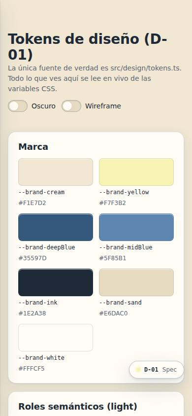
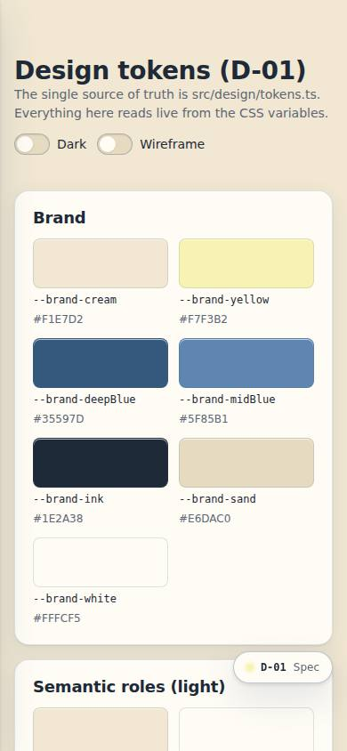
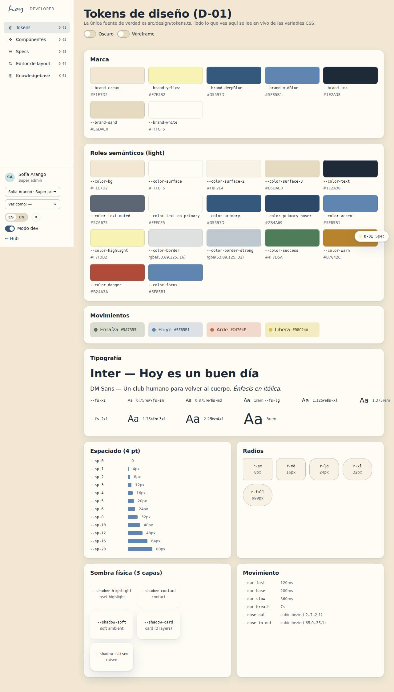
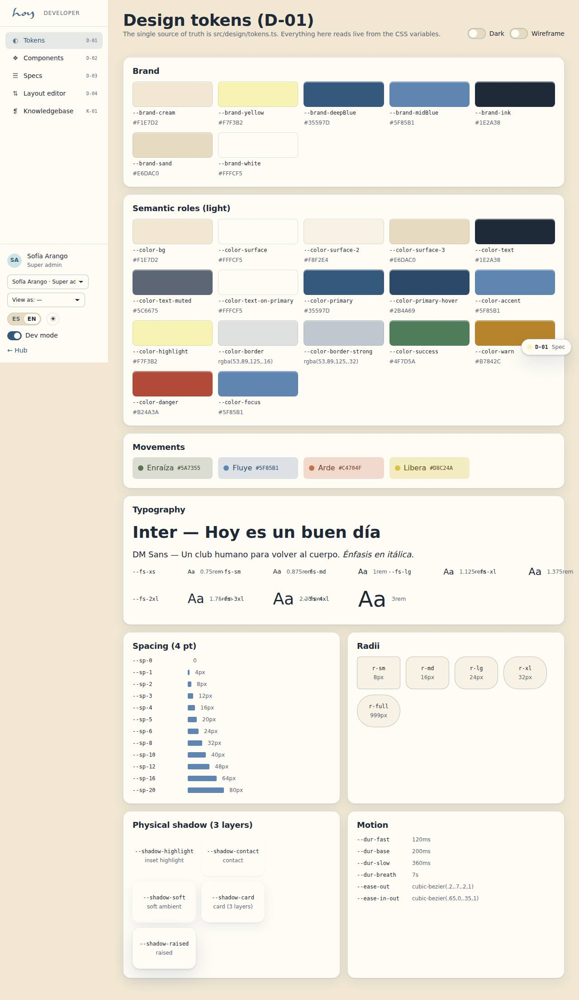

# D-01 — Materials, tokens & physicality

**Route** `/#/dev/tokens` · **Roles** super_admin · **Surface** dev · **Spec** `spec.code === 'D-01'` (see `/#/dev/specs`)

## Purpose
The material layer of the system: textures, surfaces, elevation and corner radii, with a switch between the styled build and the functional wireframe.

## Screenshots
| ES · mobile | EN · mobile |
| --- | --- |
|  |  |

| ES · desktop | EN · desktop |
| --- | --- |
|  |  |

## Sections (layout order — `useLayout(spec)`)
1. `TexturePalette (sandstone, warm stone, clay, linen, travertine)`
2. `SurfaceScale (card, elevated, pressed, soft)`
3. `AccentSwatches (sage, terracotta, ochre, deep brown)`
4. `ShadowScale ×3`
5. `RadiusScale 8/16/24/32`
6. `TypeScale (Playfair / Jost / Quicksand)`
7. `ThemeMatrix (light / dark × styled / wireframe)`

## Data
| Table | Read / write | Notes |
| --- | --- | --- |
| `design_tokens` | read | |
| `materials` | read | |
| `textures` | read | |
| `shadow_scale` | read | |
| `radius_scale` | read | |
| `type_scale` | read | |
| `themes` | read | |

## Logic and integrations
- Physicality comes from three layers, always together: an inset top highlight, a tight contact shadow, and a wide soft shadow.
- Textures are fills, not images per component — one texture token per surface role.
- Wireframe mode strips texture, colour and shadow but keeps layout and hierarchy.
- Dark mode re-maps surfaces, never inverts the accents.
- Minimum contrast 4.5:1 for body text on any material.
- Integrations: Supabase Auth

## States
- Styled × light
- Styled × dark
- Wireframe × light
- Wireframe × dark

## Real vs mock
- Real: the page renders from the data layer (`useData()` / `useTable`) over the tables above; every write goes through the `DataProvider` so the Supabase provider replaces the mock unchanged.
- Mock / pending: Supabase Auth are simulated or deferred; data is the browser-local `MockProvider` seed.

## Changelog
- `docs/changelog/0005-final-integration.md` — screenshots and this page doc (v0.3.0)

---
**Resumen (ES).** Materiales, tokens y fisicidad. Los tokens de diseño: color, tipografía, espaciado, radios, sombras y movimiento.
