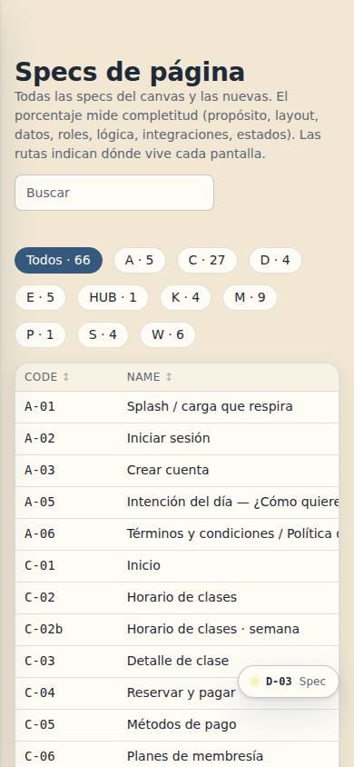
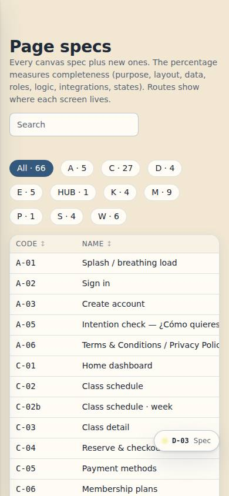
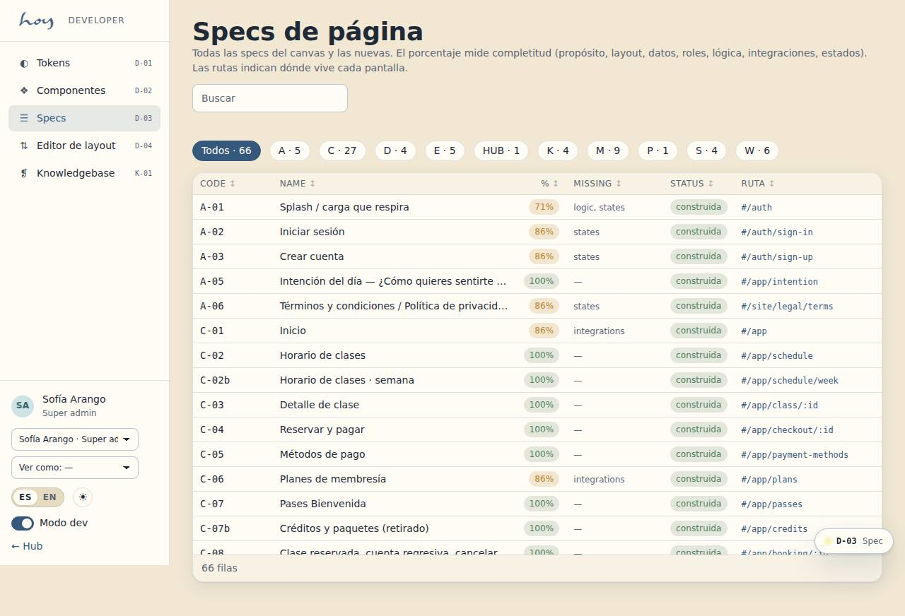
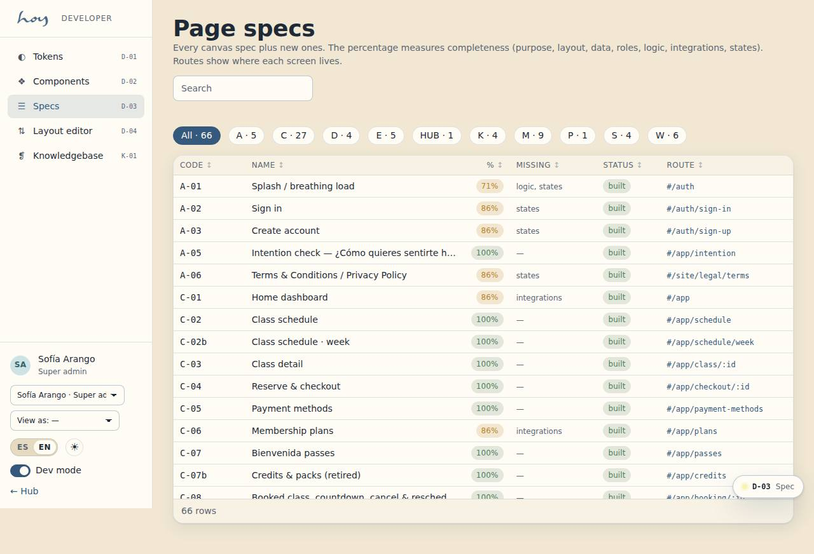

# D-03 — Specs index

**Route** `/#/dev` · `/#/dev/specs` · **Roles** super_admin · **Surface** dev · **Spec** `spec.code === 'D-03'` (see `/#/dev/specs`)

## Purpose
Lists every registered PageSpec with completeness badge, route and status (built / stub / no route).

## Screenshots
| ES · mobile | EN · mobile |
| --- | --- |
|  |  |

| ES · desktop | EN · desktop |
| --- | --- |
|  |  |

## Sections (layout order — `useLayout(spec)`)
1. `PageHead`
2. `FilterChips`
3. `SpecTable`

## Data
| Table | Read / write | Notes |
| --- | --- | --- |
| `components` | read | |
| `page_layouts` | read / write | |

## Logic and integrations
- Completeness = 7 checks (purpose, layout, data, roles, logic, integrations, states).
- A route is a stub when its element is PageStub.
- Integrations: none

## States
- default
- filtered by family

## Real vs mock
- Real: the page renders from the data layer (`useData()` / `useTable`) over the tables above; every write goes through the `DataProvider` so the Supabase provider replaces the mock unchanged.
- Mock / pending: no external integrations; data is the browser-local `MockProvider` seed.

## Changelog
- `docs/changelog/0005-final-integration.md` — screenshots and this page doc (v0.3.0)

---
**Resumen (ES).** Índice de specs. Lista todas las PageSpec registradas con badge de completitud, ruta y estado (construida / stub / sin ruta).
