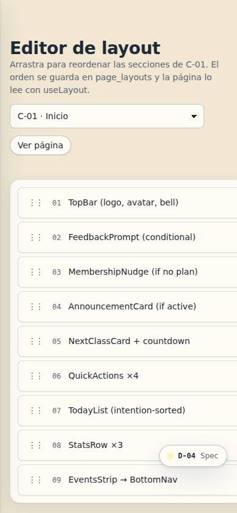
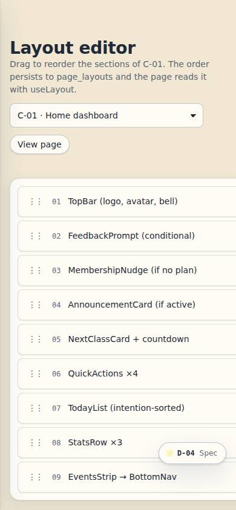
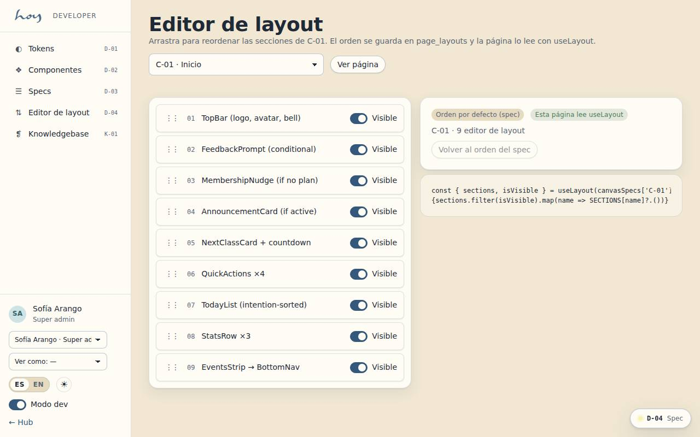
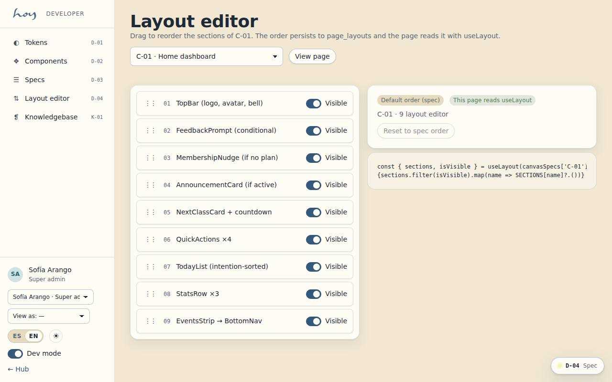

# D-04 — Layout editor

**Route** `/#/dev/layout` · `/#/dev/layout/:pageCode` · **Roles** super_admin · **Surface** dev · **Spec** `spec.code === 'D-04'` (see `/#/dev/specs`)

## Purpose
Reorder and hide a page’s sections with drag-and-drop; persists to page_layouts and pages read it with useLayout(spec).

## Screenshots
| ES · mobile | EN · mobile |
| --- | --- |
|  |  |

| ES · desktop | EN · desktop |
| --- | --- |
|  |  |

## Sections (layout order — `useLayout(spec)`)
1. `PagePicker`
2. `SortableList (dnd-kit)`
3. `Toolbar (reset, preview)`

## Data
| Table | Read / write | Notes |
| --- | --- | --- |
| `page_layouts` | read / write | |

## Logic and integrations
- Stored order wins; new spec sections append; removed ones drop.
- Hidden sections stay in order but are skipped by the page.
- Integrations: none

## States
- default (spec order)
- custom order saved
- page not wired

## Real vs mock
- Real: the page renders from the data layer (`useData()` / `useTable`) over the tables above; every write goes through the `DataProvider` so the Supabase provider replaces the mock unchanged.
- Mock / pending: no external integrations; data is the browser-local `MockProvider` seed.

## Changelog
- `docs/changelog/0005-final-integration.md` — screenshots and this page doc (v0.3.0)

---
**Resumen (ES).** Editor de layout. Reordenar y ocultar las secciones de una página con drag-and-drop; persiste en page_layouts y las páginas lo leen con useLayout(spec).
