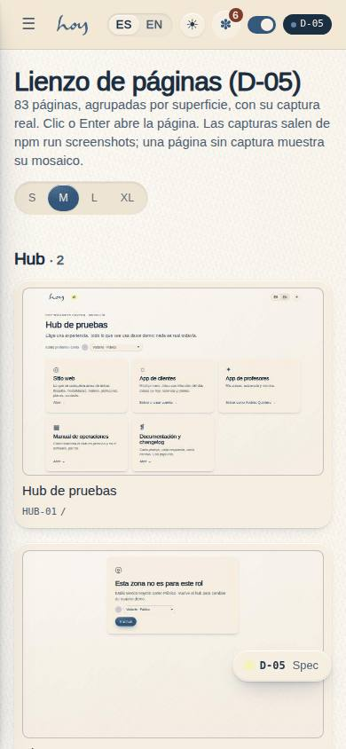
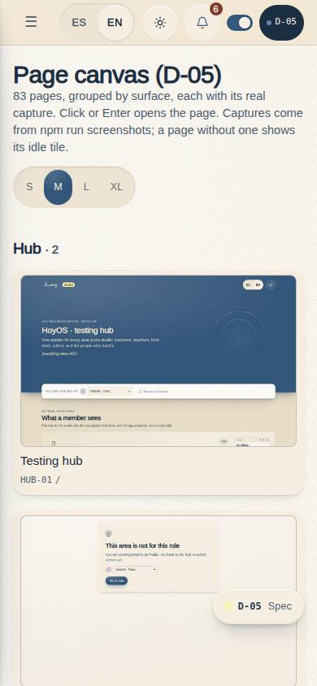



# D-05 — Page canvas

**Route** `/#/dev/canvas` · **Roles** super_admin · **Surface** dev (DesktopShell) · **Spec** `src/modules/dev/specs.ts` → `canvasSpec` · **Checked at** 360 · 390 · 768 · 1280 · 1920 · 2560 · 3840

## Purpose
The whole product on one screen. Every page the app routes to, as its real capture, grouped by
surface, with its name, code and route underneath and a four-step zoom. Click or Enter opens the
page. It is the map you point at in a review: what exists, what it looks like, and what is still a
stub.

## Screenshots
| ES · mobile | EN · mobile |
| --- | --- |
|  |  |

| ES · desktop | EN · desktop |
| --- | --- |
|  |  |

## Sections (layout order)
1. **PageHead** — title, the live page count, and the zoom `SegmentedControl` (S · M · L · XL).
2. **GroupSection × 9** — Hub · Sitio web · Acceso · Clientes · Profesores · Staff · Administración · Desarrollo · Documentación, each with its count.
3. **Tile** — a `PagePreview` (phone shape for customer and teacher pages, desktop for the rest), the page name, then `code` and `route`; a stub is badged in dev mode. The whole tile is one link.

## Data
| Table | Read / write | Notes |
| --- | --- | --- |
| `page_layouts` | read | the spec each tile represents |
| `components` | read | D-02 vocabulary; nothing is written here |

The tiles themselves come from the route registry, not from a table.

## Actions (WebMCP)
None declared yet. `hub.openCanvas` (HUB-01) is how an agent gets here.

## Logic and integrations
- Routes come from `getRoutes()`; param routes (`:id`) and splats are skipped, so a tile always opens something.
- Grouping: `/` and `/no-access` → Hub, `/auth/*` → Acceso, any other `public` surface → Sitio web, otherwise the route's own surface.
- **Static captures only.** A map of 83 pages never boots live frames.
- The zoom step sets `--zoom`, which is the grid's minimum track width — the tiles reflow, they are not transformed, so text stays crisp at every step.
- A page with no thumbnail yet shows its hue-tinted idle tile, which is exactly how a gap in the capture pass becomes visible.
- Integrations: none.

## States
default (M) · zoom S / L / XL · no captures yet (idle tiles) · dev mode (stub badges).

## Real vs mock
- **Real**: the page list and the captures. Both come from the system, so the canvas cannot claim a page that does not exist or hide one that does.
- **Mock / pending**: nothing is editable here; it is a read-only map. Selecting several tiles, or filtering by status, is a backlog idea rather than a promise.

## Changelog
- `docs/changelog/0022-hub-home-redesign.md` — first version

---
**Resumen (ES).** Todo el producto en una pantalla: cada página con su captura real, agrupada por
superficie, con zoom de cuatro pasos. Clic o Enter abre la página.
