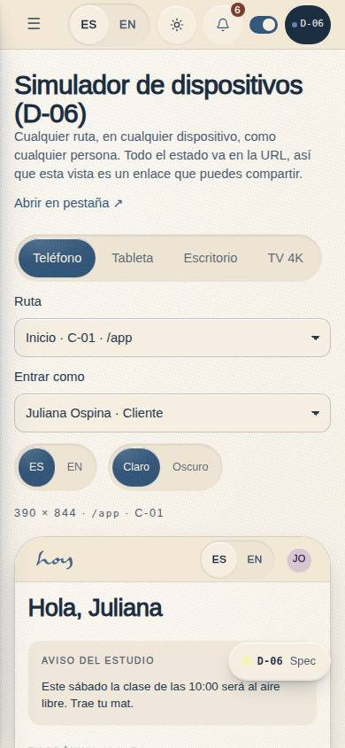
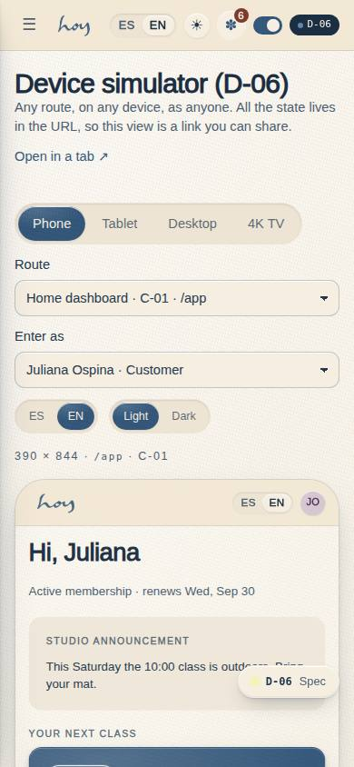
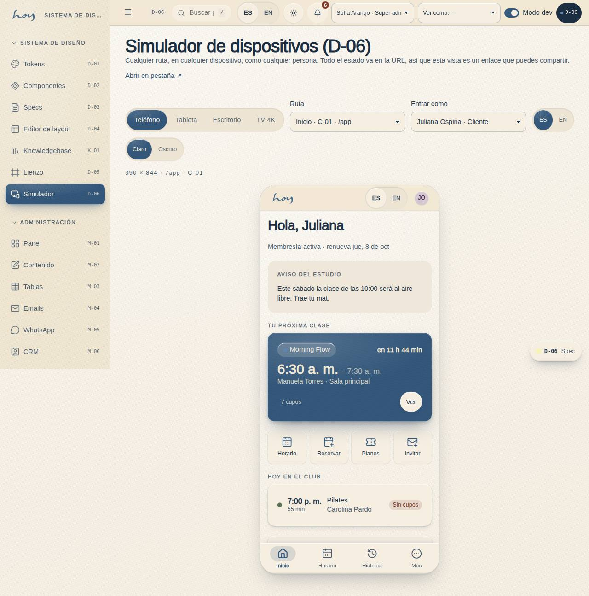
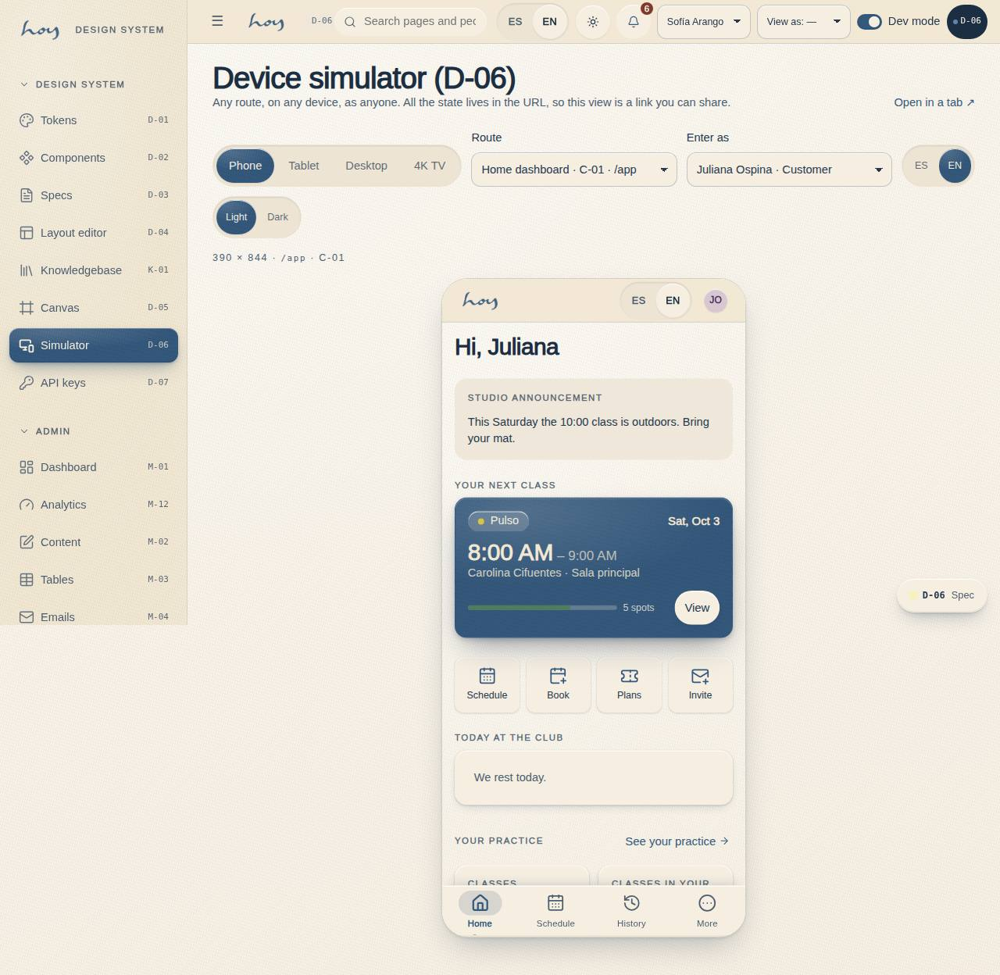

# D-06 — Device simulator

**Route** `/#/dev/simulator` · **Roles** super_admin · **Surface** dev (DesktopShell) · **Spec** `src/modules/dev/specs.ts` → `simulatorSpec` · **Checked at** 360 · 390 · 768 · 1280 · 1920 · 2560 · 3840

## Purpose
Any route, on any device, as anyone. Pick a viewport (phone 390 × 844, tablet 768 × 1024, desktop
1280 × 800, 4K TV 3840 × 2160), a route, a demo person, a language and a theme, and the real page
runs inside it. Every control is written into the URL, so a view is a link you can paste into a
thread.

## Screenshots
| ES · mobile | EN · mobile |
| --- | --- |
|  |  |

| ES · desktop | EN · desktop |
| --- | --- |
|  |  |

## Sections (layout order)
1. **PageHead** — title, lead, and "Abrir en pestaña ↗" (the same frame URL, in a real tab).
2. **Controls** — device `SegmentedControl`, route `<select>` (name · code · path), role `<select>` (the demo people), language and theme.
3. **SizeLine** — `3840 × 2160 · /admin · M-01`, so the viewport being simulated is never a guess.
4. **DeviceFrame** — the page, with device chrome.

## Data
| Table | Read / write | Notes |
| --- | --- | --- |
| `users` | read | the demo person the frame runs as |
| `user_roles` | read | a role without access to the route sees E-05 inside the frame — which is the useful answer |

## Actions (WebMCP)
None declared yet. `hub.openSimulator` (HUB-01) is how an agent gets here.

## Logic and integrations
- Every control writes to the hash query (`route`, `device`, `as`, `lang`, `theme`) with `replace`, and the page reads it back — reload and bookmark keep the view.
- The frame is the real app in a same-origin iframe at the preset's pixel size, scaled to fit by a `ResizeObserver`; the stage never grows past the device, so a phone sits at 1:1 in a wide column.
- `src/app/frameSession.ts` shadows `hoyos.session`, `hoyos.lang` and `hoyos.theme` inside the frame, so simulating a role never changes the tester's own session, and writes from inside the frame are swallowed.
- Dev tooling is off inside the frame (`dev=0`), so the spec chip does not appear in a simulated view.
- Changing any control remounts the frame (React `key`), which is a real navigation rather than a half-updated state.
- Integrations: none.

## States
phone · tablet · desktop · 4K TV · a role without access to the route (the frame shows E-05) · dark ·
English.

## Real vs mock
- **Real**: the page inside the frame is the application, at that viewport, under that session. Not a mock-up and not a screenshot.
- **Mock / pending**: no touch or pointer emulation, no network throttling, no device pixel ratio switch, and no way to capture the frame — those are simulator features we have not needed yet.

## Changelog
- `docs/changelog/0022-hub-home-redesign.md` — first version

---
**Resumen (ES).** Cualquier ruta, en cualquier dispositivo, como cualquier persona. Todo el estado va
en la URL, así que la vista es un enlace que se puede compartir.
