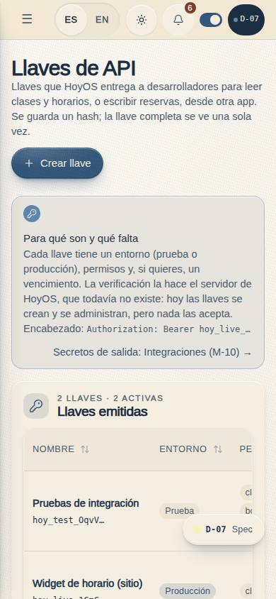
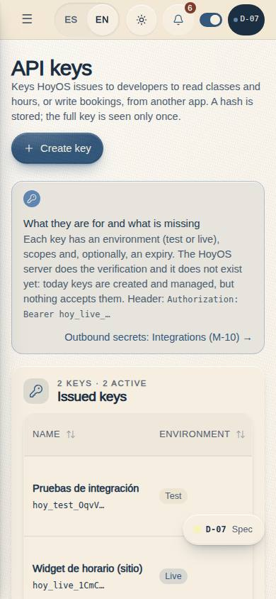
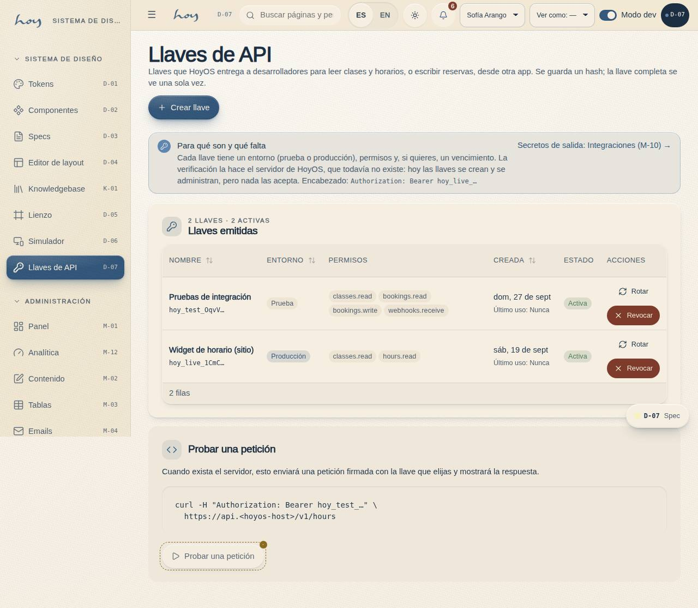
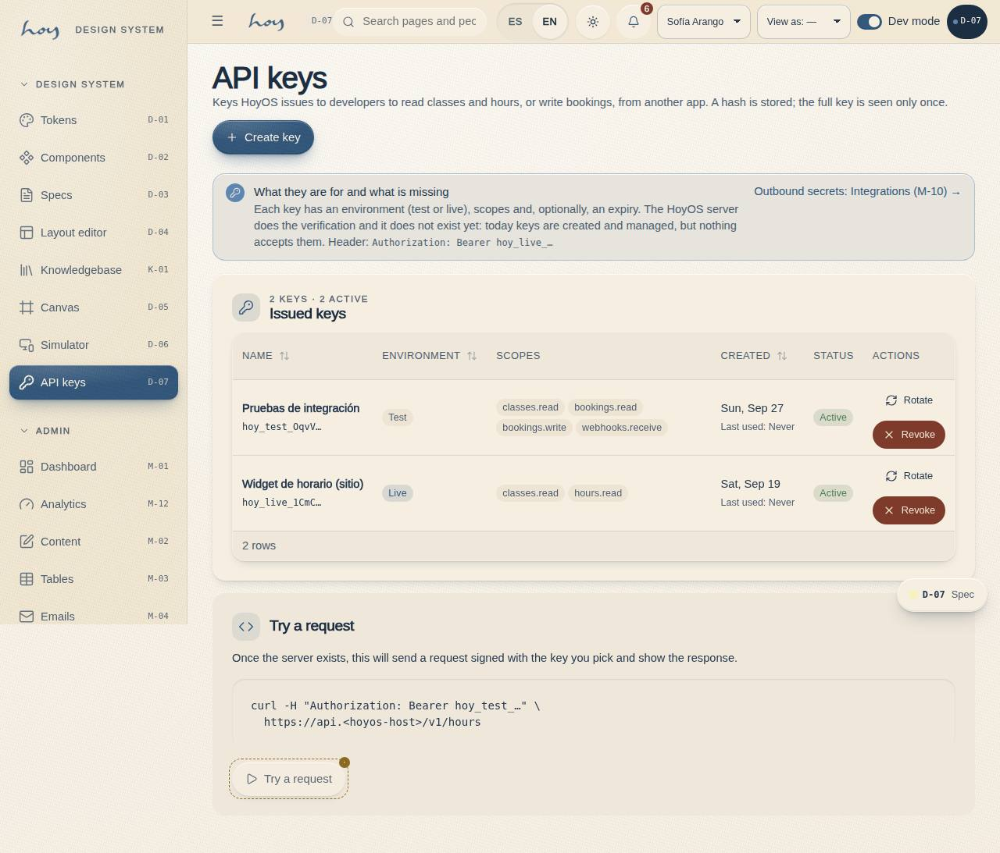

# D-07 — API keys

**Route** `/#/dev/api-keys` · **Roles** super_admin, developer, admin · **Surface** dev · **Spec** `spec.code === 'D-07'` (see `/#/dev/specs`)

## Purpose
The keys HoyOS issues to developers to call its API: create (with environment, scopes and an optional expiry), see once, rotate with a 24-hour grace period and revoke. Only a prefix and the SHA-256 hash are stored; the server will do the verification.

## Screenshots
| ES · mobile | EN · mobile |
| --- | --- |
|  |  |

| ES · desktop | EN · desktop |
| --- | --- |
|  |  |

## Sections (layout order — `useLayout(spec)`)
1. `Intro` — page head with Create key (api_keys.write) or a read-only badge; `Notice`: what keys are for, that the server verifies them (not built), the `Authorization: Bearer hoy_live_…` header, link to M-10 for outbound secrets
2. `Keys` — `Card` + `DataTable`: name + prefix + lineage · environment `Badge` · scope `Badge`s · created / last used · status `Badge` · Rotate / Revoke (two-step)
3. `TryRequest` — a curl example and “Try a request” inside `Placeholder`
- Drawers: Create (name, environment, expiry, scope `Toggle`s) and “Shown once” (raw key in a mono block, Copy, warning)

## Data
| Table | Read / write | Notes |
| --- | --- | --- |
| `api_keys` | read / write | list for api_keys.read; insert on create / rotate, update `expires_at` (rotation) and `revoked_at` (revoke) for api_keys.write; the raw key is never written |
| `audit_log` | write | `api_key.create`, `api_key.rotate`, `api_key.revoke` with the prefix only |

## Logic and integrations
- Format hoy_<live|test>_<24 base62> from crypto.getRandomValues (rejection-sampled); stored: prefix (13 chars) + SHA-256 hex via crypto.subtle. The raw key lives only in component state until the drawer closes.
- Rotate inserts a new key with replaces_id = old id and sets the old key’s expires_at to now + 24 h (unless it already expires sooner). Revoke sets revoked_at; rows are never deleted.
- Status: revoked (revoked_at) · expired (expires_at past) · expiring (within 7 days) · active.
- api_keys.write (super_admin, developer) gates create / rotate / revoke; admin reads the list (api_keys.read). Every write is audited: api_key.create / api_key.rotate / api_key.revoke with the prefix, never the key.
- Verification is a server concern (D-0015): hash the bearer token, match key_hash, check environment, scopes, expiry and revocation, stamp last_used_at. No server exists yet, so “Try a request” is a Placeholder.
- Integrations: HoyOS HTTP API (designed, not built)

## States
- Loading
- Empty
- Seed: two example keys
- Create drawer
- Key shown once
- Rotating (grace 24 h)
- Revoke confirm
- Read-only (admin)

## Real vs mock
- Real: generation (CSPRNG), hashing (Web Crypto), the rows, rotation grace, revocation, the audit entries.
- Mock / pending: nothing verifies a key yet — verification, `last_used_at` stamping and the HTTP API are the server’s job (D-0015).
- Actions (WebMCP): `dev.apiKeys.create`, `dev.apiKeys.rotate`, `dev.apiKeys.revoke` — they answer with the prefix, never the raw key.

## Changelog
- `docs/changelog/0039-hours-google-keys.md` — first version (v0.15.0)

---
**Resumen (ES).** Llaves de API. Las llaves que HoyOS entrega a desarrolladores para llamar su API: crear (con entorno, permisos y vencimiento opcional), ver una sola vez, rotar con 24 horas de gracia y revocar. Solo se guarda un prefijo y el hash SHA-256; la verificación la hará el servidor.
