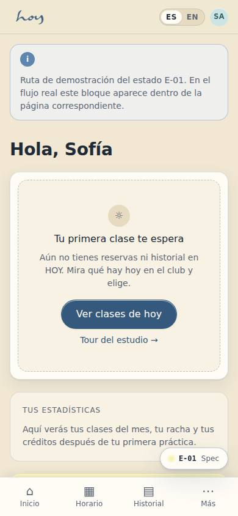
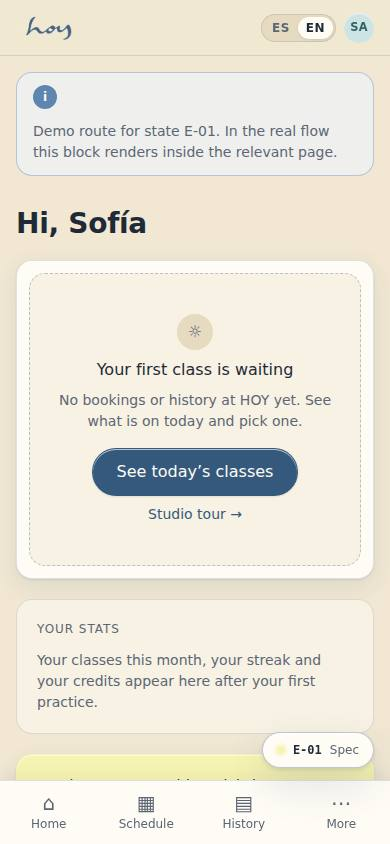
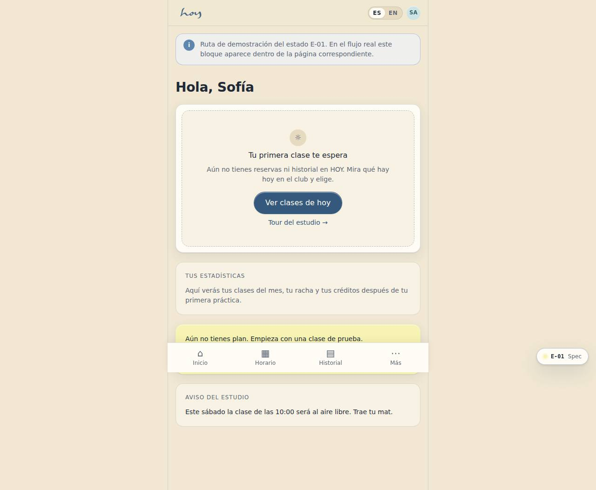
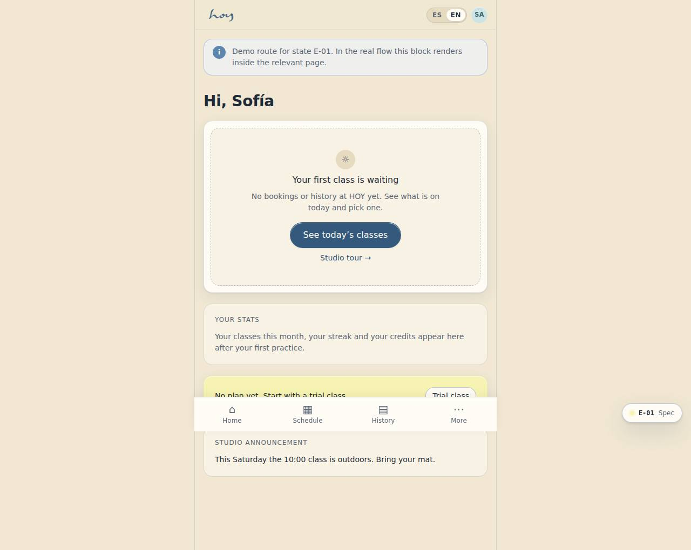

# E-01 — Home · first-time empty state

**Route** `/#/app/state/empty` · **Roles** customer · **Surface** customer · **Spec** `spec.code === 'E-01'` (see `/#/dev/specs`)

## Purpose
The home screen on day one, when there is no booking, no history and no statistics — it has to teach the next step instead of showing empty containers.

## Screenshots
| ES · mobile | EN · mobile |
| --- | --- |
|  |  |

| ES · desktop | EN · desktop |
| --- | --- |
|  |  |

## Sections (layout order — `useLayout(spec)`)
1. `Greeting`
2. `EmptyState (illustration, headline, CTA browse today, tour)`
3. `StatsPlaceholder (explanatory, not zeros)`
4. `AnnouncementCard`

## Data
| Table | Read / write | Notes |
| --- | --- | --- |
| `bookings` | read / write | |
| `memberships` | read / write | |

## Logic and integrations
- Statistics blocks never render as 0 — they render the sentence that explains when they appear.
- The trial-class offer shows only if the student has not used it and Admin → Features → Free trial is on.
- Announcements still render if active; they are studio news, not personal data.
- Once a first booking exists this screen is replaced by C-01 permanently.
- Integrations: none

## States
- Empty (this screen)
- Loading: skeleton rows
- Error: retry with cached announcements

## Real vs mock
- Real: the page renders from the data layer (`useData()` / `useTable`) over the tables above; every write goes through the `DataProvider` so the Supabase provider replaces the mock unchanged.
- Mock / pending: no external integrations; data is the browser-local `MockProvider` seed.
- Note: Demo route /app/state/empty; C-01 shows this block when the person has no bookings at all.

## Changelog
- `docs/changelog/0005-final-integration.md` — screenshots and this page doc (v0.3.0)

---
**Resumen (ES).** Inicio · primera vez (vacío). Estado vacío del inicio para una persona nueva: invita a reservar la primera clase.
