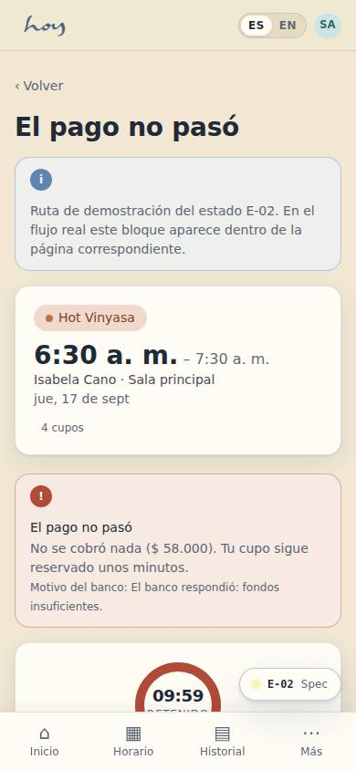
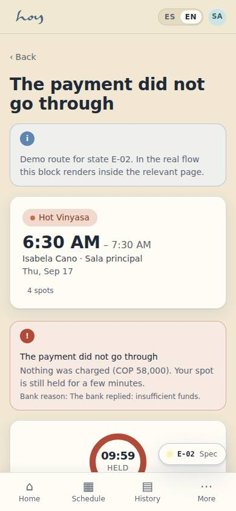
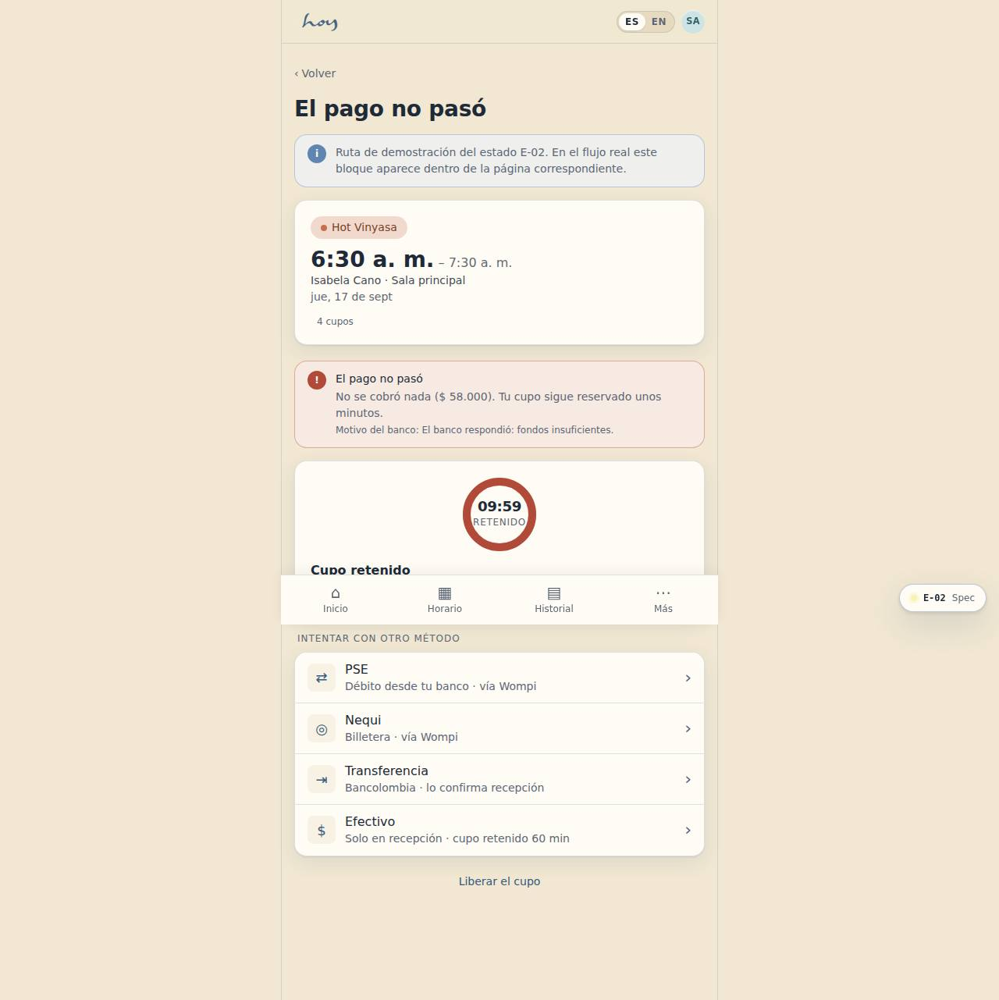
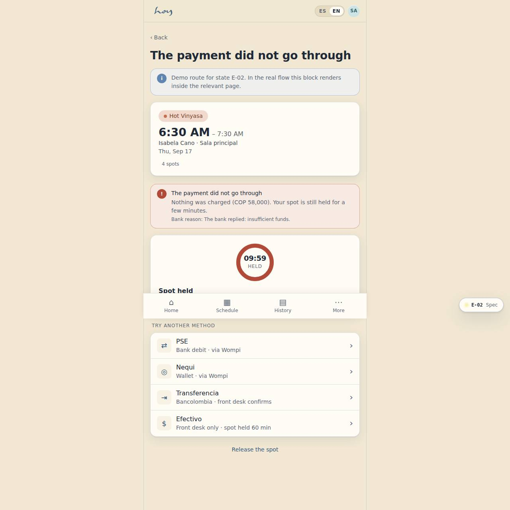

# E-02 — Payment declined

**Route** `/#/app/state/declined` · **Roles** customer, front_desk, finance · **Surface** customer · **Spec** `spec.code === 'E-02'` (see `/#/dev/specs`)

## Purpose
A refusal is the highest-risk moment in the funnel: say what happened, confirm nothing was charged, keep the class reserved, and offer a way through.

## Screenshots
| ES · mobile | EN · mobile |
| --- | --- |
|  |  |

| ES · desktop | EN · desktop |
| --- | --- |
|  |  |

## Sections (layout order — `useLayout(spec)`)
1. `ErrorBanner (title, body, gateway reason)`
2. `HoldCard · countdown`
3. `AlternateMethods`
4. `ReleaseSpotLink`

## Data
| Table | Read / write | Notes |
| --- | --- | --- |
| `payments` | read / write | |
| `class_sessions` | read | |

## Logic and integrations
- Never blame the card; state the gateway reason verbatim where one exists and keep it plain.
- The spot is held 10 minutes from the first attempt; the countdown is visible and honest.
- Three declines on one order switch the primary suggestion to PSE or cash.
- No charge is ever captured on a decline; the order stays pending and the audit trail records every attempt.
- Cash creates a pending order the front desk settles — the same path as C-05.
- Integrations: Wompi

## States
- Declined (this screen)
- Retrying: button spinner, methods locked
- Hold expired: spot released, rebook offered
- Recovered: confirmation sheet

## Real vs mock
- Real: the page renders from the data layer (`useData()` / `useTable`) over the tables above; every write goes through the `DataProvider` so the Supabase provider replaces the mock unchanged.
- Mock / pending: Wompi are simulated or deferred; data is the browser-local `MockProvider` seed.
- Note: Demo route /app/state/declined; the real path is C-04 → Wompi declined (dev mode has a "simulate decline" switch).

## Changelog
- `docs/changelog/0005-final-integration.md` — screenshots and this page doc (v0.3.0)

---
**Resumen (ES).** Pago rechazado. Pago rechazado: explicar, reintentar, cambiar método o pedir ayuda a recepción.
