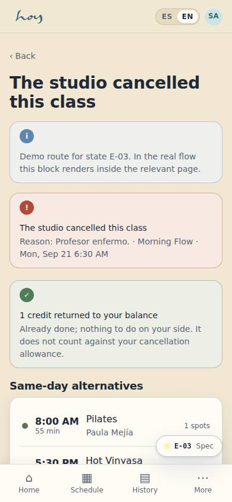
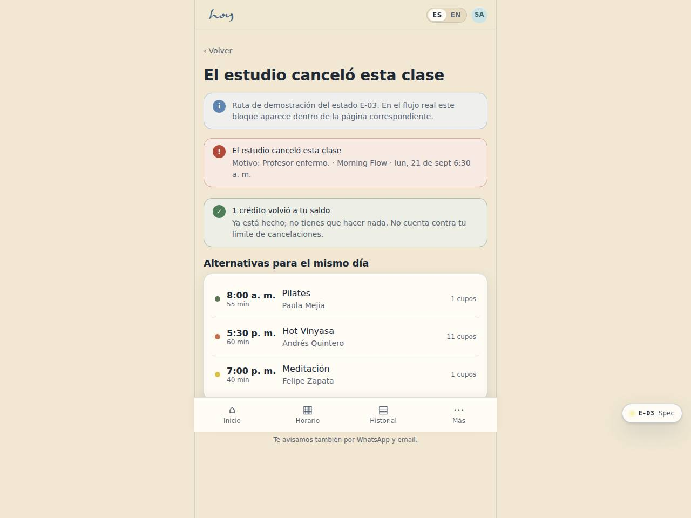
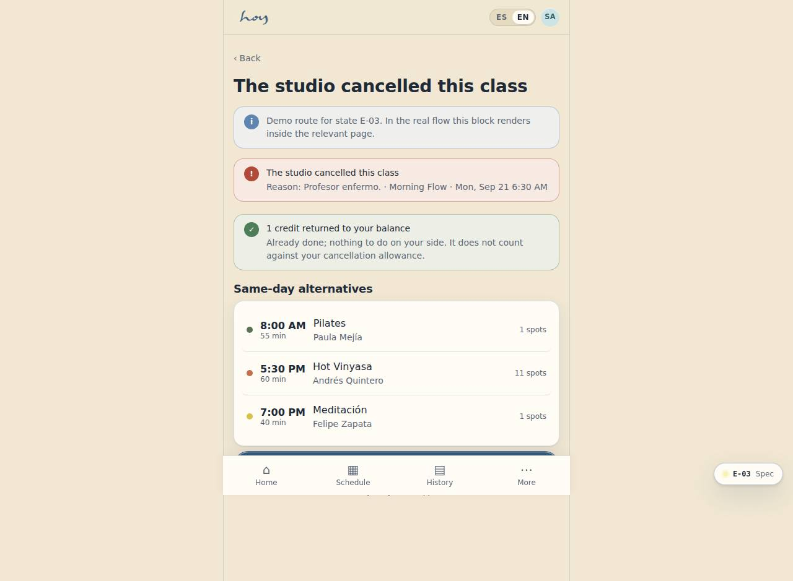

# E-03 — Class cancelled by the studio

**Route** `/#/app/state/cancelled` · **Roles** customer, coordinator, front_desk · **Surface** customer · **Spec** `spec.code === 'E-03'` (see `/#/dev/specs`)

## Purpose
When the studio breaks the promise, the screen should do the recovery work: refund already done, replacement classes ready, no action required to get the credit back.

## Screenshots
| ES · mobile | EN · mobile |
| --- | --- |
|  |  |

| ES · desktop | EN · desktop |
| --- | --- |
|  |  |

## Sections (layout order — `useLayout(spec)`)
1. `CancelBanner (reason)`
2. `RefundConfirmation · 1 credit`
3. `AlternativesList → ClassRow`
4. `PrimaryCTA · book a replacement`
5. `ChannelNote`

## Data
| Table | Read / write | Notes |
| --- | --- | --- |
| `class_sessions` | read | |
| `bookings` | read / write | |
| `credits` | read / write | |
| `modalities` | read | |
| `teachers` | read | |

## Logic and integrations
- The credit returns automatically before the student opens the app — the screen confirms, it does not ask.
- Alternatives are same-day and matched on class_tags, then nearest time.
- A studio cancellation never counts against a cancellation allowance.
- Fires the class-cancelled WhatsApp template immediately, ignoring quiet hours.
- If nothing suitable is available the screen offers the waitlist for the next occurrence.
- Integrations: WhatsApp, Wompi, Email, Supabase Realtime, Push notifications

## States
- Cancelled with alternatives (this screen)
- Cancelled, none available: waitlist offer
- Already rebooked: confirmation
- Past class: read-only

## Real vs mock
- Real: the page renders from the data layer (`useData()` / `useTable`) over the tables above; every write goes through the `DataProvider` so the Supabase provider replaces the mock unchanged.
- Mock / pending: WhatsApp, Wompi, Email, Supabase Realtime, Push notifications are simulated or deferred; data is the browser-local `MockProvider` seed.
- Note: Demo route /app/state/cancelled picks a cancelled session from the seed; C-08 renders the same block when the booked session is cancelled.

## Changelog
- `docs/changelog/0005-final-integration.md` — screenshots and this page doc (v0.3.0)

---
**Resumen (ES).** Clase cancelada por el estudio. El estudio canceló la clase: devolver crédito, ofrecer alternativas y avisar.
