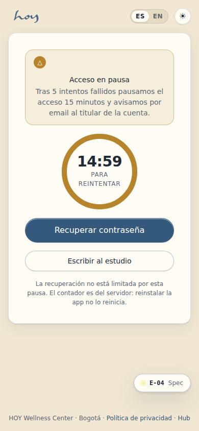
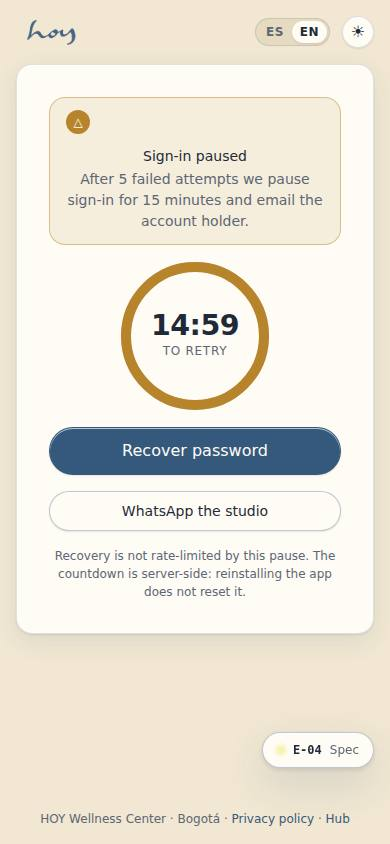
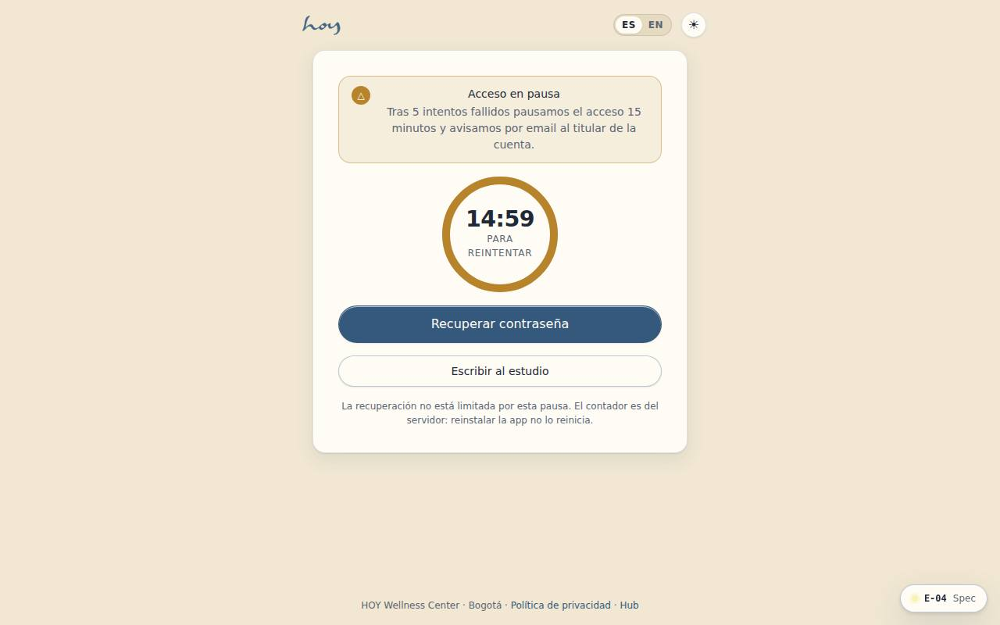
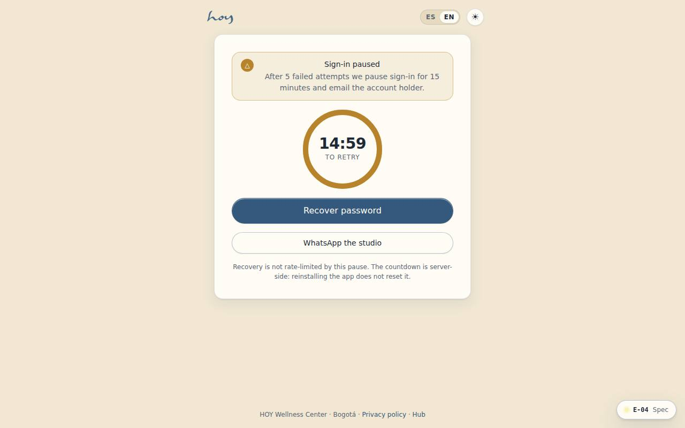

# E-04 — Sign-in locked

**Route** `/#/auth/locked` · **Roles** public · **Surface** public · **Spec** `spec.code === 'E-04'` (see `/#/dev/specs`)

## Purpose
A lockout is a security measure that must not become a dead end: state the pause, count it down, and route to recovery, which is not rate-limited.

## Screenshots
| ES · mobile | EN · mobile |
| --- | --- |
|  |  |

| ES · desktop | EN · desktop |
| --- | --- |
|  |  |

## Sections (layout order — `useLayout(spec)`)
1. `LockNotice (title, reason, countdown)`
2. `PrimaryCTA · recover password → C-21`
3. `SecondaryCTA · WhatsApp the studio`
4. `SecurityNote`

## Data
| Table | Read / write | Notes |
| --- | --- | --- |
| `users` | read / write | |

## Logic and integrations
- Five failed attempts pause sign-in for 15 minutes and send the account holder an email alert.
- Password recovery stays available during a lockout — it uses a different rate limit.
- The countdown is server-authoritative; reinstalling the app does not reset it.
- Never state whether the email exists; the copy is identical for unknown accounts.
- Repeated lockouts within 24h escalate to a staff review flag.
- Integrations: WhatsApp, Email, Supabase Auth

## States
- Locked (this screen)
- Countdown finished: form re-enabled
- Escalated: contact-support copy

## Real vs mock
- Real: the page renders from the data layer (`useData()` / `useTable`) over the tables above; every write goes through the `DataProvider` so the Supabase provider replaces the mock unchanged.
- Mock / pending: WhatsApp, Email, Supabase Auth are simulated or deferred; data is the browser-local `MockProvider` seed.
- Note: Reached from A-02 after 5 failed attempts; the 15-minute countdown is local in the demo.

## Changelog
- `docs/changelog/0005-final-integration.md` — screenshots and this page doc (v0.3.0)

---
**Resumen (ES).** Acceso bloqueado. Acceso bloqueado tras intentos fallidos: espera, OTP o contacto con el estudio.
