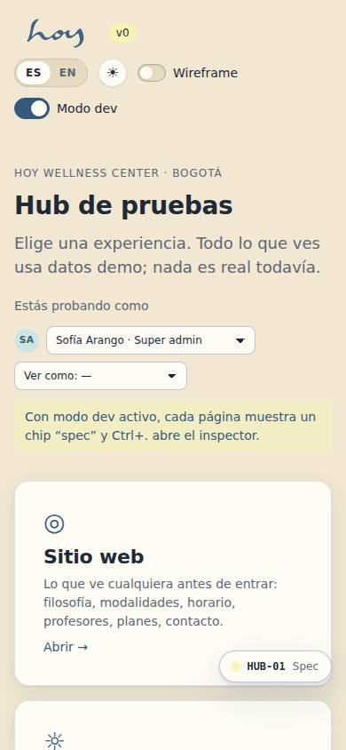
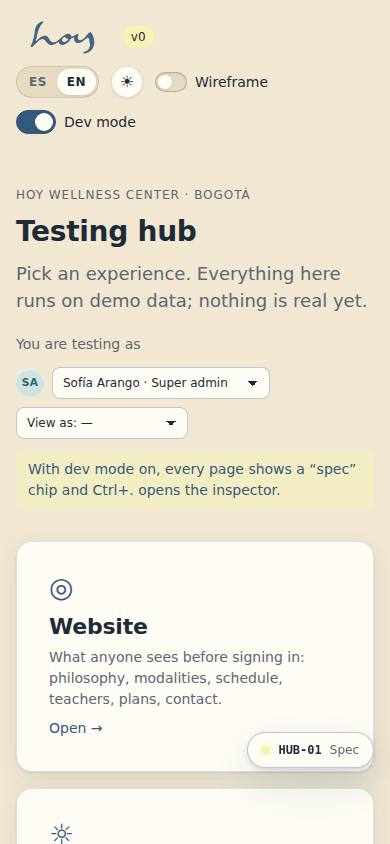
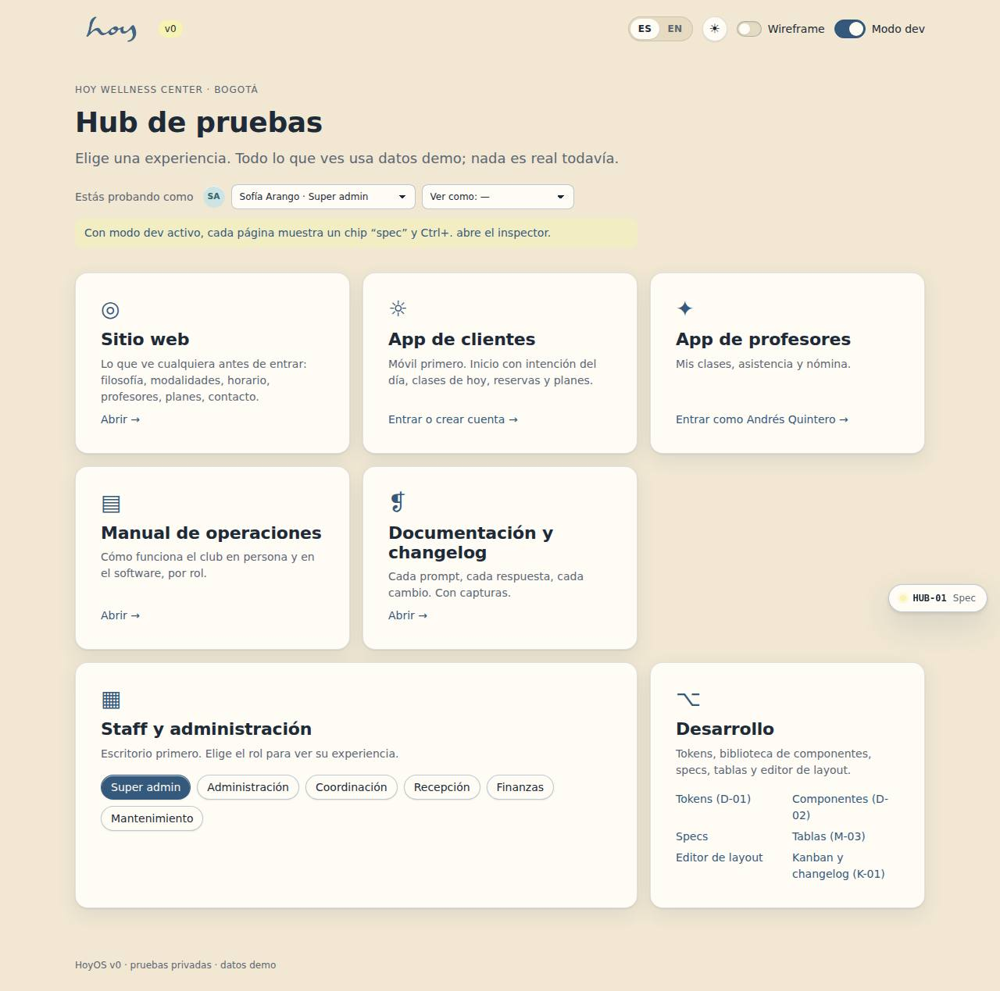
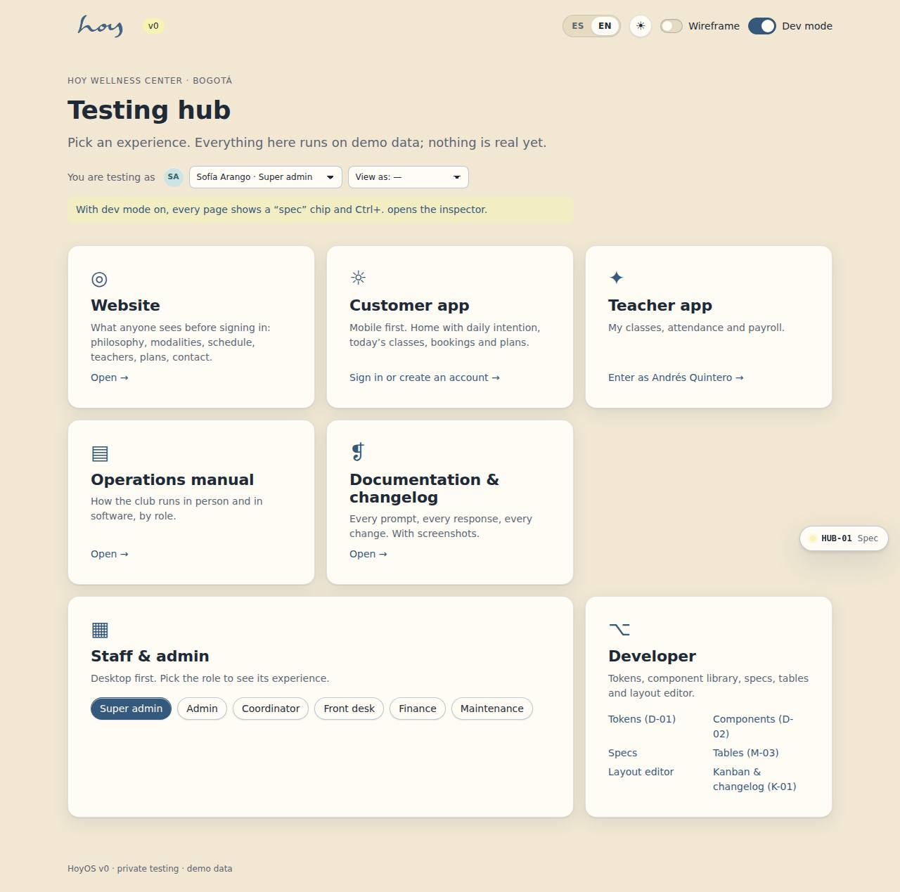
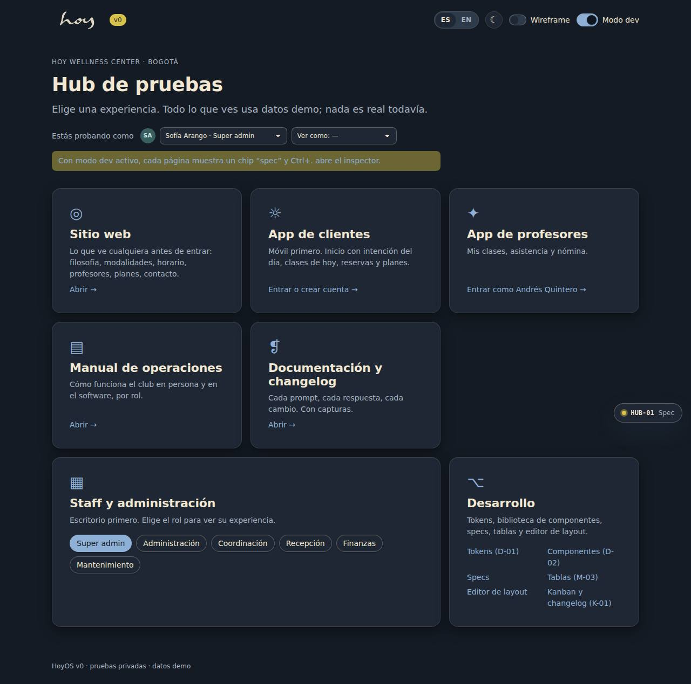
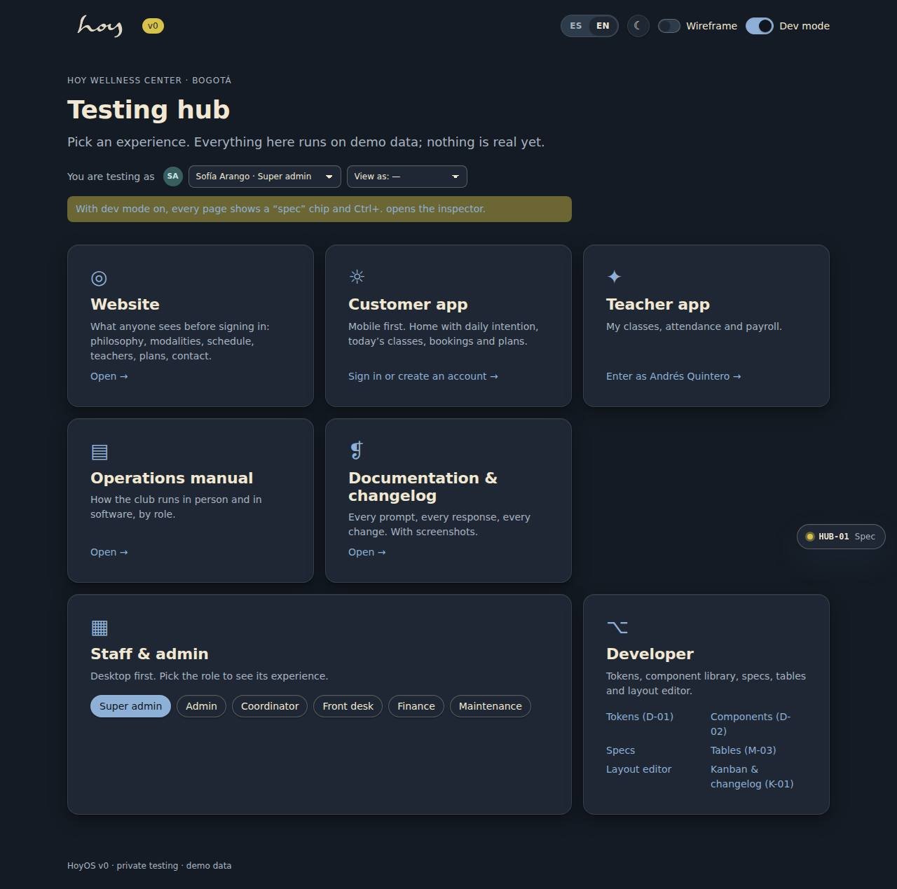

# HUB-01 — Testing hub

**Route** `/#/` · **Roles** super_admin, admin, coordinator, front_desk, finance, teacher, maintenance, customer, public · **Surface** public · **Spec** `spec.code === 'HUB-01'` (see `/#/dev/specs`)

## Purpose
First screen for testers: pick an experience (web, customer, teacher, staff by role, manual, docs, dev) and global controls (language, theme, dev mode).

## Screenshots
| ES · mobile | EN · mobile |
| --- | --- |
|  |  |

| ES · desktop | EN · desktop |
| --- | --- |
|  |  |

| ES · dark | EN · dark |
| --- | --- |
|  |  |

## Sections (layout order — `useLayout(spec)`)
1. `HubHeader (wordmark, LangToggle, theme, dev toggle)`
2. `SessionStrip (RoleSwitcher)`
3. `ExperienceGrid (7 cards)`
4. `StaffRolePicker`
5. `DeveloperLinks`
6. `Footer`

## Data
| Table | Read / write | Notes |
| --- | --- | --- |
| `users` | read / write | |
| `user_roles` | read | |
| `feature_flags` | read | |

## Logic and integrations
- Picking a staff role calls switchUser(role) before navigating.
- Dev toggle only renders for super_admin.
- Cards link to each surface home; the customer card also resets viewAs.
- Integrations: none

## States
- default
- dev mode on
- viewing as another role

## Real vs mock
- Real: the page renders from the data layer (`useData()` / `useTable`) over the tables above; every write goes through the `DataProvider` so the Supabase provider replaces the mock unchanged.
- Mock / pending: no external integrations; data is the browser-local `MockProvider` seed.
- Note: Not part of the canvas; added for private testing. Replace with A-01 splash + real auth later.

## Changelog
- `docs/changelog/0005-final-integration.md` — screenshots and this page doc (v0.3.0)

---
**Resumen (ES).** Hub de pruebas. Primera pantalla para el equipo de pruebas: elegir experiencia (web, cliente, profesor, staff por rol, manual, docs, dev) y controles globales (idioma, tema, modo dev).
