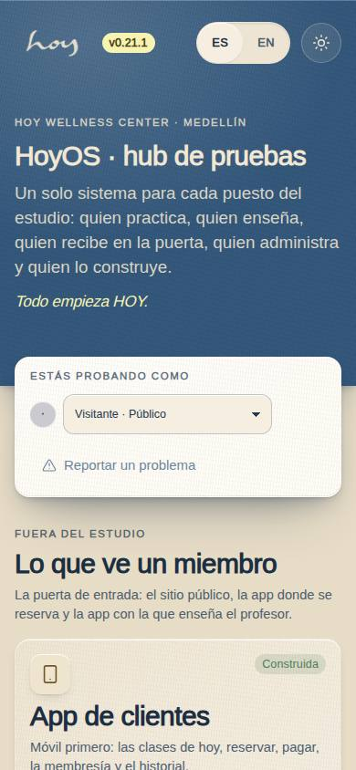
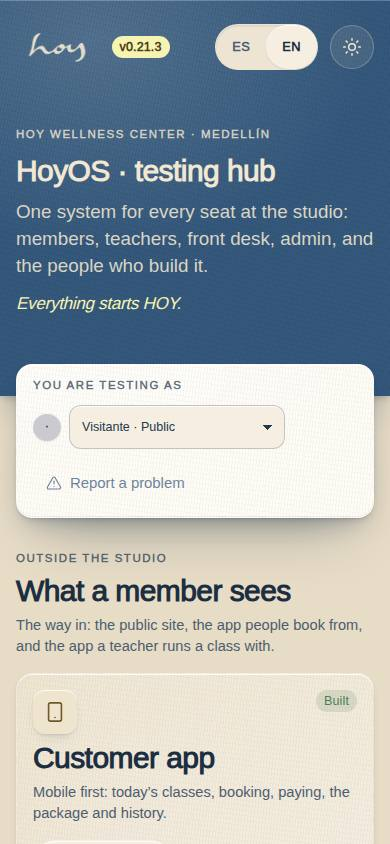
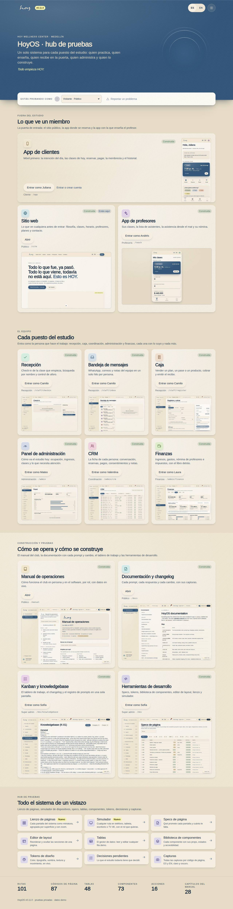
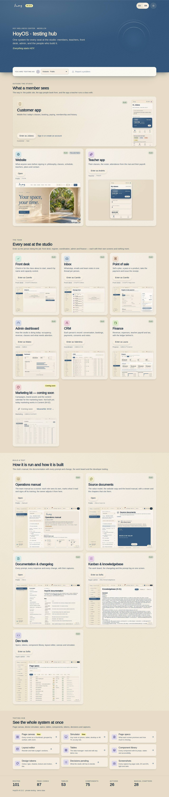
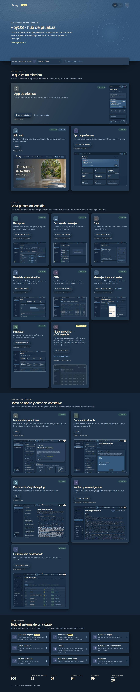
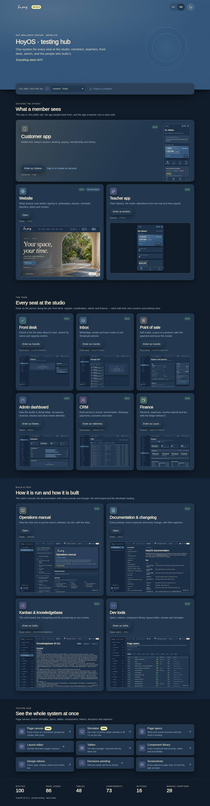

# HUB-01 — Testing hub

**Route** `/#/` · **Roles** everyone (including the visitor) · **Surface** public · **Spec** `src/modules/hub/specs.ts` → `hubSpec` · **Checked at** 360 · 390 · 768 · 1280 · 1920 · 2560 · 3840

## Purpose
The first screen: it shows the whole system at once and lets a tester enter any seat at the studio as
that seat's demo user. Every card carries the real screen behind it — a committed capture, and on a
real browser the running page — plus its status and its route. Below the surfaces, the system in
numbers and the testing hub: canvas, simulator, specs, tables, components, tokens, decisions,
captures.

## Screenshots
| ES · mobile | EN · mobile |
| --- | --- |
|  |  |

| ES · desktop | EN · desktop |
| --- | --- |
|  |  |

| ES · dark | EN · dark |
| --- | --- |
|  |  |

Before the redesign, for comparison (eight captures, one per after-shot above):
[es-390-before](../screenshots/HUB-01/es-390-before.jpg) ·
[en-390-before](../screenshots/HUB-01/en-390-before.jpg) ·
[es-1280-before](../screenshots/HUB-01/es-1280-before.jpg) ·
[en-1280-before](../screenshots/HUB-01/en-1280-before.jpg) ·
[es-390-dark-before](../screenshots/HUB-01/es-390-dark-before.jpg) ·
[en-390-dark-before](../screenshots/HUB-01/en-390-dark-before.jpg) ·
[es-1280-dark-before](../screenshots/HUB-01/es-1280-dark-before.jpg) ·
[en-1280-dark-before](../screenshots/HUB-01/en-1280-dark-before.jpg).

The page's own thumbnails (what the canvas shows for it):
`../screenshots/HUB-01/thumb-es-desktop.jpg`, `thumb-en-desktop.jpg`, and the `-dark` pair.

[screenshot: HUB-01 — the live-frame state: the first six cards running the real page. A capture pass cannot photograph it (`navigator.webdriver` switches live frames off); open the hub in a normal browser.]

## Sections (layout order)
1. **BrandBand** — deep-blue band: wordmark, version `Badge` from `package.json`, `LangToggle`, a 44 × 44 theme button, and for a super admin the wireframe and dev-mode `Toggle`s. Cream ink, cream focus ring.
2. **Hero** — eyebrow `tenant.legalName · tenant.city`, `h1`, the one-sentence lead, the brand tagline (`src/tenant/brand.ts` → `taglines.start`), and `BreathingRings` under a radial mask (hidden under 900 px).
3. **SessionBar** — floats over the band edge: `RoleSwitcher`, a `Placeholder`-wrapped "Reportar un problema", and the `Ctrl + .` hint in dev mode.
4. **Band A · Fuera del estudio** — Customer app (featured, full width, phone preview, secondary "Entrar o crear cuenta" → `/auth/sign-in`), Website, Teacher app.
5. **Band B · El equipo** — Recepción, Bandeja de mensajes, Caja, Panel de administración, CRM, Finanzas.
6. **Band C · Construcción y pruebas** (tinted lane) — Manual de operaciones, Documentación y changelog, Kanban y knowledgebase, Herramientas de desarrollo.
7. **ToolsRow · Hub de pruebas** — nine compact tool cards: lienzo, simulador, specs, editor de layout, tablas, componentes, tokens, decisiones, capturas.
8. **StatStrip** — a `<dl>`: routes, page codes, tables, components, actions, manual chapters.
9. **Footer** — `HoyOS v{version} · pruebas privadas · datos demo` (v0.11.0 at 0027).

Each surface card: hue medallion + `Icon`, a built / stub / planned `Badge`, an "Estás aquí" badge
when the route is the current role's home, title, one-line body, a `PagePreview`, one outline
`Button` ("Entrar como {name}" or "Abrir") and a `Role · /path` meta line that gains the page code in
dev mode.

## Data
| Table | Read / write | Notes |
| --- | --- | --- |
| `users` | read / write | through `switchUser()`; a card enters as its role's demo user |
| `user_roles` | read | the effective role decides the "Estás aquí" badge |
| `feature_flags` | read | dev mode and the wireframe skin |
| `page_layouts` | read | the layout editor links from the inspector |

Counts in the stat strip do not come from a table: routes and codes from `getRoutes()`, tables from
`tableRegistry`, components from the build-time `__COMPONENT_COUNT__`, actions from `listActions()`,
manual chapters from the ops-manual glob (`src/app/counts.ts`).

## Actions (WebMCP)
| id | Intent (ES) | Params | Permission |
| --- | --- | --- | --- |
| `hub.enterAs` | Entra a {surface} como su usuario demo | `surface` (13 keys) | — |
| `hub.openCanvas` | Muéstrame todas las páginas en el lienzo | — | `dev.tools` |
| `hub.openSimulator` | Abre el simulador de dispositivos | — | `dev.tools` |
| `hub.openTool` | Abre {tool} | `tool` (9 keys) | — |
| `hub.toggleDevMode` | Enciende o apaga el modo dev | — | `dev.tools` |
| `hub.setLang` | Pon la interfaz en {lang} | `lang` (`es` or `en`) | — |
| `hub.map` | Dame el mapa del hub | — | — |
| `hub.toggleTheme` | Cambia entre claro y oscuro | — | — |
| `hub.toggleWireframe` | Muestra el sistema en wireframe | — | `dev.tools` |

Declared in `hubSpec.actions`, mounted by `useActions()`, listed at `window.__hoyos.actions` and run
with `window.__hoyos.run(id, params)`. See `docs/reference/surfaces.md`.

`hub.map` (0027) loads the published hub map and answers with its URL and counts, e.g.
`hub map https://imagine-os.github.io/hoy/hub-map.json · hoy.hub-map/1 v0.11.1 · 9 roles, 13 experiences, 87 pages, 9 tools`;
the parsed map is then at `window.__hoyos.hubMap.data`.

## The hub map (data module)
Since 0027 the bands, the cards and the tools row are not written in `HubPage.tsx`: they come from
`src/hub/hubMap.data.ts` (`HUB_EXPERIENCES`, `HUB_TOOL_LIST`, `HUB_ROLES`, `HOY_PRODUCT`), a pure data module
that `scripts/gen-hub-map.mjs` also publishes, joined with the route registry, as `public/hub-map.json`
(schema `hoy.hub-map/1`, [`docs/reference/hub-map.md`](../reference/hub-map.md)). The card and tool labels and
bodies, the "Entrar o crear cuenta" link and the hero lead (`hub.card.*`, `hub.tool.*`, `hub.lead`) are derived
from it in `src/modules/hub/strings.ts`. Only the icons and the preview shapes (`CARD_UI`, `TOOL_UI`) stay in the
page. Changing a card is one edit in the data module: the hub, the published map and every host that reads it
(aluzina, between-gigs) move together. `src/hub/hubMap.check.ts` checks the module's copied role facts against
`src/auth/` (dev warning; the generator fails the build).

## Logic and integrations
- A card enters as the demo user of its role: `switchUser(role)` then `navigate(to)` — the tester never has to pick a person first.
- The built / stub badge is read from `routeManifest()` (`src/app/manifest.ts`), not typed into the card.
- A preview layers a capture (`docs/screenshots/<code>/thumb-*`) over a hue-tinted idle tile; a missing capture hides the image instead of breaking it.
- A preview becomes the running page only when it is in view (`IntersectionObserver`, 160 px), inside a budget of six frames in document order, and never when the hub is framed, `live=0` is in the URL, or `navigator.webdriver` is true.
- A framed preview runs under its own session (`src/app/frameSession.ts`), so the tester's own session is untouched.
- A tool whose route the current role cannot open still renders and lands on `/no-access` (E-05), as the guard does everywhere else.
- Type, medallions, padding and the grid width scale with `--ui`: 1 · 1.125 (≥ 1920) · 1.375 (≥ 2560) · 1.75 (≥ 3840).
- Integrations: none.

## States
default (visitor) · signed in as a member · super admin · dev mode · wireframe skin · dark theme ·
live previews on · live previews off (`live=0`) · automation: live previews off (`navigator.webdriver`) ·
framed (inside a preview or the simulator) · no captures yet (idle tiles) · English.

## Real vs mock
- **Real**: the route list, the page codes, the status badges, the counts and the captures — all read from the running system, so the hub cannot drift from it. Entering a surface really switches the session.
- **Mock / pending**: the data behind every surface is the browser-local `MockProvider` seed. "Reportar un problema" is a `Placeholder` — in-product annotations are on the backlog.

## Changelog
- `docs/changelog/0001-initial-build.md` — first version (card grid, staff role picker, developer links)
- `docs/changelog/0022-hub-home-redesign.md` — rebuilt around real previews ([before](../screenshots/HUB-01/es-1280-before.jpg) → [after](../screenshots/HUB-01/es-1280.jpg))
- `docs/changelog/0027-hub-map.md` — cards and tools read from `src/hub/hubMap.data.ts` (same rendering), the `hub.map` action, captures at v0.11.0

---
**Resumen (ES).** La puerta de entrada. Cada tarjeta muestra la pantalla real que abre — la captura y,
en un navegador normal, la página funcionando — y entra como la persona demo de ese puesto. Abajo, el
sistema en números y las herramientas de prueba.
