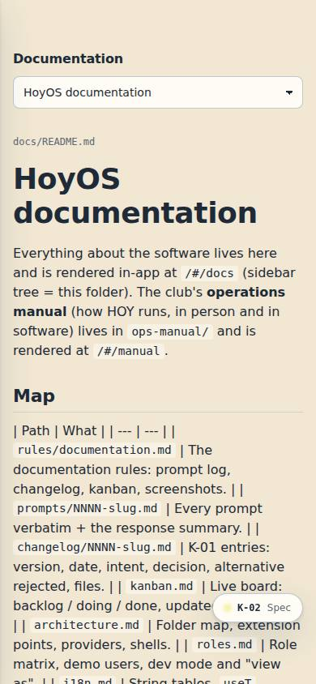
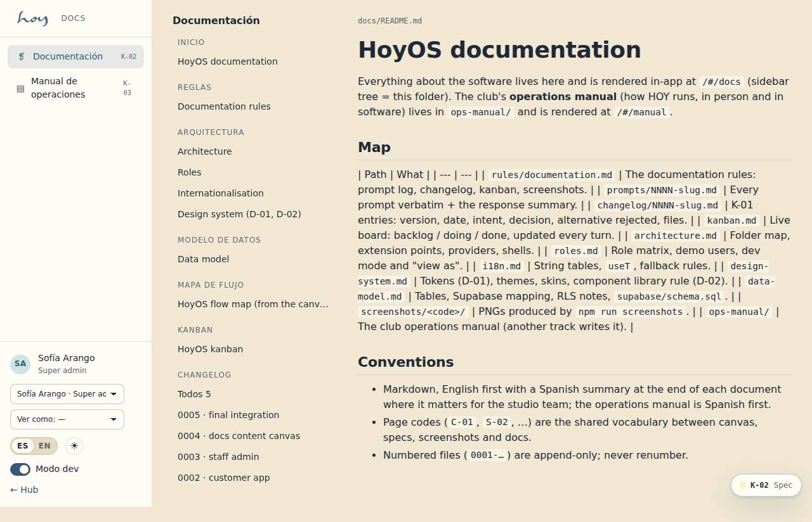
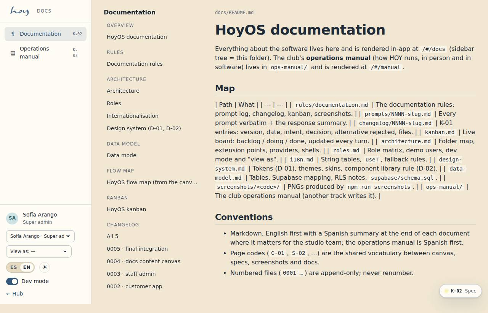

# K-02 — Documentation

**Route** `/#/docs` · **Roles** super_admin, admin, coordinator, front_desk, finance, teacher, maintenance, customer, public · **Surface** docs · **Spec** `spec.code === 'K-02'` (see `/#/dev/specs`)

## Purpose
In-app viewer for docs/**: rules, architecture, prompts, changelog, kanban, flow map, data model, screenshots. The .md files are the source; no CMS.

## Screenshots
| ES · mobile | EN · mobile |
| --- | --- |
|  |  |

| ES · desktop | EN · desktop |
| --- | --- |
|  |  |

## Sections (layout order — `useLayout(spec)`)
1. `DocsSidebar (grouped: Overview, Rules, Architecture, Data model, Flow map, Kanban, Changelog, Prompts, Pages, Screenshots, Manual)`
2. `MarkdownViewer`
3. `KanbanBoard (lanes × columns)`
4. `ChangelogList / ChangelogEntry (newest first, header as definition grid)`
5. `PromptEntry (prompt | response side by side)`
6. `ScreenshotGallery (docs/screenshots/<code>/)`

## Data
| Table | Read / write | Notes |
| --- | --- | --- |
| `docs_entries` | read | |

## Logic and integrations
- import.meta.glob loads every docs/**/*.md as raw text and every image as a bundled URL at build time (works under base "./").
- Relative images resolve to bundled URLs; .md links become routes; manual chapters route to /manual/<slug>.
- Kanban: `## Backlog|Doing|Done|Blocked` are columns; any other `##` is a lane whose `###` are its columns.
- Changelog and prompt lists sort by file number descending (newest first).
- Prompt entries split at `## Response` into two columns.
- Integrations: none

## States
- default
- doc not found
- index pages (changelog, prompts, screenshots)
- screenshots empty

## Real vs mock
- Real: the page renders from the data layer (`useData()` / `useTable`) over the tables above; every write goes through the `DataProvider` so the Supabase provider replaces the mock unchanged.
- Mock / pending: no external integrations; data is the browser-local `MockProvider` seed.

## Changelog
- `docs/changelog/0005-final-integration.md` — screenshots and this page doc (v0.3.0)

---
**Resumen (ES).** Documentación. Visor en la app de docs/**: reglas, arquitectura, prompts, changelog, kanban, mapa de flujo, modelo de datos, capturas. Los .md son la fuente; no hay CMS.
