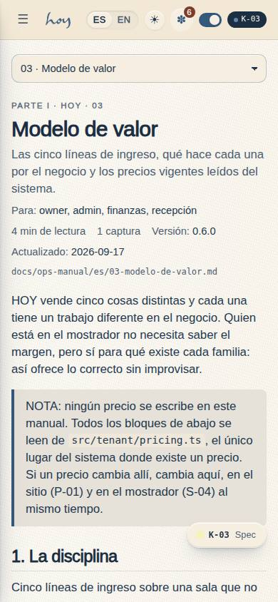
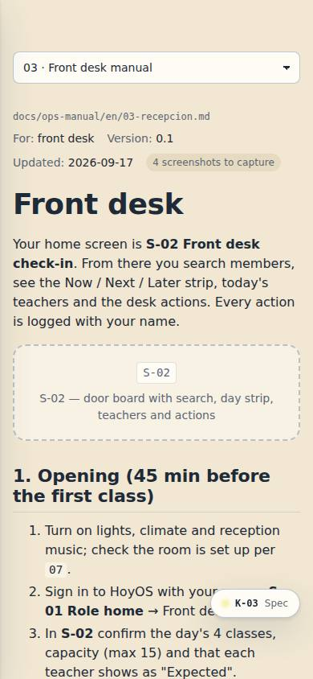
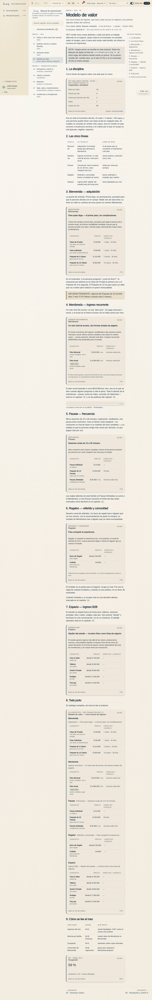
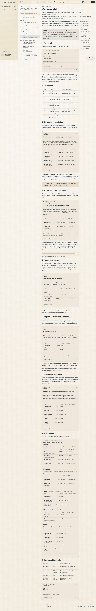
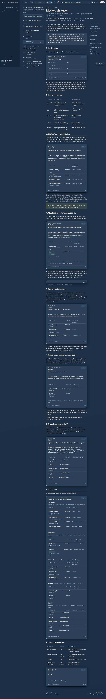
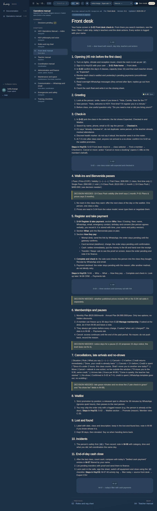

# K-03 — Operations manual

**Route** `/#/manual` · `/#/manual/:chapter` · **Roles** super_admin, admin, coordinator, front_desk, finance, teacher, maintenance, customer, public · **Surface** docs · **Spec** `spec.code === 'K-03'` (see `/#/dev/specs`)

## Purpose
How the club runs in person and in software, in seven parts — who we are, daily operations, customers and plans, money, content and brand, legal and policies, the system. Same for everyone who looks; Spanish first, English as a mirror.

Since 0.6.0 the manual is **visual and live**. Visual: 61 real captures per language are embedded as
figures (framed, captioned, chipped with the page code and clickable through to the screen), so a
procedure shows the screen it talks about. Live: a number the system owns is never typed into a
chapter — prices, studio facts, the M-08 policy values, the 38-table schema, the role matrix, the
route manifest and counts from the data layer are written as `{{directive}}` lines and rendered by
`LiveBlock`, each with the bilingual "Datos en vivo del sistema · Live from the system" caption. The
manual therefore cannot drift from the product: editing a price in `src/tenant/pricing.ts` or a
cancellation window in M-08 changes the chapter.

The home page is the cover (wordmark, title, "La vida es HOY.", version, last updated, chapter /
reading / figure / decision counts), a search box over title, summary, role and body, a "start here by
role" row (recepción · maestros · admin · finanzas, three chapters each) and a part-by-part grid of
chapter cards whose reading time, figure count, decision count and pending-capture count are all
derived from the markdown. A chapter page adds a part eyebrow, a role chip and a sticky in-page
outline built from its `##` headings.

## Screenshots
| ES · mobile | EN · mobile |
| --- | --- |
|  |  |

| ES · desktop | EN · desktop |
| --- | --- |
|  |  |

| ES · dark | EN · dark |
| --- | --- |
|  |  |

## Sections (layout order — `useLayout(spec)`)
1. `ManualCover (wordmark, title, tagline, version + updated, chapter/reading/figure counts, decisions badge)`
2. `ManualSearch (filters chapters by title, summary, role and body)`
3. `StartHere (three chapters per role: recepción, maestros, admin, finanzas)`
4. `PartGrid (ChapterCard per chapter: number, title, summary, role chips, reading time, figures, decisions)`
5. `ChapterSidebar (parts and their chapters, decisions link, search, print)`
6. `ChapterHead (part eyebrow, title, summary, role, reading time, version, updated)`
7. `MarkdownViewer (callouts, Figure captures, LiveBlock directives, screenshot placeholders)`
8. `Toc (sticky in-page outline from the ## headings, desktop)`
9. `PrevNext`

## Data
| Table | Read / write | Notes |
| --- | --- | --- |
| `docs_entries` | read | nominal; the chapters themselves are markdown on disk |
| `tenants` | read | the M-08 settings behind `{{policy}}` (via `usePolicy()`) |
| `profiles`, `memberships`, `class_sessions`, `teachers`, `bookings` | read | the counts behind `{{stats}}` and `{{kpi:…}}` |

## Logic and integrations
- Chapters are docs/ops-manual/<lang>/<NN-slug>.md loaded with import.meta.glob at build time; the slug is shared across languages.
- Follows the app language: ES is the source; a missing EN chapter falls back to ES with a notice.
- `> DECISIÓN PENDIENTE:` / `> DECISION NEEDED:` blockquotes render as highlighted callouts and feed K-04.
- `[screenshot: CODE — caption]` lines render as dashed placeholder boxes until a real capture replaces them. Two remain per language (the teacher payroll sub-page has no capture of its own).
- `` renders as a `Figure`: framed capture, code chip and a link to the live screen.
- A `{{directive}}` line, or a fenced ```live block holding `kind:arg`, renders as a `LiveBlock`: `pricing[:family]`, `tenant:hours|contact|capacity`, `policy[:field]`, `tables`, `table:<name>`, `roles`, `routes:<surface>`, `stats`, `kpi:<name>`. An unknown directive or argument explains itself and lists what exists.
- Front matter carries `part` (I…VII) and `summary`; reading time, figures, decisions and placeholders are derived from the body, never written down.
- Slugs retired by the 0.6.0 re-categorisation resolve through `LEGACY_SLUGS`, so old links and the screenshot tooling's `:chapter` param keep working.
- Print: sidebar and shell chrome hidden; callouts and placeholders never split across pages.
- Integrations: none

## States
- home (cover + part grid)
- chapter
- search results
- chapter not found
- untranslated (ES fallback)
- print

## Real vs mock
- Real: the page renders from the data layer (`useData()` / `useTable`) over the tables above; every write goes through the `DataProvider` so the Supabase provider replaces the mock unchanged.
- Mock / pending: no external integrations; data is the browser-local `MockProvider` seed.
- Real: every number in the manual that the system owns is read at render time — prices from `src/tenant/pricing.ts`, studio facts from `src/tenant/tenant.ts`, policy values from M-08 through `usePolicy()`, the schema from `tableRegistry`, the roles from `src/auth/roles.ts`, the routes from the module registry, and the counts from `useTable`. Nothing is duplicated into prose.
- Mock / pending: the captures are files on disk, so a figure is as fresh as the last `npm run screenshots` pass; `docs_entries` is still unused.
- Note: the chapters are markdown on disk, not data — adding, renaming or renumbering one needs no code change beyond a `LEGACY_SLUGS` entry.

## Changelog
- `docs/changelog/0005-final-integration.md` — screenshots and this page doc (v0.3.0)
- `docs/changelog/0013-ops-manual-visual-live.md` — 28 chapters in seven parts, real figures, live-data directives, the cover and the in-page outline (v0.6.0)

---
**Resumen (ES).** Manual de operaciones. Cómo funciona el club en persona y en el software, por rol. Igual para todos los que lo miran; español primero, inglés como espejo.
