# K-03 — Operations manual

**Route** `/#/manual` · `/#/manual/:chapter` · **Roles** super_admin, admin, coordinator, front_desk, finance, teacher, maintenance, customer, public · **Surface** docs · **Spec** `spec.code === 'K-03'` (see `/#/dev/specs`)

## Purpose
How the club runs in person and in software, in seven parts — who we are, daily operations, customers and plans, money, content and brand, legal and policies, the system. Same for everyone who looks; Spanish first, English as a mirror.

Since 0.6.0 the manual is **visual and live**. Visual: 61 real captures per language are embedded as
figures (framed, captioned, chipped with the page code and clickable through to the screen), so a
procedure shows the screen it talks about. Live: a number the system owns is never typed into a
chapter — prices, studio facts, the M-08 policy values, the 38-table schema, the role matrix, the
route manifest and counts from the data layer are written as `{{directive}}` lines and rendered by
`LiveBlock`, each with the bilingual "Datos en vivo del sistema · Live from the system" caption. The
manual therefore cannot drift from the product: editing a price in `src/tenant/pricing.ts` or a
cancellation window in M-08 changes the chapter.

The home page is the cover (wordmark, title, "La vida es HOY.", version, last updated, chapter /
reading / figure / decision counts), a search box over title, summary, role and body, a "start here by
role" row (recepción · maestros · admin · finanzas, three chapters each) and a part-by-part grid of
chapter cards whose reading time, figure count, decision count and pending-capture count are all
derived from the markdown. A chapter page adds a part eyebrow, a role chip and a sticky in-page
outline built from its `##` headings.

## 0031 — the manual as a staff LMS
Justin asked for a manual that is less technical, that each staff member reads as their own filtered version (like
an LMS), that the owner and operations manager can adjust, and that embeds the three source documents. What the
product side does (the chapter rewrite is a parallel content pass, 0032):

- **Lens.** "Ver el manual como… / View the manual as…" (sidebar and cover): the signed-in role by default, any team
  role or "Todo el manual", kept in the hash query as `?as=<role>` — the hub map's embed key, so a framed manual opened
  as a teacher is already the teacher's. Audience is data (`src/modules/ops-manual/audience.ts`, the 00-index §4
  matrix + marketing + developer).
- **Tu manual.** With a lens the cover shows tiles (required read as a `ProgressRing`, recommended, training, decisions,
  open requests, source documents), then *Empieza por aquí*, *Obligatorio* and *Recomendado*; the part grid dims the
  chapters that do not apply (still openable) and marks the ones read. A chapter shows "Obligatorio / Recomendado /
  No aplica para <rol>" and a 44 px **Marcar como leído** (`manual_progress`).
- **Training.** `{{training:<role>}}` renders Día 1 / Semana 1 / Mes 1 from `training.ts` (chapter 09 verbatim) with a
  checkbox per item (`manual_training`); coordination and up pick the person and **Firmar etapa**. The **Equipo** view
  on the home (coordination and up) lists each person's required-read % and training stage.
- **Editing.** A section with `{{editable:owner}}` / `{{editable:coordinator}}` gets an "Ajustable por…" tag and, for that
  level and up, **Editar** (the M-02a `MarkdownEditor` with the manual's own preview); the edit is a `manual_overrides`
  row shown in place ("Editado por … · Ver original"), with history, suggestions and **Restaurar original**.
  `{{studio:<key>}}` is an inline-editable text policy (`studio_policies`); M-08 policies point to Settings. Every
  chapter ends with **Pedir un cambio**; agents use `manual.suggestEdit` / `manual.listRequests`. "Reescribir con IA" is
  a Placeholder.
- **Screen boxes, scoped passages, figures.** `> EN HOYOS:` boxes, `{{for:…}}` … `{{/for}}` passages ("Solo para …" when
  the lens does not match), and every figure shows its capture date with "puede estar desactualizada" when the page
  changed later (`src/app/captureDates.ts`).
- **Icons.** One icon per part and chapter (`chapterIcons.ts`) in the sidebar, cards, paths, tiles and heads.

| ES · cover as the teacher (Andrés) · desktop | EN · cover as the teacher · desktop |
| --- | --- |
| 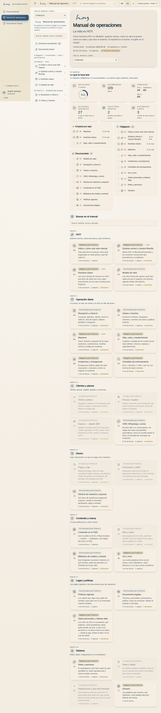 | 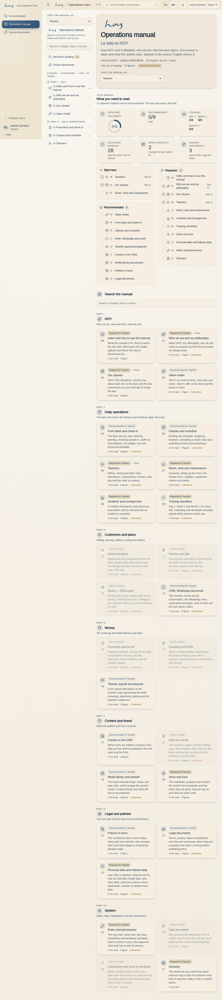 |

| ES · cover as the owner (Mateo, with Equipo) · desktop | EN · cover as the owner · desktop |
| --- | --- |
| 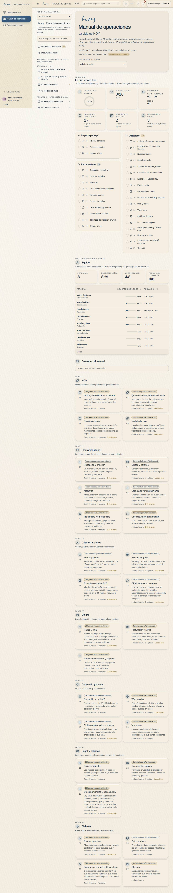 | 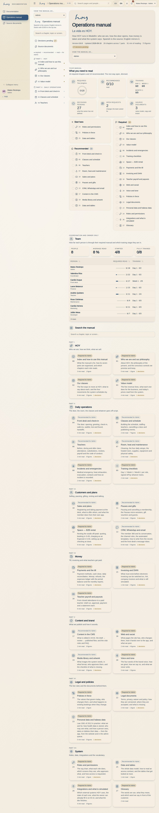 |

| ES · teacher · mobile | EN · teacher · mobile | ES · owner · mobile | EN · owner · mobile |
| --- | --- | --- | --- |
| 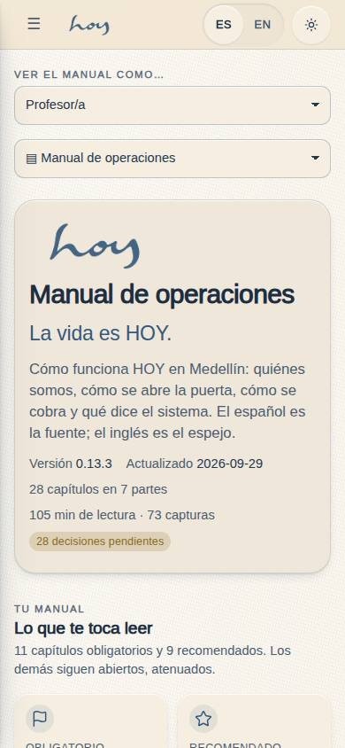 | 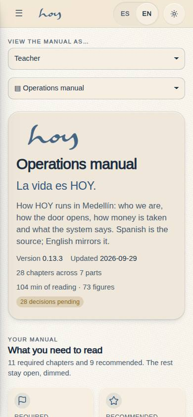 | 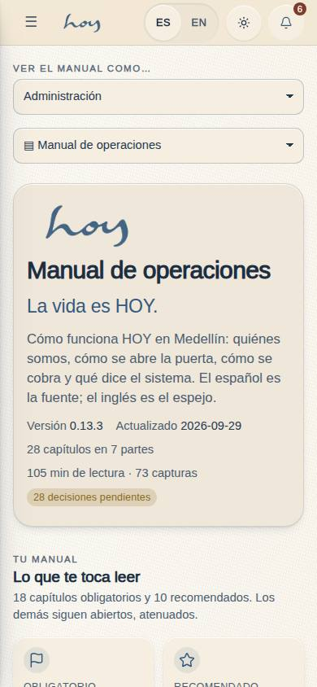 | 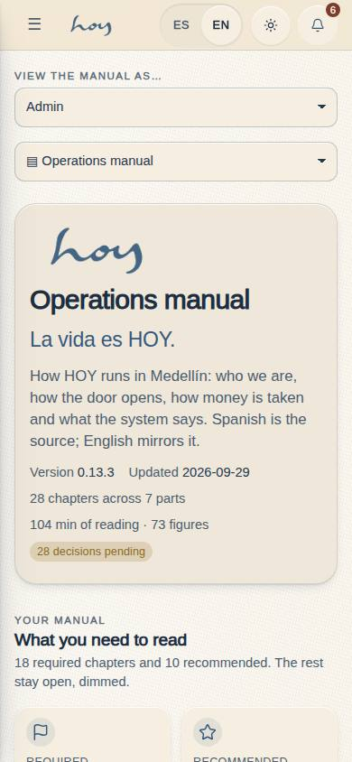 |

## 0050 — mark unread, admin edits in place, phone figures
- **Read toggle, top and foot.** The chapter head and a new **ChapterFoot** at the end of every chapter body (team roles)
  carry one `ReadToggle`: "Marcar como leído" (primary) ↔ "✓ Leído el {date}" + "Marcar como no leído" (outline).
  Unmarking deletes the person's `manual_progress` rows for the chapter (audit `manual.unread`, action
  `manual.markUnread`), so "Tu manual", the sidebar ✓ and the Equipo view update at once. The foot adds "¿Terminaste este
  capítulo?" and "Siguiente →" (next chapter in the reader's role list).
- **Who edits in place** (`canEditSection`): admin and super admin — every `##` section, marked or not, no request
  needed; coordination — sections marked `{{editable:coordinator}}`; everyone else — "Pedir un cambio" (answered in
  K-04 `/#/manual/decisions`, linked from the box for leads) or `manual.suggestEdit`. Unmarked sections carry no tag;
  the chapter badge reads "{n} secciones editables por ti".
- **Phone figures** (`-390` captures) are 360 px wide, centred, hairline `--r-lg` frame; two adjacent ones pair side by
  side from 768 px (`FigurePair`). Before 0050 every phone capture rendered at desktop width on the live site (the
  hashed build file names defeated the `-390.jpg` check).

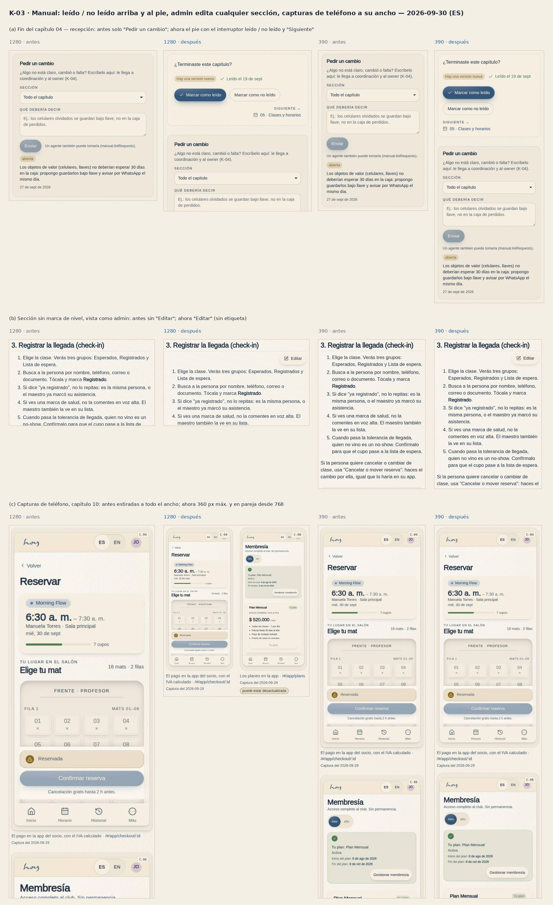

The directive contract for chapter authors is the "Directives" table in `docs/changelog/0031-manual-lms.md`; the
actions are listed in `docs/reference/surfaces.md` §1.

## Screenshots
| ES · mobile | EN · mobile |
| --- | --- |
| 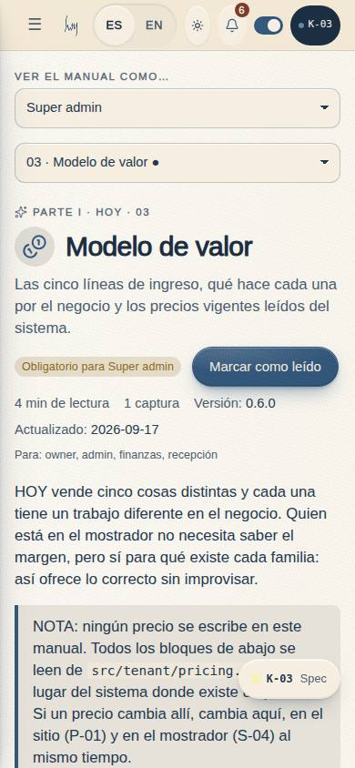 | 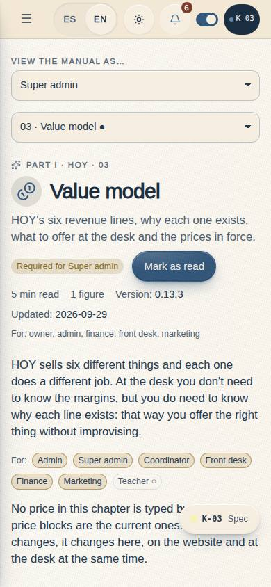 |

| ES · desktop | EN · desktop |
| --- | --- |
|  |  |

| ES · dark | EN · dark |
| --- | --- |
|  |  |

`/manual` and `/manual/:chapter` share the K-03 code, so the unlabelled captures above are the
**chapter** route (`03-modelo-de-valor`, the param the screenshot script fills). The **cover** —
`/manual` itself, with the reading paths and the part-by-part grid — is captured under the `cover`
label by `npm run screenshots -- '--only=/manual$' --label=cover`:

| ES · cover · desktop | EN · cover · desktop |
| --- | --- |
| 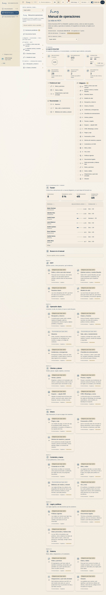 | 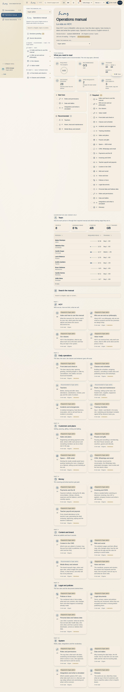 |

## Sections (layout order — `useLayout(spec)`)
1. `ManualCover (wordmark, title, tagline, version + updated, chapter/reading/figure counts, decisions badge)`
2. `ManualSearch (filters chapters by title, summary, role and body)`
3. `StartHere (three chapters per role: recepción, maestros, admin, finanzas)`
4. `PartGrid (ChapterCard per chapter: number, title, summary, role chips, reading time, figures, decisions)`
5. `ChapterSidebar (parts and their chapters, decisions link, search, print)`
6. `ChapterHead (part eyebrow, title, summary, role, reading time, version, updated)`
7. `MarkdownViewer (callouts, Figure captures, LiveBlock directives, screenshot placeholders)`
8. `Toc (sticky in-page outline from the ## headings, desktop)`
9. `PrevNext`

## Data
| Table | Read / write | Notes |
| --- | --- | --- |
| `docs_entries` | read | nominal; the chapters themselves are markdown on disk |
| `tenants` | read | the M-08 settings behind `{{policy}}` (via `usePolicy()`) |
| `profiles`, `memberships`, `class_sessions`, `teachers`, `bookings` | read | the counts behind `{{stats}}` and `{{kpi:…}}` |

## Logic and integrations
- Chapters are docs/ops-manual/<lang>/<NN-slug>.md loaded with import.meta.glob at build time; the slug is shared across languages.
- Follows the app language: ES is the source; a missing EN chapter falls back to ES with a notice.
- `> DECISIÓN PENDIENTE:` / `> DECISION NEEDED:` blockquotes render as highlighted callouts and feed K-04.
- `[screenshot: CODE — caption]` lines render as dashed placeholder boxes until a real capture replaces them. None remain: every chapter uses real captures (72 per language).
- `` renders as a `Figure`: framed capture, code chip and a link to the live screen.
- A `{{directive}}` line, or a fenced ```live block holding `kind:arg`, renders as a `LiveBlock`: `pricing[:family]`, `tenant:hours|contact|capacity`, `policy[:field]`, `tables`, `table:<name>`, `roles`, `routes:<surface>`, `stats`, `kpi:<name>`. An unknown directive or argument explains itself and lists what exists.
- Front matter carries `part` (I…VII) and `summary`; reading time, figures, decisions and placeholders are derived from the body, never written down.
- Slugs retired by the 0.6.0 re-categorisation resolve through `LEGACY_SLUGS`, so old links and the screenshot tooling's `:chapter` param keep working.
- Print: sidebar and shell chrome hidden; callouts and placeholders never split across pages.
- Integrations: none

## States
- home (cover + part grid)
- chapter
- search results
- chapter not found
- untranslated (ES fallback)
- print

## Real vs mock
- Real: the page renders from the data layer (`useData()` / `useTable`) over the tables above; every write goes through the `DataProvider` so the Supabase provider replaces the mock unchanged.
- Mock / pending: no external integrations; data is the browser-local `MockProvider` seed.
- Real: every number in the manual that the system owns is read at render time — prices from `src/tenant/pricing.ts`, studio facts from `src/tenant/tenant.ts`, policy values from M-08 through `usePolicy()`, the schema from `tableRegistry`, the roles from `src/auth/roles.ts`, the routes from the module registry, and the counts from `useTable`. Nothing is duplicated into prose.
- Mock / pending: the captures are files on disk, so a figure is as fresh as the last `npm run screenshots` pass; `docs_entries` is still unused.
- Note: the chapters are markdown on disk, not data — adding, renaming or renumbering one needs no code change beyond a `LEGACY_SLUGS` entry.

## Changelog
- `docs/changelog/0031-manual-lms.md` — the manual as a staff LMS: lens, Tu manual, training sign-off, editing beside the markdown, requests, source documents, icons (v0.13.0)
- `docs/changelog/0005-final-integration.md` — screenshots and this page doc (v0.3.0)
- `docs/changelog/0013-ops-manual-visual-live.md` — 28 chapters in seven parts, real figures, live-data directives, the cover and the in-page outline (v0.6.0)
- `docs/changelog/0038-manual-qa.md` — QA 2026-09-29 (v0.13.4): fresh captures (stale badges 0 on the cover and chapters 01, 04, 09, 21, 24), `npm run lint:manual` 0 violations in 28 × 2 chapters, eight role lenses at 390 and 1280 (`K-03/<lang>-<width>-cover-<role>.jpg`), smoke and keyboard walk in `docs/qa/manual-2026-09-29.md`; schema tables in chapters show descriptions as plain text. Widths checked by this pass: 390 and 1280 (the spec's wider `checkedAt` is unchanged)

---
**Resumen (ES).** Manual de operaciones. Cómo funciona el club en persona y en el software, por rol. Igual para todos los que lo miran; español primero, inglés como espejo.
