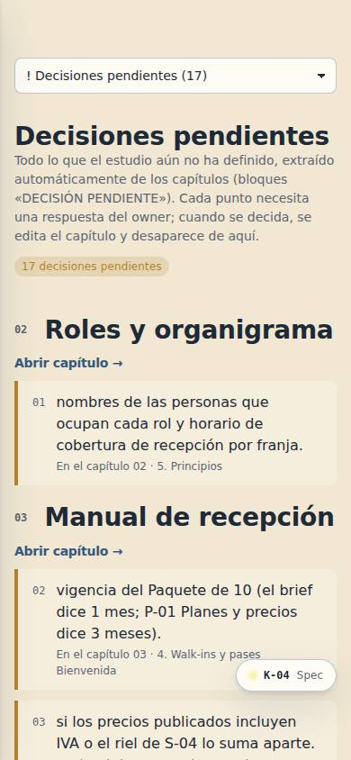
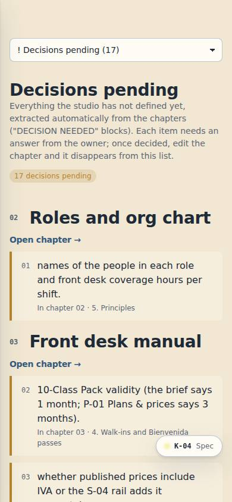
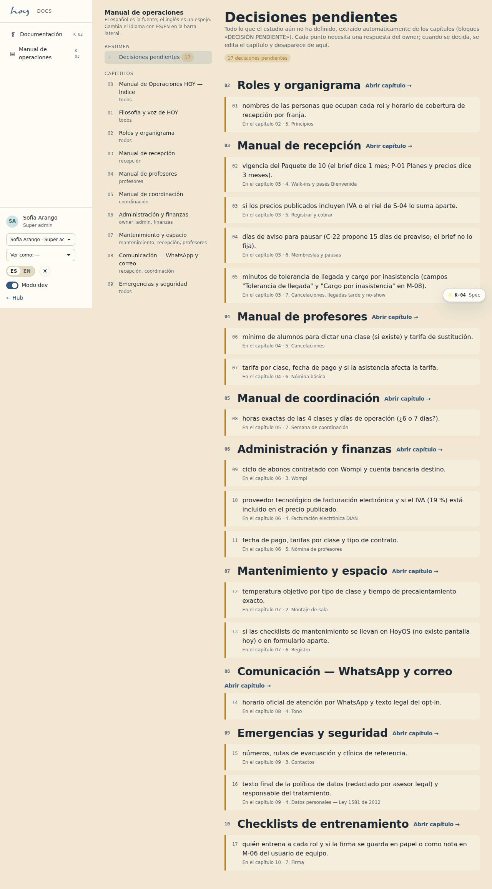
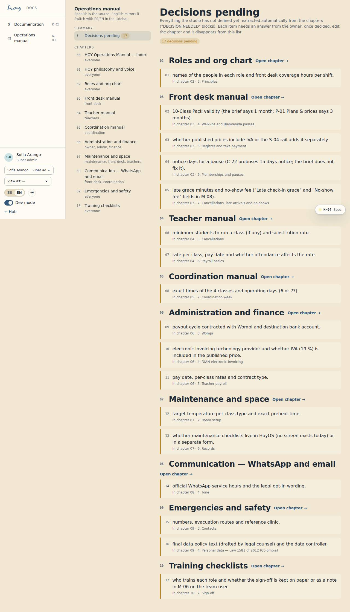

# K-04 — Decisions pending

**Route** `/#/manual/decisions` · **Roles** super_admin, admin, coordinator, front_desk, finance, teacher, maintenance, customer, public · **Surface** docs · **Spec** `spec.code === 'K-04'` (see `/#/dev/specs`)

## Purpose
Automatic list of everything the studio has not defined, extracted from the manual’s "DECISION NEEDED" blocks, grouped by chapter and section.

## Screenshots
| ES · mobile | EN · mobile |
| --- | --- |
|  |  |

| ES · desktop | EN · desktop |
| --- | --- |
|  |  |

## Sections (layout order — `useLayout(spec)`)
1. `PageHead (count)`
2. `DecisionList (grouped by chapter, section, link to chapter)`

## Data
| Table | Read / write | Notes |
| --- | --- | --- |
| `docs_entries` | read | |

## Logic and integrations
- Extracted at build/run time from the markdown; editing a chapter updates the list, no code change.
- Same list feeds ROADMAP.md "Open decisions for the owner".
- Integrations: none

## States
- default
- empty

## Real vs mock
- Real: the page renders from the data layer (`useData()` / `useTable`) over the tables above; every write goes through the `DataProvider` so the Supabase provider replaces the mock unchanged.
- Mock / pending: no external integrations; data is the browser-local `MockProvider` seed.

## Changelog
- `docs/changelog/0005-final-integration.md` — screenshots and this page doc (v0.3.0)

---
**Resumen (ES).** Decisiones pendientes. Lista automática de todo lo que el estudio no ha definido, extraída de los bloques «DECISIÓN PENDIENTE» del manual, agrupada por capítulo y sección.
