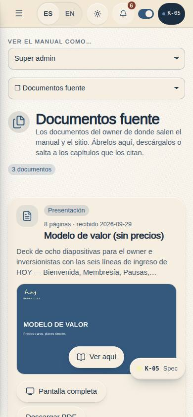
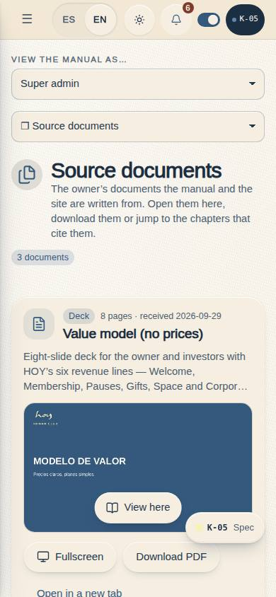
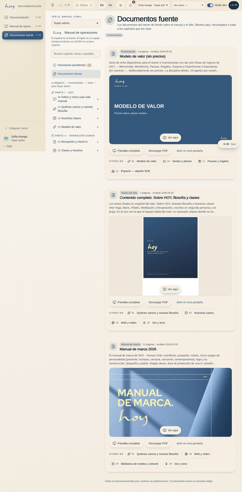
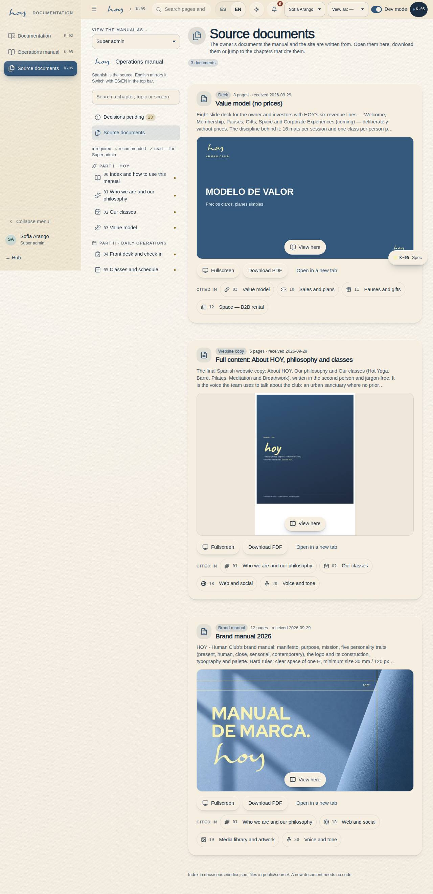

# K-05 — Source documents

**Route** `/#/docs/source` · **Roles** super_admin, admin, coordinator, front_desk, finance, teacher, maintenance, marketing, developer, customer · **Surface** docs · **Spec** `spec.code === 'K-05'` (see `/#/dev/specs`)

## Purpose
The owner’s documents the manual and the website are written from — the value model, the website copy and the brand manual — with an inline viewer, download and the chapters that cite them.

## Screenshots
| ES · mobile | EN · mobile |
| --- | --- |
|  |  |

| ES · desktop | EN · desktop |
| --- | --- |
|  |  |

## How it works
The three PDFs Justin sent on 2026-09-29 are served from `public/source/` (the brand manual republished from
27.8 MB to 2.4 MB with ghostscript at 300 dpi; the other two as received) and indexed in `docs/source/index.json`.
Each card shows the first page until **Ver aquí / View here** loads the inline viewer (so the page never downloads
three PDFs at once), plus 44 px **Pantalla completa**, **Descargar PDF** and **Abrir en otra pestaña** controls and
chips to the chapters that cite it. A chapter embeds the same card with `{{source:<id>}}`; an agent opens one with
`manual.openSource` (`?doc=<id>` scrolls to it and opens the viewer). The page sits in the manual's sidebar and in
the hub's Build band (hub map experience `sources`).

## Sections (layout order — `useLayout(spec)`)
1. `PageHead (icon, count, lead)`
2. `SourceEmbed × n (kind, title, pages, date, summary, cover → inline PDF viewer, fullscreen, download, new tab)`
3. `ChapterLinks (chapters that embed it, with icons)`
4. `ChapterSidebar`

## Data
| Table | Read / write | Notes |
| --- | --- | --- |
| `docs_entries` | read | |

## Logic and integrations
- The list is docs/source/index.json; the files are public/source/<id>.pdf (+ <id>-cover.jpg). Adding a document needs no code change.
- `?doc=<id>` scrolls to one document and opens its viewer (manual.openSource).
- A chapter embeds one with {{source:<id>}}.
- Integrations: none

## States
- default
- one document opened (?doc=)
- viewer fullscreen

## Real vs mock
- Real: the page renders from the data layer (`useData()` / `useTable`) over the tables above; every write goes through the `DataProvider` so the Supabase provider replaces the mock unchanged.
- Mock / pending: no external integrations; data is the browser-local `MockProvider` seed.

## Changelog
- `docs/changelog/0031-manual-lms.md` — the page, its three documents and this page doc (v0.13.0)
- `docs/changelog/0038-manual-qa.md` — QA 2026-09-29 (v0.13.4): recaptured ES/EN 390 + 1280; the source-document embeds (`{{source:…}}`) resolve in every chapter that uses them (`npm run lint:manual`)

---
**Resumen (ES).** Documentos fuente. Los documentos del owner de los que salen el manual y el sitio — el modelo de valor, los textos del sitio y el manual de marca — con un visor en línea, descarga y los capítulos que los citan.
