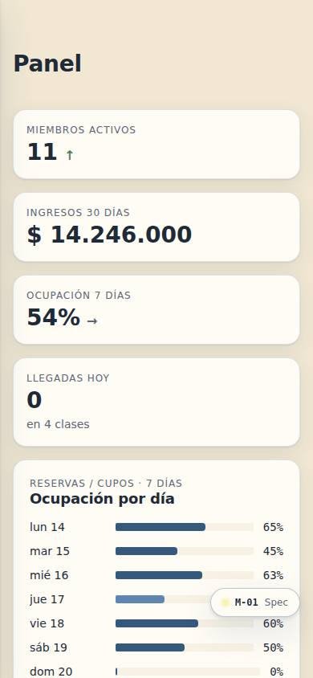
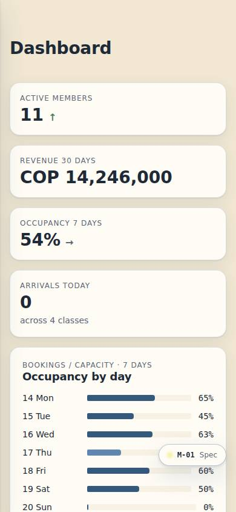
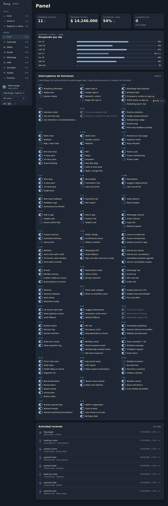
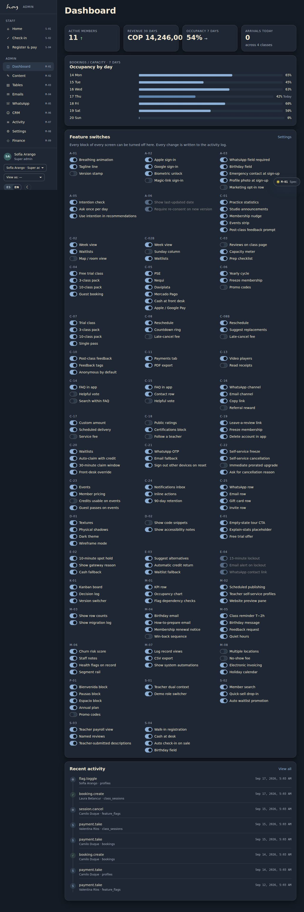

# M-01 — Admin dashboard & feature switches

**Route** `/#/admin` · **Roles** super_admin, coordinator, finance · **Surface** admin · **Spec** `spec.code === 'M-01'` (see `/#/dev/specs`)

## Purpose
The control room: the numbers that matter this and the switch panel that turns pages, steps and features on or off across the app, the website and the staff tools.

## Screenshots
| ES · mobile | EN · mobile |
| --- | --- |
|  |  |

| ES · desktop | EN · desktop |
| --- | --- |
|  |  |

| ES · dark | EN · dark |
| --- | --- |
|  |  |

## Sections (layout order — `useLayout(spec)`)
1. `KPIRow ×4`
2. `OccupancyChart`
3. `FeatureTable`
4. `AuditTrail`

## Data
| Table | Read / write | Notes |
| --- | --- | --- |
| `memberships` | read / write | |
| `payments` | read / write | |
| `class_sessions` | read | |
| `bookings` | read / write | |
| `feature_flags` | read | |
| `audit_log` | read / write | |
| `users` | read / write | |
| `profiles` | read / write | |

## Logic and integrations
- Every flag is scoped: app, website, staff, or all; audience can be all, members, staff, or a test group.
- Turning a step off removes it from the flow immediately — no release needed.
- Emergency and legal pages cannot be disabled.
- Each change writes actor, previous value and timestamp to the audit log.
- Desktop-first layout; collapses to a stacked list on tablet and phone.
- Integrations: Supabase Auth

## States
- Loading: KPI skeletons
- Flag conflict: dependency warning before saving
- No permission: switches render read-only

## Real vs mock
- Real: the page renders from the data layer (`useData()` / `useTable`) over the tables above; every write goes through the `DataProvider` so the Supabase provider replaces the mock unchanged.
- Mock / pending: Supabase Auth are simulated or deferred; data is the browser-local `MockProvider` seed.
- Note: Sections are reorderable through useLayout (layout editor D-04).
- Note: Flag toggles write audit_log flag.toggle with before/after.

## Changelog
- `docs/changelog/0005-final-integration.md` — screenshots and this page doc (v0.3.0)

---
**Resumen (ES).** Panel admin e interruptores de funciones. Panel de administración con métricas y los interruptores de funciones por página.
