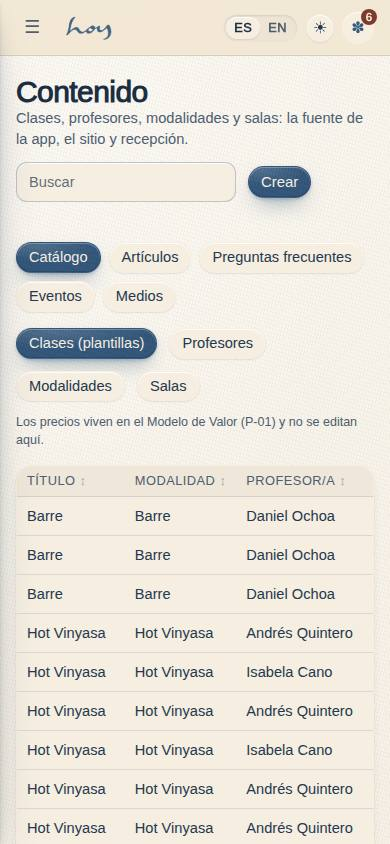
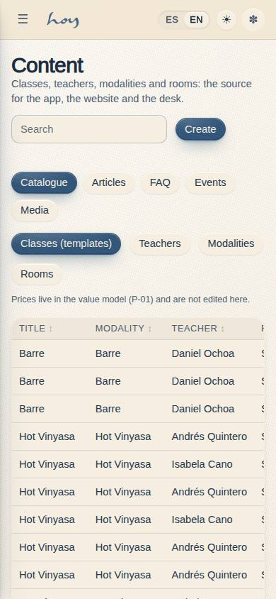
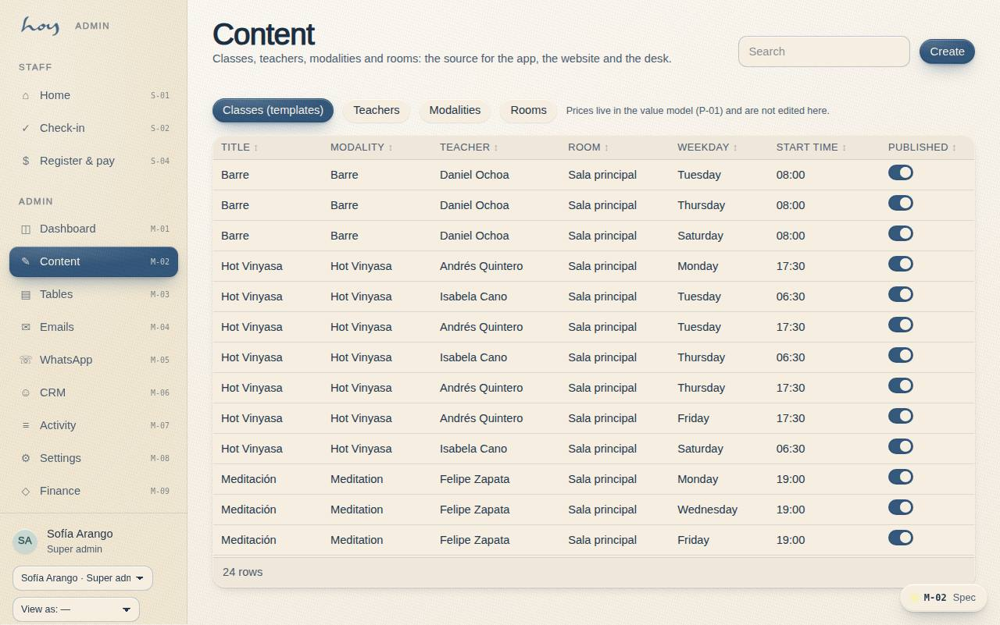

# M-02 — Content: classes, teachers, schedule, pricing

**Route** `/#/admin/content` · **Roles** coordinator, super_admin, teacher, finance · **Surface** admin · **Spec** `spec.code === 'M-02'` (see `/#/dev/specs`)

## Purpose
The single source of truth behind everything: class types, the schedule, teacher profiles, pricing and content — feeding the app, the staff tools and the public website.

## Screenshots
| ES · mobile | EN · mobile |
| --- | --- |
|  |  |

| ES · desktop | EN · desktop |
| --- | --- |
|  |  |

## Sections (layout order — `useLayout(spec)`)
M-02 is a **family of five pages** behind one sub-navigation (`ContentSubNav`). This page is the
catalogue; the four leaves have their own codes and their own specs.

1. `ContentSubNav` — Catálogo · Artículos (M-02a) · Preguntas frecuentes (M-02b) · Eventos (M-02c) · Medios (M-02d)
2. `EntityTabs` — class templates, teachers, modalities, rooms
3. `ListView` — `DataTable` with search and a publish toggle per row
4. `EditDrawer` — typed fields, ES/EN pairs, publish state, delete
5. `PreviewPane` — the row rendered as the customer sees it (`ClassRow`, `TeacherCard`, chips)

## Data
| Table | Read / write | Notes |
| --- | --- | --- |
| `class_templates` | read / write | the weekly timetable rules sessions are generated from |
| `teachers` | read / write | public profile and `rate_per_class` (M-09a pays from it) |
| `modalities` | read / write | movement, intensity, heat, duration |
| `rooms` | read / write | capacity in mats |
| `content_articles` | read / write | **M-02a** |
| `faq_entries` | read / write | **M-02b** |
| `events`, `event_rsvps` | read / write · read | **M-02c** (the RSVP count is read, never written here) |
| `media_assets` | read / write | **M-02d** |
| `audit_log` | write | every create, update, publish, reorder and delete |

## Logic and integrations
- Prices are **not** editable here: they live in `src/tenant/pricing.ts` (P-01). An event's price is
  stored per event in COP and defaults from the workshop price in that file.
- Publish state is the `active` column on the four catalogue entities, `published` on articles and FAQ
  entries, and `status` on events and media.
- An article's status is **derived**: `published = false` is a draft, `published = true` with a future
  `publish_at` is scheduled, otherwise it is live. "Publish now" sets the flag and clears the date in
  one write.
- FAQ order is the `sort` column and moves one step at a time with ↑/↓ (two sort values swap).
  `group_title`, `group_lead` and `page` belong to the section, so saving them propagates to every
  sibling row of the same `group_key`.
- An event's capacity cannot drop below the RSVPs already taken, nor exceed `tenant.studio.mats`.
- `media_assets.slot_key` is the contract with the UI: `MediaPlaceholder({ slotKey })` renders the URL
  when the row is `ready` and a branded empty slot otherwise. A row can only be marked ready with a
  URL, and marking it pending again hides the asset everywhere without deleting the record.
- Every write appends an `audit_log` row through `useAudit('admin')`; `content.write` gates all of it
  and without the permission every control renders disabled.
- Integrations: Supabase Storage (uploads, later — HoyOS stores the URL, never the binary), Wompi
  (event payments, through the existing checkout seam).

## States
- Loading · empty · filter with no matches (per leaf)
- Draft / scheduled / published article; unpublished FAQ entry; draft / published / cancelled event
- First and last FAQ entry: the matching arrow is disabled
- Sold-out event (RSVPs = capacity); capacity below RSVPs and end-before-start are blocked with a reason
- Delete blocked because an event already has RSVPs
- Pending media slot (ratio + brief) · ready photo · ready video · invalid URL
- Read-only without `content.write` · unsaved changes

## Real vs mock
- **Real.** All five pages read and write through `useData()` / `useTable`, so `SupabaseProvider`
  replaces the mock unchanged. Articles, FAQ entries and events published here are what C-13, C-14/C-15
  and C-23 render — there is no second copy of the content in code. Ordering, scheduling, publish state,
  RSVP counts and the audit trail are all real behaviour.
- **Mock / pending.** There is no file upload: M-02d stores a URL, and the upload UI arrives with
  Supabase Storage. Scheduled publication is honest but passive — the status is computed at render
  time, so a scheduled article goes live when someone loads the page rather than through a cron job;
  the server-side job lands with Supabase. Every art slot ships `pending`, which is the point: the
  page is the checklist of what the studio still owes.
- **Note.** The seed contains one `media_assets` row per known slot (class hero 16:9, teacher portrait
  4:3, event 4:5, studio-tour video 16:9, site hero 21:9, about 4:3, contact map), each with the brief
  the photographer needs.

## Changelog
- `docs/changelog/0012-thin-screens-depth.md` — depth pass on the thin screens (v0.6.0)
- `docs/changelog/0005-final-integration.md` — screenshots and this page doc (v0.3.0)

---
**Resumen (ES).** Contenido: clases, profesores, horario, precios. Gestionar clases, profesores, horario y precios desde un solo lugar.
