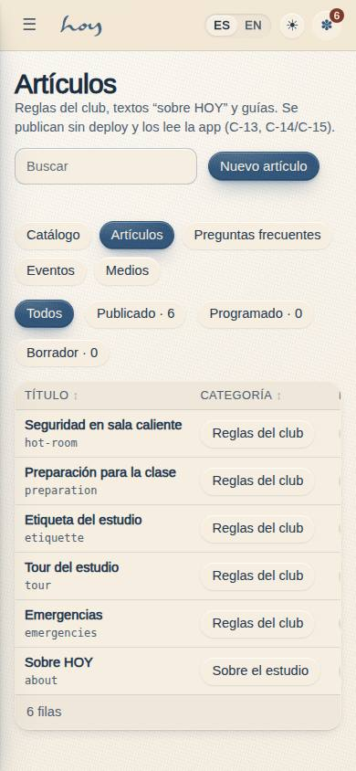
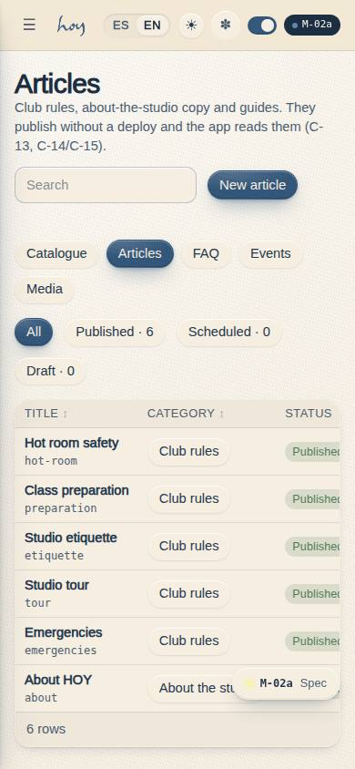
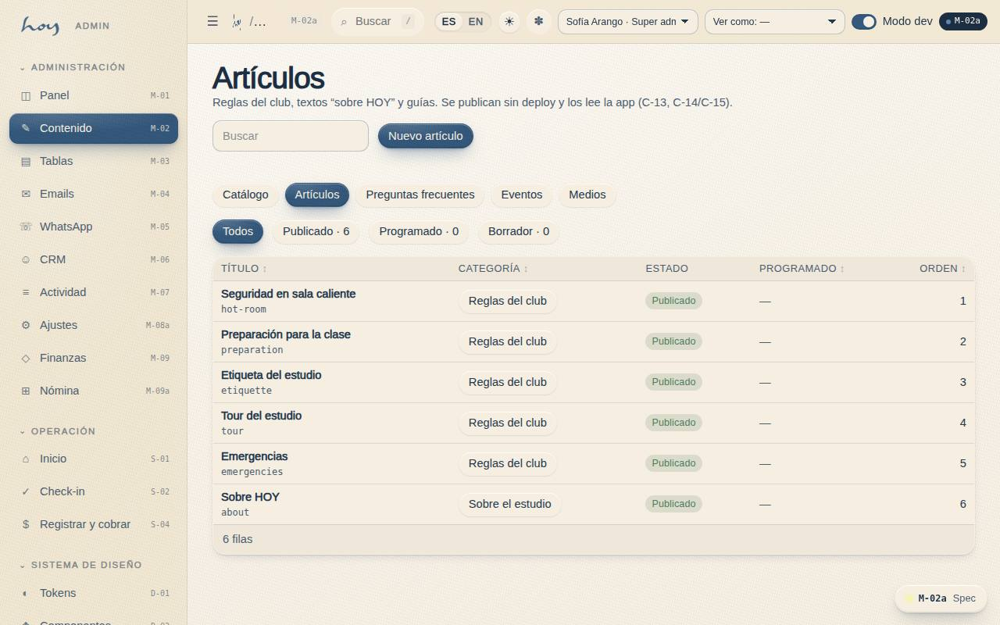
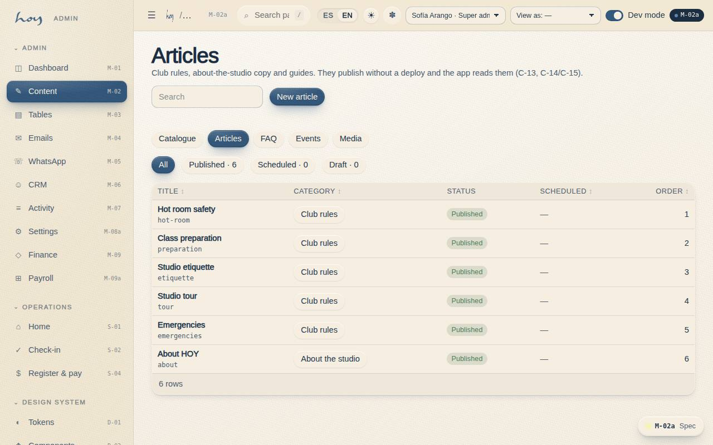

# M-02a — Content · Articles

**Route** `/#/admin/content/articles` · **Roles** super_admin, admin, coordinator · **Surface** admin · **Spec** `spec.code === 'M-02a'` (see `/#/dev/specs`)

## Purpose
Editor for `content_articles`: bilingual title and markdown body with a live preview, slug, category, scheduled publication and “publish now”.

## Screenshots
| ES · mobile | EN · mobile |
| --- | --- |
|  |  |

| ES · desktop | EN · desktop |
| --- | --- |
|  |  |

## Sections (layout order — `useLayout(spec)`)
1. `ContentSubNav`
2. `StatusFilter (todos / publicado / programado / borrador)`
3. `ArticleTable (título + slug, categoría, estado, fecha, orden)`
4. `EditDrawer`
5. `MarkdownEditor ES/EN + preview`
6. `ScheduleFields (publish_at, sort)`
7. `PublishNow / Unpublish`

## Data
| Table | Read / write | Notes |
| --- | --- | --- |
| `content_articles` | read | |
| `audit_log` | read / write | |

## Logic and integrations
- Status is derived, not stored: published = false is a draft; published = true with a future publish_at is scheduled; otherwise it is live.
- “Publish now” sets published = true and clears publish_at in one write, so a scheduled row can be pushed live early.
- Slug is lowercase a–z, digits and hyphens; C-13 and C-14/C-15 read the rows by section and sort.
- Integrations: none

## States
- Loading
- Empty (no articles)
- Filter with no matches
- Draft / scheduled / published
- Invalid slug
- Read-only (sin content.write)
- Unsaved changes

## Real vs mock
- Real: the page renders from the data layer (`useData()` / `useTable`) over the tables above; every write goes through the `DataProvider` so the Supabase provider replaces the mock unchanged.
- Mock / pending: no external integrations; data is the browser-local `MockProvider` seed.
- Note: Sub-page of M-02; the sub-navigation is shared by all five.
- Note: Every write appends an audit_log row through useAudit('admin').

## Changelog
- `docs/changelog/0005-final-integration.md` — screenshots and this page doc (v0.3.0)

---
**Resumen (ES).** Contenido · Artículos. Editor de `content_articles`: título y cuerpo bilingües en markdown con vista previa en vivo, slug, categoría, publicación programada y “publicar ahora”.
