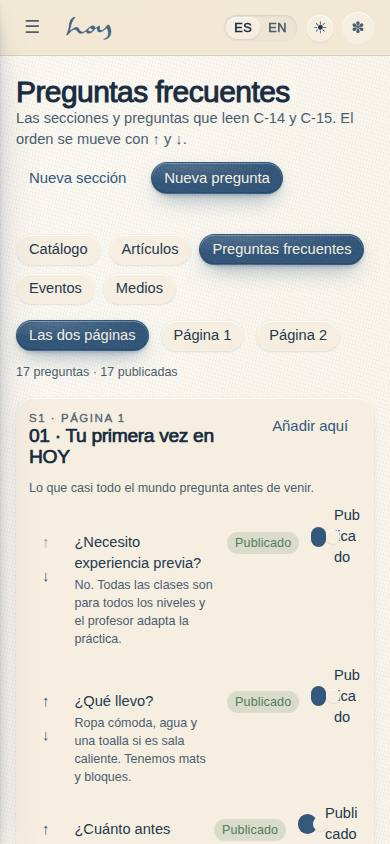
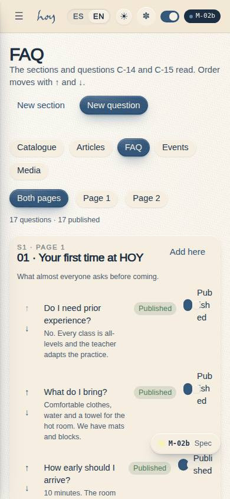
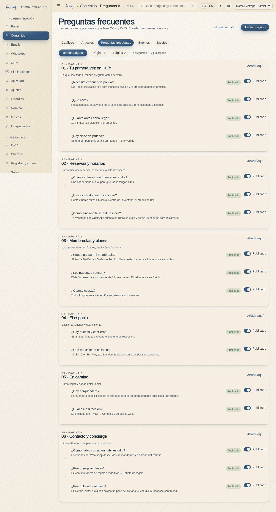
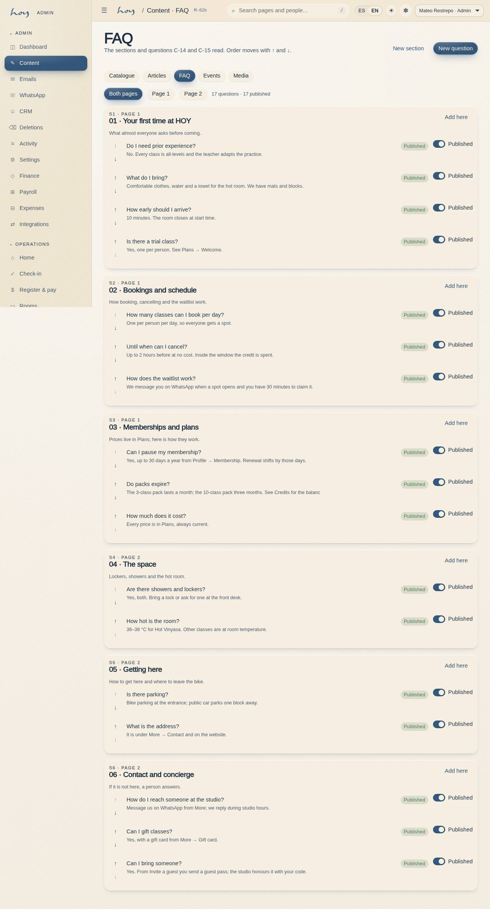

# M-02b — Content · FAQ

**Route** `/#/admin/content/faq` · **Roles** super_admin, admin, coordinator · **Surface** admin · **Spec** `spec.code === 'M-02b'` (see `/#/dev/specs`)

## Purpose
Editor for `faq_entries` by section: bilingual question and answer, ↑/↓ ordering, page 1 or 2 and publish state.

## Screenshots
| ES · mobile | EN · mobile |
| --- | --- |
|  |  |

| ES · desktop | EN · desktop |
| --- | --- |
|  |  |

## Sections (layout order — `useLayout(spec)`)
1. `ContentSubNav`
2. `PageFilter (todas / 1 / 2)`
3. `SectionCard ×n`
4. `EntryRow (↑ ↓, pregunta, respuesta, publicado)`
5. `EditDrawer (Q/A, sección, página)`
6. `AddGroup / AddEntry`

## Data
| Table | Read / write | Notes |
| --- | --- | --- |
| `faq_entries` | read | |
| `audit_log` | read / write | |

## Logic and integrations
- Order is the `sort` column and moves one step at a time (↑/↓ swap the two sort values) — keyboard-reachable and impossible to do by accident, unlike drag-and-drop.
- group_title, group_lead and page belong to the section: saving them propagates to every sibling row of the same group_key.
- A new section is a new group_key with one unpublished entry; C-14 is page 1 and C-15 is page 2.
- Integrations: none

## States
- Loading
- Empty
- First / last entry (arrow disabled)
- Unpublished entry
- Read-only
- New empty section

## Real vs mock
- Real: the page renders from the data layer (`useData()` / `useTable`) over the tables above; every write goes through the `DataProvider` so the Supabase provider replaces the mock unchanged.
- Mock / pending: no external integrations; data is the browser-local `MockProvider` seed.
- Note: Sub-page of M-02; the sub-navigation is shared by all five.
- Note: Every write appends an audit_log row through useAudit('admin').

## Changelog
- `docs/changelog/0005-final-integration.md` — screenshots and this page doc (v0.3.0)

---
**Resumen (ES).** Contenido · Preguntas frecuentes. Editor de `faq_entries` por secciones: pregunta y respuesta bilingües, orden con ↑/↓, página 1 o 2 y estado de publicación.
