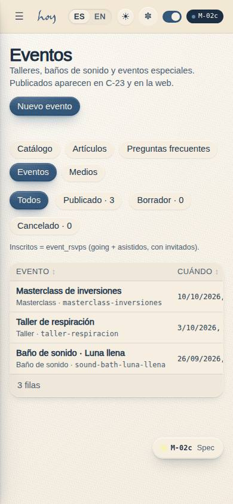
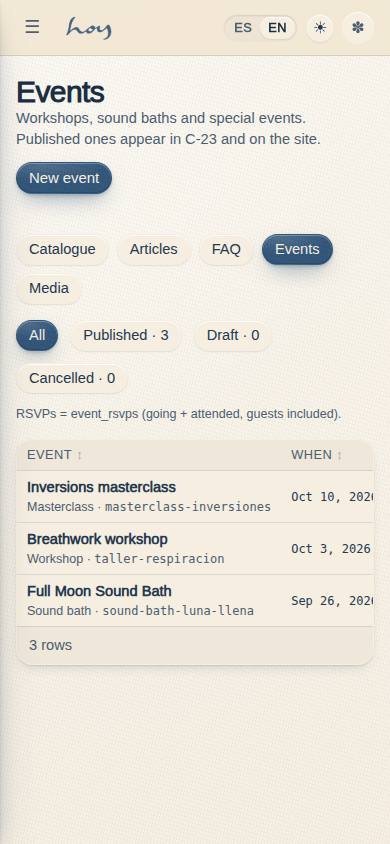
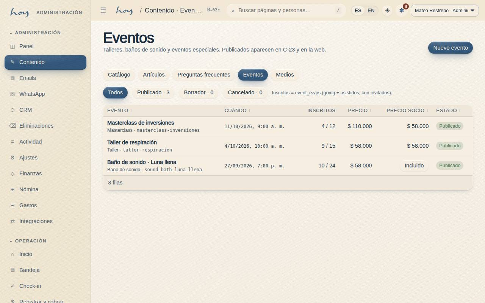
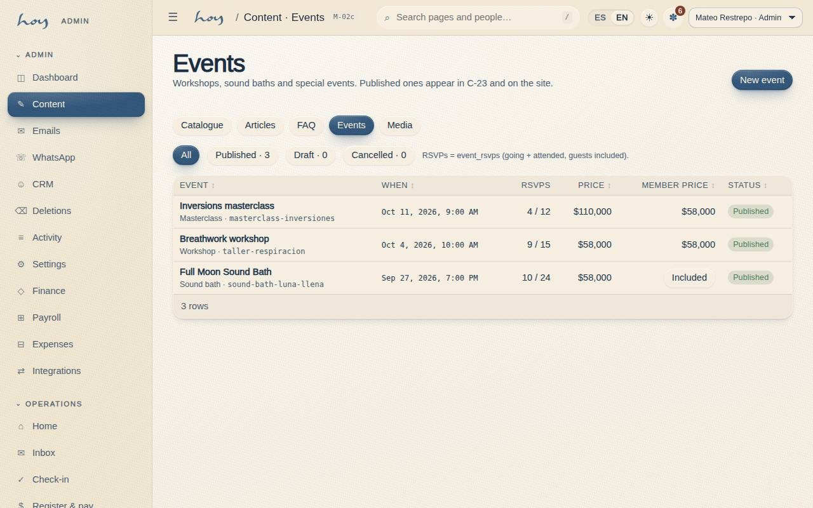

# M-02c — Content · Events

**Route** `/#/admin/content/events` · **Roles** super_admin, admin, coordinator · **Surface** admin · **Spec** `spec.code === 'M-02c'` (see `/#/dev/specs`)

## Purpose
Publisher for `events`: create and edit, publish or unpublish, capacity, public and member price, and the RSVPs already received.

## Screenshots
| ES · mobile | EN · mobile |
| --- | --- |
|  |  |

| ES · desktop | EN · desktop |
| --- | --- |
|  |  |

## Sections (layout order — `useLayout(spec)`)
1. `ContentSubNav`
2. `StatusFilter`
3. `EventTable (título, cuándo, inscritos / aforo, precios, estado)`
4. `EditDrawer (fechas, sala, anfitrión, aforo, precios)`
5. `Publish / Unpublish / Cancel`

## Data
| Table | Read / write | Notes |
| --- | --- | --- |
| `events` | read | |
| `event_rsvps` | read | |
| `rooms` | read | |
| `teachers` | read | |
| `audit_log` | read / write | |

## Logic and integrations
- The RSVP count is event_rsvps rows with status going or attended, plus their guests — it is never stored on the event.
- Capacity cannot drop below the RSVPs already taken, and cannot exceed the studio mats (tenant.studio.mats).
- Publishing is the only thing that makes an event visible in C-23; cancelling keeps the row and its RSVPs for the refund conversation.
- A default price comes from src/tenant/pricing.ts (talleres); member_price_cop = 0 renders as “included”.
- Integrations: Wompi

## States
- Loading
- Empty
- Draft / published / cancelled
- Sold out (RSVPs = capacity)
- Capacity below RSVPs: blocked
- End before start: blocked
- Delete blocked by RSVPs
- Read-only

## Real vs mock
- Real: the page renders from the data layer (`useData()` / `useTable`) over the tables above; every write goes through the `DataProvider` so the Supabase provider replaces the mock unchanged.
- Mock / pending: Wompi are simulated or deferred; data is the browser-local `MockProvider` seed.
- Note: Sub-page of M-02; the sub-navigation is shared by all five.
- Note: Every write appends an audit_log row through useAudit('admin').

## Changelog
- `docs/changelog/0005-final-integration.md` — screenshots and this page doc (v0.3.0)

---
**Resumen (ES).** Contenido · Eventos. Publicador de `events`: crear y editar, publicar o despublicar, aforo, precio público y de socio, y las inscripciones ya recibidas.
