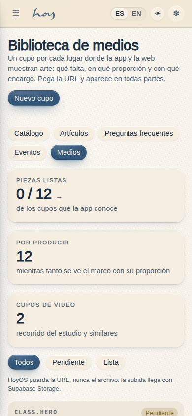
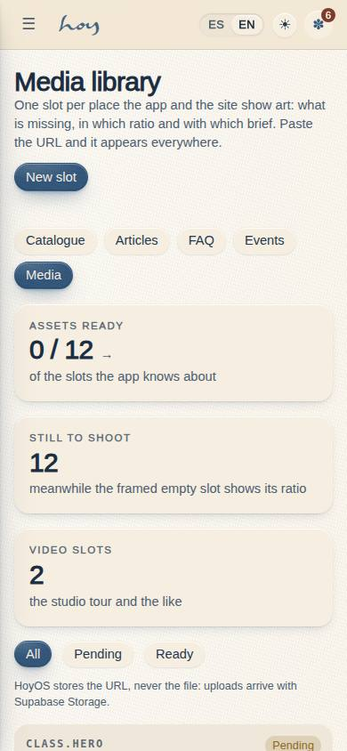
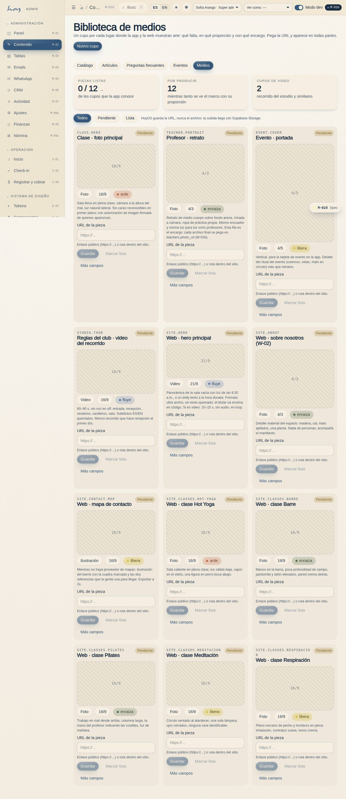
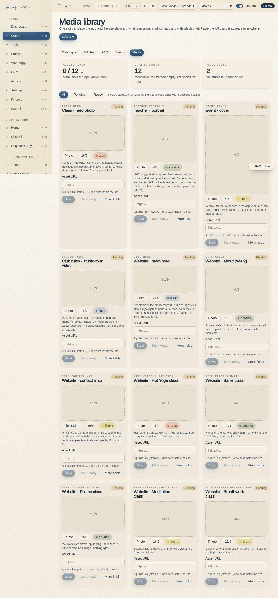

# M-02d — Content · Media library

**Route** `/#/admin/content/media` · **Roles** super_admin, admin, coordinator · **Surface** admin · **Spec** `spec.code === 'M-02d'` (see `/#/dev/specs`)

## Purpose
The checklist of art the studio owes: one slot per place in the app and the site, with its ratio, brief and alt text. Pasting a URL publishes it with no deploy.

## Screenshots
| ES · mobile | EN · mobile |
| --- | --- |
|  |  |

| ES · desktop | EN · desktop |
| --- | --- |
|  |  |

## Sections (layout order — `useLayout(spec)`)
1. `ContentSubNav`
2. `ReadyKPIs (listas / pendientes / video)`
3. `StatusFilter`
4. `MediaGrid → MediaCard (marco con proporción, encargo, URL, alt)`
5. `MarkReady / MarkPending`
6. `AdvancedFields (slot_key, ratio, kind, credit, label, alt, brief)`

## Data
| Table | Read / write | Notes |
| --- | --- | --- |
| `media_assets` | read | |
| `audit_log` | read / write | |

## Logic and integrations
- slot_key is the contract between the table and the components: MediaPlaceholder({slotKey}) renders the URL when status = ready and a branded empty slot otherwise.
- A row can only be marked ready with a URL; marking it pending again hides the asset everywhere without deleting the record.
- The seed ships one pending row per known slot (class hero 16:9, teacher portrait 4:3, event 4:5, studio tour video 16:9, site hero 21:9, about 4:3, contact map), so the owner reads the page as a to-do list.
- HoyOS stores the URL, never the binary: uploads belong to Supabase Storage when it lands.
- Integrations: Supabase Storage

## States
- Loading
- Empty
- Pending slot (ratio + brief)
- Ready photo
- Ready video
- Invalid URL
- Read-only

## Real vs mock
- Real: the page renders from the data layer (`useData()` / `useTable`) over the tables above; every write goes through the `DataProvider` so the Supabase provider replaces the mock unchanged.
- Mock / pending: Supabase Storage are simulated or deferred; data is the browser-local `MockProvider` seed.
- Note: Sub-page of M-02; the sub-navigation is shared by all five.
- Note: Every write appends an audit_log row through useAudit('admin').

## Changelog
- `docs/changelog/0005-final-integration.md` — screenshots and this page doc (v0.3.0)

---
**Resumen (ES).** Contenido · Biblioteca de medios. La lista de arte que el estudio debe: un cupo por lugar de la app y la web, con proporción, encargo y texto alternativo. Pegar una URL lo publica sin deploy.
