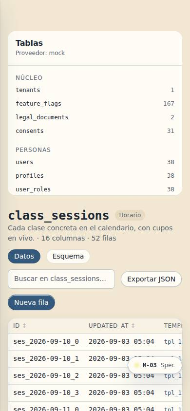
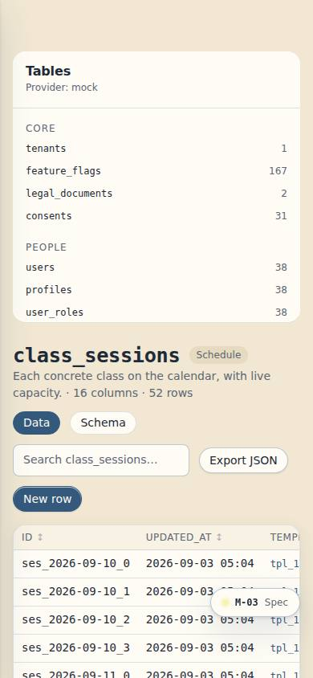
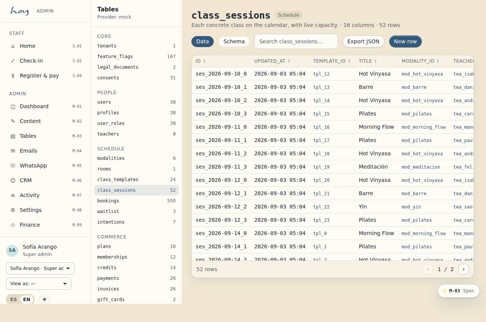
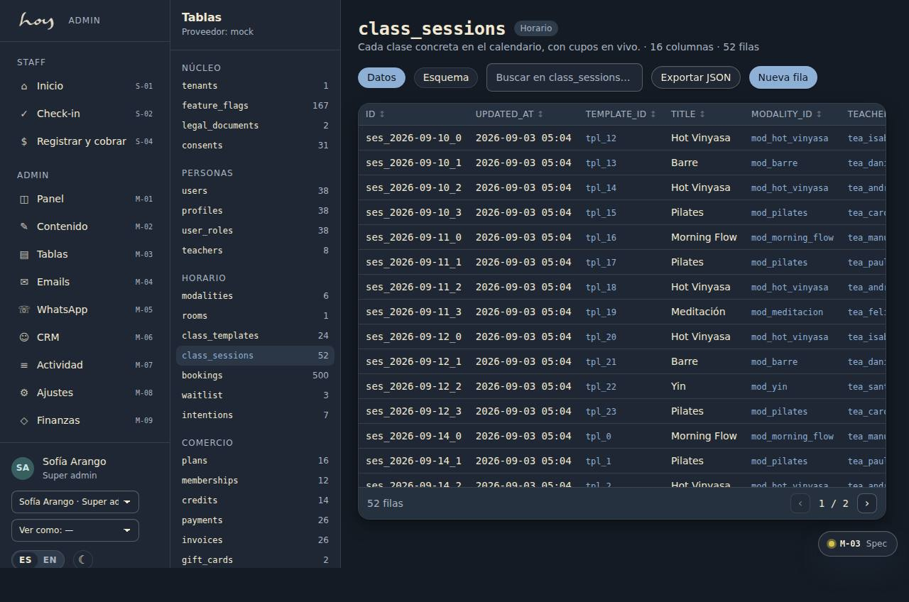
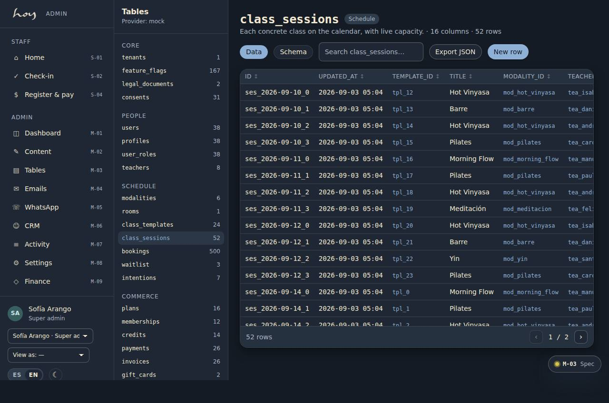

# M-03 — Tables & relations

**Route** `/#/admin/tables` · `/#/admin/tables/:table` · **Roles** super_admin, finance · **Surface** admin · **Spec** `spec.code === 'M-03'` (see `/#/dev/specs`)

## Purpose
The data model in one place, so developers and the studio agree on what exists: entities, keys, relations and cardinality.

## Screenshots
| ES · mobile | EN · mobile |
| --- | --- |
|  |  |

| ES · desktop | EN · desktop |
| --- | --- |
|  |  |

| ES · dark | EN · dark |
| --- | --- |
|  |  |

## Sections (layout order — `useLayout(spec)`)
1. `EntityGrid → EntityCard`
2. `RelationMap (cardinality)`
3. `MigrationLog`

## Data
| Table | Read / write | Notes |
| --- | --- | --- |
| `schema_metadata` | read | |
| `migrations` | read | |
| `indexes` | read | |
| `row_counts` | read | |

## Logic and integrations
- users 1—1 profiles, 1—N bookings, 1—N payments, 1—N consents.
- classes N—1 class_types, N—1 teachers, N—1 rooms; schedules 1—N classes via recurrence_rules.
- bookings 1—0..1 credit_ledger entries; orders 1—N payments; payments 1—0..1 refunds.
- Soft deletes everywhere financial; hard deletes only for biometric templates.
- All money in COP minor units; all timestamps UTC with America/Bogota display.
- Integrations: Wompi, Supabase Auth

## States
- Loading: grid skeleton
- Unmigrated change: amber badge on the entity

## Real vs mock
- Real: the page renders from the data layer (`useData()` / `useTable`) over the tables above; every write goes through the `DataProvider` so the Supabase provider replaces the mock unchanged.
- Mock / pending: Wompi, Supabase Auth are simulated or deferred; data is the browser-local `MockProvider` seed.

## Changelog
- `docs/changelog/0005-final-integration.md` — screenshots and this page doc (v0.3.0)

---
**Resumen (ES).** Tablas y relaciones. Todas las tablas del sistema, limpias y ordenadas, con edición, filtros y exportación.
