# M-03 — Tables & relations

**Route** `/#/admin/tables` · `/#/admin/tables/:table` · **Roles** super_admin, finance, developer · **Surface** admin · **Spec** `M03` in `src/modules/admin/specs.ts` (`spec.code === 'M-03'`, see `/#/dev/specs`)

## Purpose
The studio's data manager with views. Any of the 57 tables opens as a grid, list, gallery, board or relationship graph, with filters, multi-sort, grouping, hidden columns and views saved for the team. Everything is written in words (Inter headings, DM Sans body; the `snake_case` names appear only in dev mode), a foreign key shows the title of the row it points at and opens it, and the row panel lists what uses the row. Redesigned in 0044 after "it looks like it's only for developers"; the schema stays the single source (D-0020) and saved views are rows in `table_views` (D-0021).

## Screenshots
| ES · mobile | EN · mobile |
| --- | --- |
| 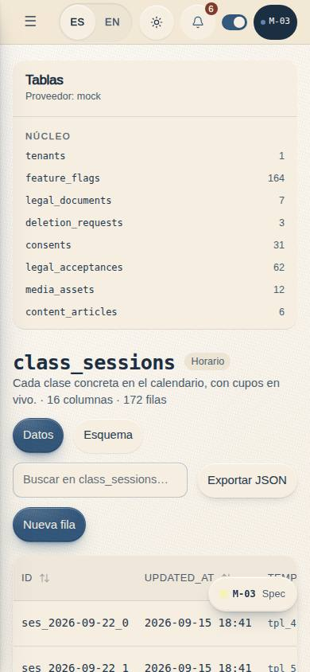 | 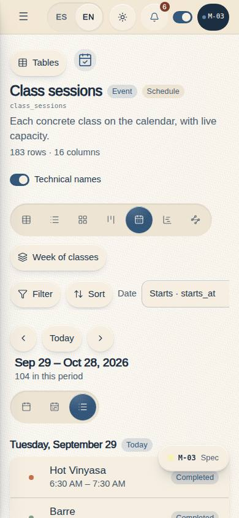 |

| ES · tablet | EN · tablet |
| --- | --- |
| 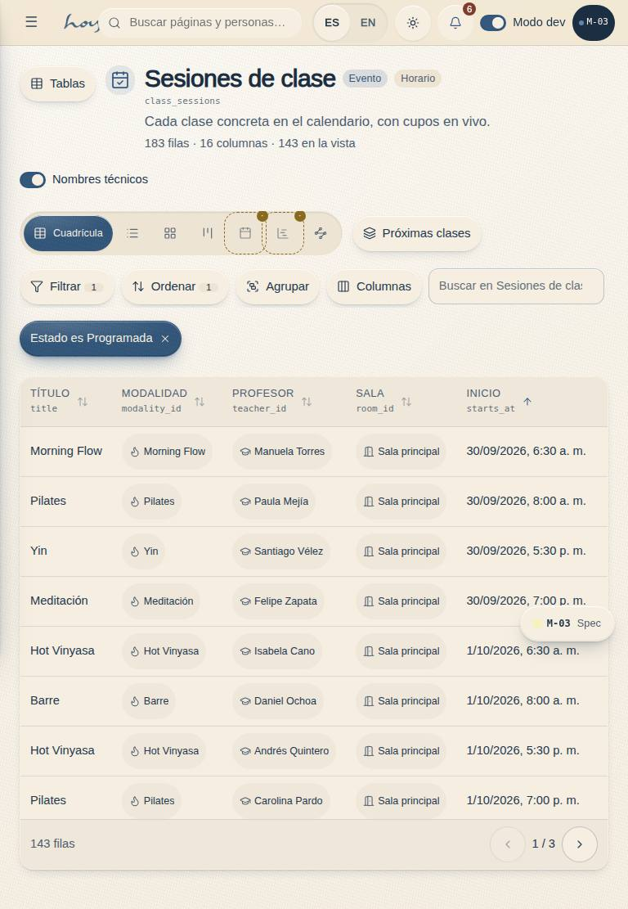 | 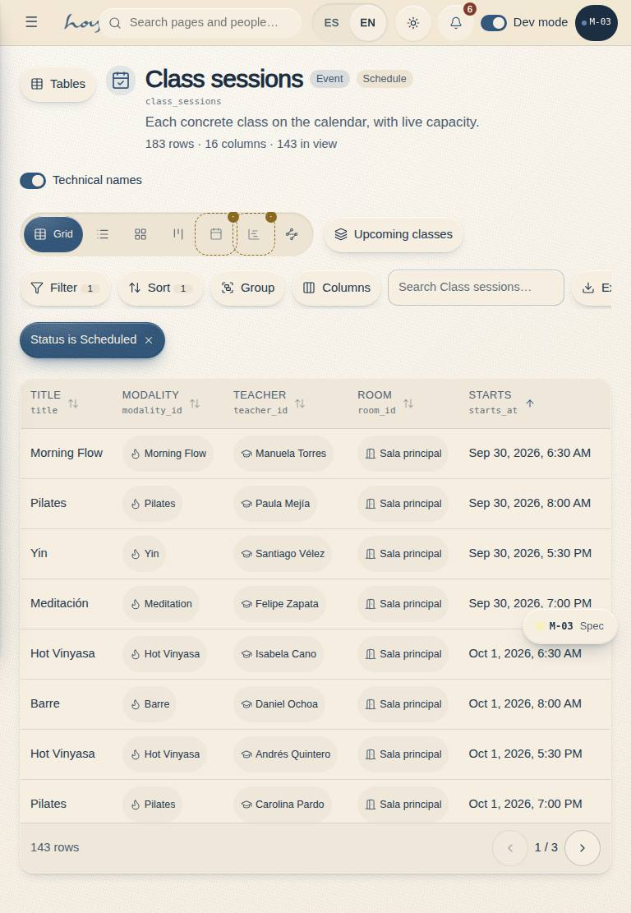 |

| ES · desktop | EN · desktop |
| --- | --- |
| 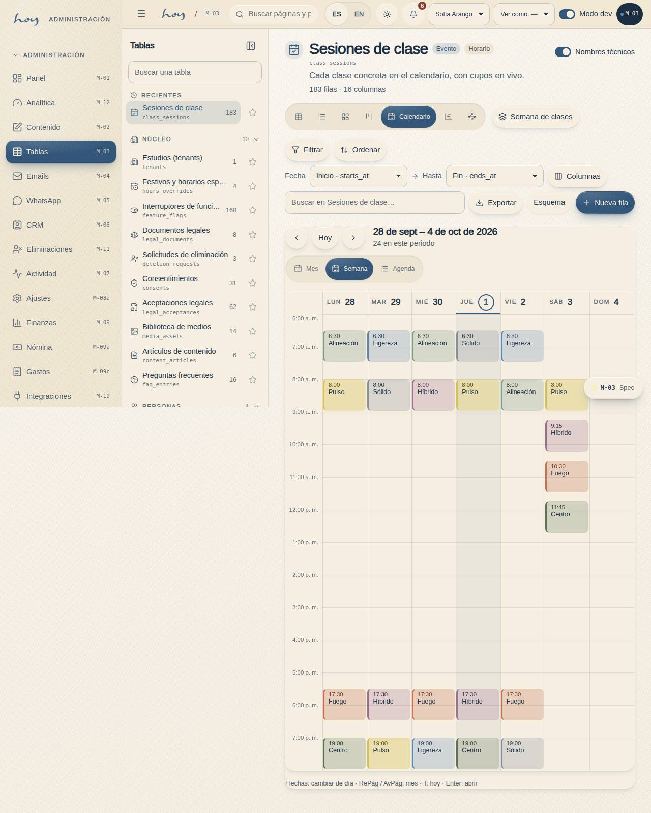 |  |

| ES · 1920 | EN · 1920 |
| --- | --- |
| 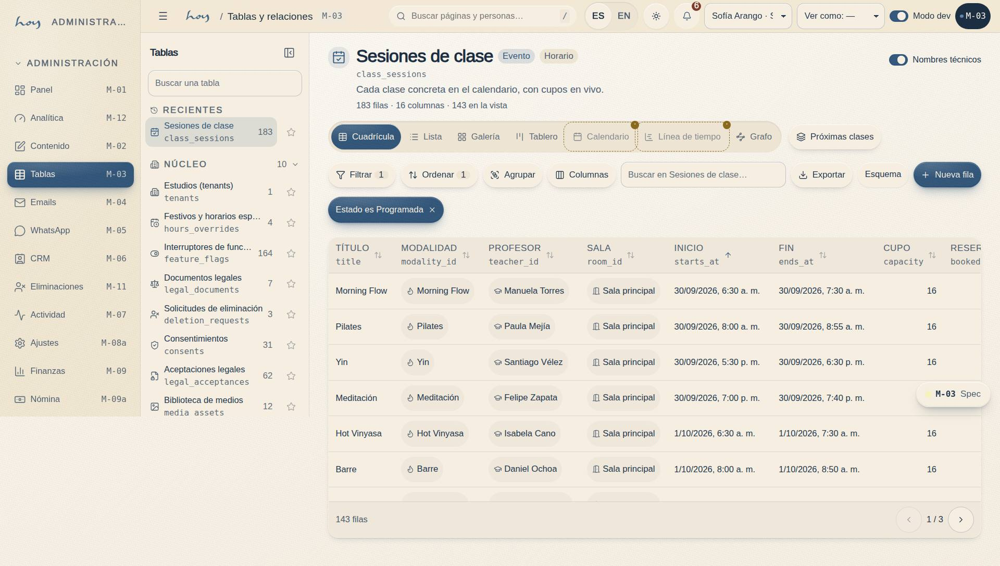 | 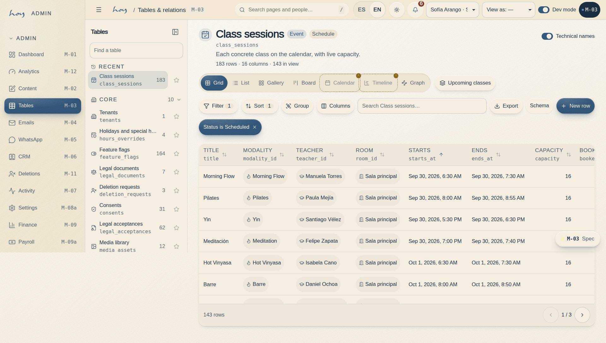 |

| ES · 4K TV | EN · 4K TV |
| --- | --- |
| 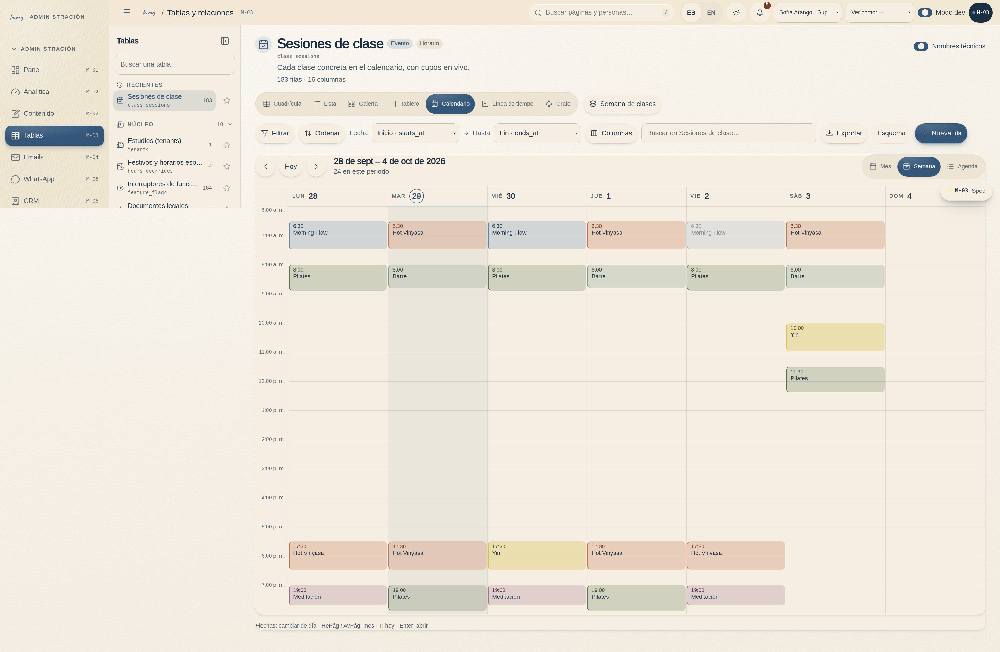 | 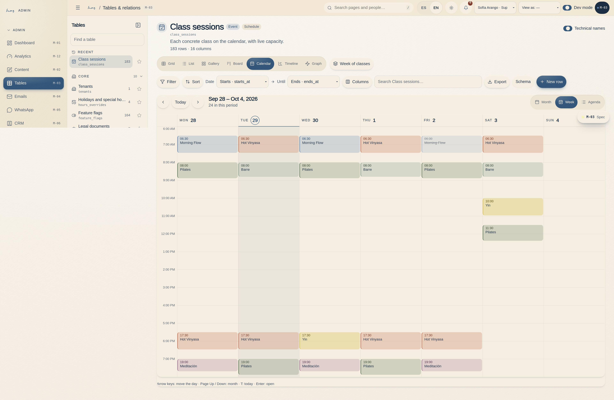 |

| ES · dark | EN · dark |
| --- | --- |
| 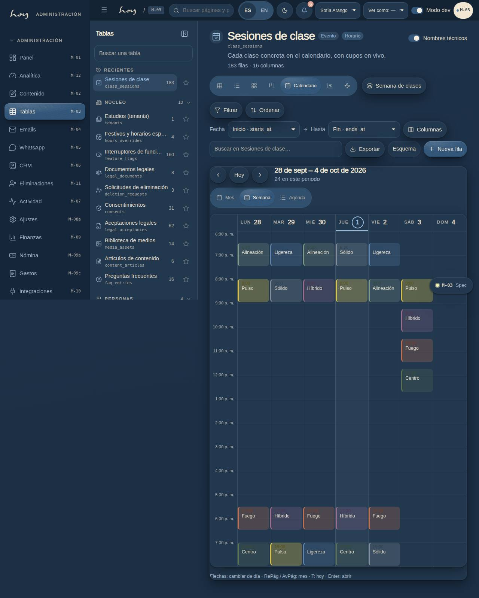 | 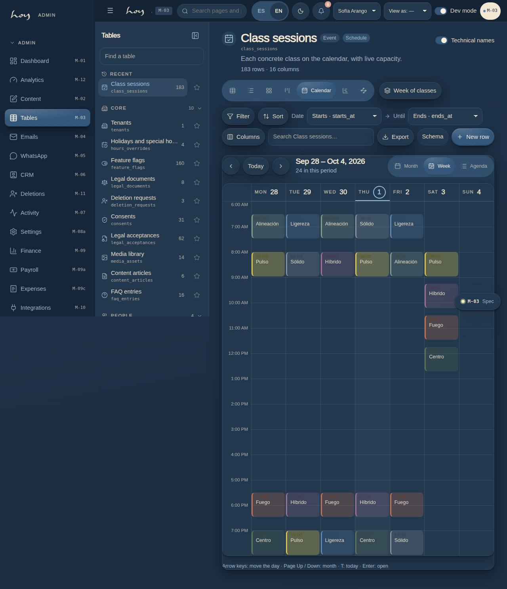 |

Before and after, and the two views that are hardest to see in a full-page capture:

| Before → after · 390 | Before → after · 1280 |
| --- | --- |
|  |  |

| Graph view · 1280 | Kanban view · 1280 |
| --- | --- |
|  |  |

## Sections (layout order — `useLayout(spec)`)
1. **`TablesSidebar`** (`tables/TablesSidebar.tsx`) — three states: expanded (desktop), rail (icons and counts) and a sheet on phones. Search, *Fijadas* (pinned), *Recientes* (last 5), the groups as accordions with counts, a provider footer, and "reset demo data" behind a design-system dialog. Collapse with the header toggle or `tables.toggleSidebar`; 44 px targets, arrow keys move, Escape closes the sheet. State in `localStorage['hoyos.tables.prefs']`.
2. **Header** — table icon, human title, kind and group badges, description, row and column counts, and (dev mode) the technical-names toggle.
3. **View switcher** (`SegmentedControl`, `compact`) — Grid · List · Gallery · Board · Graph work; Calendar and Timeline are `Placeholder` entries (disabled with a hint on tables without a date column) — not wired yet. Beside it the saved-views menu.
4. **Toolbar** (`tables/Panels.tsx`) — filter builder (operators by column type: is, is not, contains, empty, not empty, before, after, greater, less, in), multi-sort, group by, columns (show, hide, reorder), search, JSON / CSV export, the schema toggle, new row. Active filters show as removable chips. "Save view" writes the whole state into `table_views`.
5. **Views** (`tables/Views.tsx`, `tables/GraphView.tsx`, `tables/SchemaView.tsx`)
   - **Grid** — `DataTable` with `hiddenColumns`, `groupBy`, `multiSort`, `onCellRender`; FK cells show the referenced row's title (id in the tooltip) and open it.
   - **List** — one `ListRow` per record, title first, the other visible fields inline.
   - **Gallery** — `Card` grid from `titleColumn` and the first media or text columns.
   - **Board** — `KanbanBoard` (new organism): one lane per value of an enum or boolean column (default `status`); drag with the pointer or the keyboard (dnd-kit), or use the "Move to…" select on each card. Read-only without `tables.write`.
   - **Graph** — `RelationGraph` (new organism, SVG): table level draws the 57 tables coloured by group with the 83 foreign keys (the open table ringed, "neighbours only" toggle); row level draws one record with the rows it points at and the tables pointing at it. Zoom with the buttons or `+` `−` `0`, pan by drag or arrow keys, nodes are focusable, legend by group.
   - **Calendar, Timeline** — not wired yet (Pass B2).
6. **`RowDrawer`** (`tables/RowDrawer.tsx`) — fields by type; foreign-key pickers by title (with search above 50 rows); ES / EN inputs for bilingual `json` columns; a *System fields* group (`id`, `tenant_id`, timestamps); a *Related* section with one list per reverse relation, each with a count and a link; "Show in the graph"; delete with an in-product confirm.

## URL params (a linkable view)
| Param | Meaning |
| --- | --- |
| `?id=<row id>` | opens that row's drawer (foreign-key chips use it) |
| `?view=<kind>` | grid, list, gallery, kanban, graph |
| `?v=<view id>` | applies a saved view (`table_views`) |
| `?focus=<row id>` | centres the row-level graph on that row |
| `?where=<column>:<value>` | opens the table filtered (the drawer's Related links use it) |

Example: `/#/admin/tables/bookings?view=graph`.

## Actions (WebMCP — `window.__hoyos.actions`)
Declared in `src/modules/admin/actions.ts` (`ADMIN_ACTIONS['M-03']`).

| id | Intent (ES) | Params | Permission |
| --- | --- | --- | --- |
| `tables.open` | Abre la tabla {table} | `table` | `tables.read` |
| `tables.openRow` | Abre la fila {id} de {table} | `table`, `id` | `tables.read` |
| `tables.setView` | Muéstralo como {kind} | `kind: enum:grid,list,gallery,kanban,graph` (calendar, timeline answer "not wired yet") | `tables.read` |
| `tables.search` | Busca {q} en esta tabla | `q` (empty clears) | `tables.read` |
| `tables.filter` | Filtra donde {column} {op} {value} | `column`, `op: enum:is,is_not,contains,empty,not_empty,before,after,gt,lt,in`, `value` | `tables.read` |
| `tables.newRow` | Crea una fila nueva en esta tabla | — | `tables.write` |
| `tables.export` | Exporta esta vista en {format} | `format: enum:json,csv` | `tables.read` |
| `tables.toggleSidebar` | Contrae (o expande) la barra de tablas | — | `tables.read` |
| `tables.saveView` | Guarda esta vista como {name} | `name` | `tables.write` |
| `tables.pin` | Fija (o suelta) la tabla {table} | `table` (default: the open one) | `tables.read` |
| `tables.toggleTechnicalNames` | Muestra (u oculta) los nombres técnicos | — | `dev.tools` |

## Data
| Table | Read / write | Notes |
| --- | --- | --- |
| `table_views` | read / write | saved views: `table_name`, `name` {es,en}, `kind`, `config` (filters, sorts, groupBy, hiddenColumns, kanbanColumn, cardFields), `shared`, `is_default`, `created_by`; six seeded (bookings and payments boards, upcoming classes, classes by teacher, people, modalities) |
| any table in `src/data/schema.ts` | read / write | `useTable(name)` over `tableRegistry`; writes need `tables.write`; `api_keys.key_hash` (`sensitive`) is hidden for read-only roles |
| `tenants` | read | tenant context for the provider footer |

## Logic and integrations
- One pipeline for every view: rows → filters (AND) → search (display text of the visible columns) → sorts → view. Filters, sorts, group by, hidden columns, column order, card fields and the board column are the view state; "Save view" stores exactly that in `table_views.config`.
- Labels: `columnLabel()` = `ColumnDef.label` → the ES / EN dictionary in `src/data/labels.ts` (~300 terms) → `humanizeName()`; `tableLabel()` = `TableDef.label`; `rowTitle()` = `titleColumn` → first text column → id.
- Relations come from `ColumnDef.references` (`src/data/relations.ts`: `getRelations` 83 edges, `neighborsOf`, `reverseName`, `schemaGraph`, `layoutGraph` — a seeded force layout, identical on every render). `tenant_id` is left out.
- Technical names (`snake_case`) show only in dev mode, behind the `technical` preference (default on in dev mode). Exports use the raw column names and raw values.
- Per-viewer conveniences (sidebar state, open groups, pinned, recent, technical toggle) live in `localStorage['hoyos.tables.prefs']`; view state that is shared lives in `table_views` (D-0021).
- Integrations: `DataProvider` (MockProvider today, SupabaseProvider later): list / peek / insert / update / remove / subscribe. Nothing else.

## States
- No table picked (overview of every group)
- Grid · List · Gallery · Board · Graph (table level) · Graph (row level)
- Filtered to no rows
- Sidebar expanded / rail / phone sheet; search with no matching table
- Row drawer (edit); read-only for finance and developer
- Delete confirm and reset-demo-data confirm (in-product dialogs)
- Board without an option column
- Calendar / Timeline placeholder (disabled on tables without a date column)
- Technical names on (dev mode)

## Real vs mock
- Real: labels, sidebar, every view except calendar and timeline, filters, sorts, grouping, hidden columns, saved views as `table_views` rows through the `DataProvider`, the relations and graph derived from the schema, the row drawer with related rows, the URL params and the 11 declared actions.
- Mock / pending: data is the browser-local `MockProvider` seed (`SEED_VERSION` 7); saved views cannot be renamed or deleted in the UI yet; enum badges use one Spanish gender form until per-column labels land (B1); calendar and timeline are `Placeholder` (B2); the table-level graph overlaps labels around `users` (44 incoming keys). No presence, offline queue or optimistic `version` yet (Pass C in `docs/plans/tables-system.md`).

## Changelog
- `docs/changelog/0005-final-integration.md` — screenshots and the first page doc (v0.3.0)
- `docs/changelog/0044-tables-views.md` — redesign: human labels, sidebar, five views, graph, saved views, actions (v0.19.0) ([before](../screenshots/M-03/es-1280-before.jpg) → [after](../screenshots/M-03/es-1280.jpg))

---
**Resumen (ES).** Tablas y relaciones. El gestor de datos del estudio con vistas: cualquiera de las 57 tablas se abre como cuadrícula, lista, galería, tablero o grafo de relaciones, con filtros, orden, agrupación, columnas y vistas guardadas para el equipo. Todo en palabras (los nombres técnicos solo en modo dev), cada referencia abre la fila a la que apunta y el panel de la fila muestra quién la usa. Calendario y línea de tiempo llegan en la siguiente pasada.
