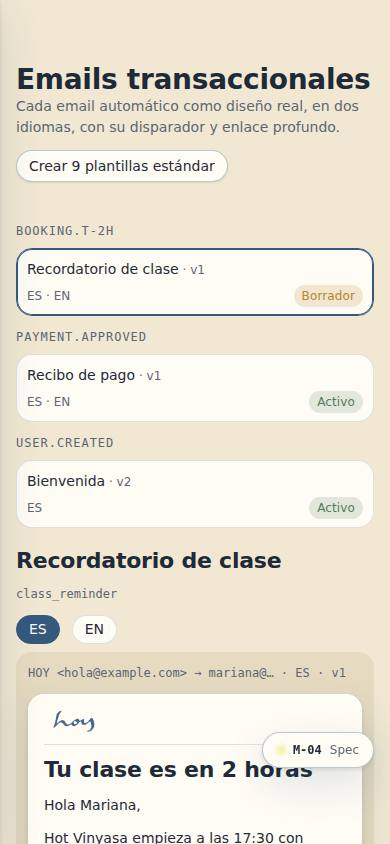
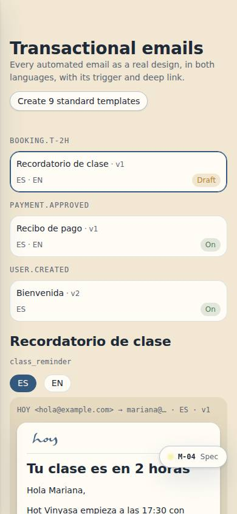
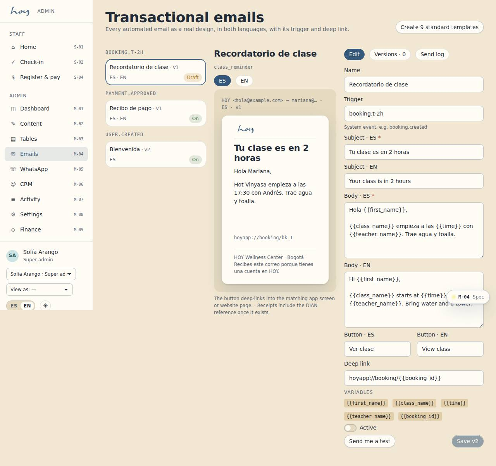

# M-04 — Transactional email designs

**Route** `/#/admin/emails` · **Roles** coordinator, super_admin, finance · **Surface** admin · **Spec** `spec.code === 'M-04'` (see `/#/dev/specs`)

## Purpose
Every automated email as a real design, editable and previewable, in both languages, with the trigger and the deep link it carries.

## Screenshots
| ES · mobile | EN · mobile |
| --- | --- |
|  |  |

| ES · desktop | EN · desktop |
| --- | --- |
|  |  |

## Sections (layout order — `useLayout(spec)`)
1. `TemplateList (trigger, locale, status)`
2. `Canvas (EmailPreview)`
3. `VariablePanel + Editor`
4. `LocaleSwitch ES / EN`
5. `Versions + TestSend + SendLog`

## Data
| Table | Read / write | Notes |
| --- | --- | --- |
| `email_templates` | read | |
| `message_log` | read / write | |
| `audit_log` | read / write | |

## Logic and integrations
- Templates: booking confirmed, receipt, class cancelled, waitlist promoted, class reminder, how to prepare, birthday, membership renewal, payment failed, gift card delivered, invite.
- Every template deep-links into the matching app screen or website page.
- Receipts include the DIAN electronic invoice reference.
- Version history with rollback; a test send never touches the real send log.
- Integrations: Wompi, Email, Supabase Auth, Supabase Realtime, DIAN e-invoicing

## States
- Unsaved changes: sticky save bar
- Missing translation: blocked from activation
- Provider error: banner with retry

## Real vs mock
- Real: the page renders from the data layer (`useData()` / `useTable`) over the tables above; every write goes through the `DataProvider` so the Supabase provider replaces the mock unchanged.
- Mock / pending: Wompi, Email, Supabase Auth, Supabase Realtime, DIAN e-invoicing are simulated or deferred; data is the browser-local `MockProvider` seed.
- Note: body_mjml stores a JSON {es,en} plain-text body until the MJML designer exists.
- Note: Versions are the audit_log rows of the template; rollback restores the before value.
- Note: Test send writes message_log with payload.test = true.

## Changelog
- `docs/changelog/0005-final-integration.md` — screenshots and this page doc (v0.3.0)

---
**Resumen (ES).** Diseños de email transaccional. Diseñar y versionar los emails transaccionales con disparadores y estadísticas.
