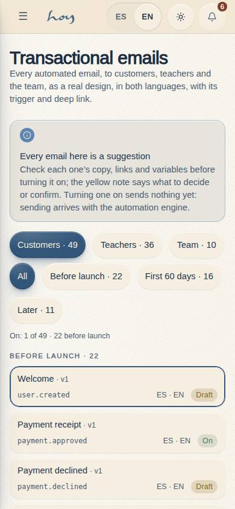

# M-04 — Transactional email designs

**Route** `/#/admin/emails` · **Roles** coordinator, super_admin, finance · **Surface** admin · **Spec** `spec.code === 'M-04'` (see `/#/dev/specs`)

## Purpose
Every automated email as a real design, editable and previewable, in both languages, with the trigger and the deep link it carries.

## Screenshots
| ES · mobile | EN · mobile |
| --- | --- |
|  |  |

| ES · desktop | EN · desktop |
| --- | --- |
|  |  |

## Sections (layout order — `useLayout(spec)`)
1. `TemplateList (audience → priority, trigger, locale, status)`
2. `Canvas (EmailPreview)`
3. `VariablePanel + Editor`
4. `LocaleSwitch ES / EN`
5. `Versions + TestSend + SendLog`

## Data
| Table | Read / write | Notes |
| --- | --- | --- |
| `email_templates` | read | |
| `message_log` | read / write | |
| `audit_log` | read / write | |

## Logic and integrations
- Templates: the 72 emails of `src/data/emailCatalog.ts` (0055) — 38 to customers, 33 to teachers, 1 to the team — each with its recipient, priority, trigger and deep link. Inventory and gaps: `docs/reference/automated-emails.md`.
- Every template deep-links into the matching app screen or website page.
- Receipts include the DIAN electronic invoice reference.
- Version history with rollback; a test send never touches the real send log.
- Integrations: Wompi, Email, Supabase Auth, Supabase Realtime, DIAN e-invoicing

## States
- Unsaved changes: sticky save bar
- Missing translation: blocked from activation
- Provider error: banner with retry

## Real vs mock
- Real: the page renders from the data layer (`useData()` / `useTable`) over the tables above; every write goes through the `DataProvider` so the Supabase provider replaces the mock unchanged.
- Mock / pending: Wompi, Email, Supabase Auth, Supabase Realtime, DIAN e-invoicing are simulated or deferred; data is the browser-local `MockProvider` seed.
- Note: body_mjml stores a JSON {es,en} plain-text body until the MJML designer exists.
- Note: Versions are the audit_log rows of the template; rollback restores the before value.
- Note: Test send writes a `message_log` row — `direction outbound`, `source manual`, `subject` = the template subject, `sent_by` = you, `payload.test = true` — so it is excluded from the customer conversations (M-06 / S-06) and shows only in this log.

## 0051 — the studio's verified content (2026-10-01)
The standard set's renewal email became **"Paquete por vencer"** (`package.expiring`: classes left and expiry,
link to Mis clases); the class-cancelled email returns the class to the package.

## 0055 — the automated email inventory (2026-10-03)
Lore's three inventories (website, customer app, teacher app) are in M-04: 72 templates in ES and EN. Tabs by recipient
(Clientes · Profesores · Equipo), a priority filter (Antes del lanzamiento · Primeros 60 días · Después) and the list
grouped by priority. Each email shows when it sends, its priority, whether a screen already promises it, whether it is
marketing (needs opt-in), whether the channel is still email-or-WhatsApp, and what the 2026-10-02 inventory said. The
editor sets recipient and priority (`email_templates.audience`, `priority`). Only the receipt is on.

## Changelog
- `docs/changelog/0055-automated-emails-inventory.md` — 72 automated emails by recipient and priority (v0.23.0, 2026-10-03)
- `docs/changelog/0051-website-verified-content.md` — "Paquete por vencer" replaces the membership renewal template (v0.22.0, 2026-10-01)
- `docs/changelog/0021-crm-conversacion-y-bandeja.md` — the test send writes the unified `message_log` shape (v0.8.0)
- `docs/changelog/0005-final-integration.md` — screenshots and this page doc (v0.3.0)

---
**Resumen (ES).** Diseños de email transaccional. Diseñar y versionar los emails transaccionales con disparadores y estadísticas.
