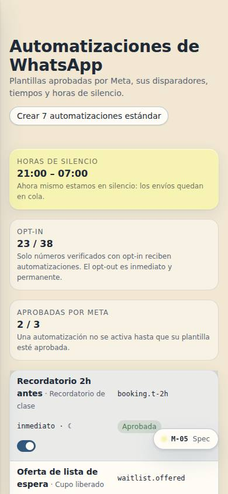
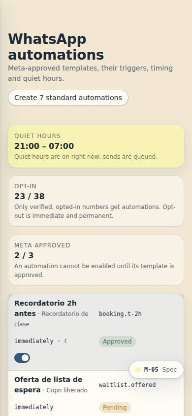

# M-05 — WhatsApp automations

**Route** `/#/admin/whatsapp` · **Roles** coordinator, super_admin, front_desk · **Surface** admin · **Spec** `spec.code === 'M-05'` (see `/#/dev/specs`)

## Purpose
The channel the studio actually lives on: approved template messages, their triggers, timing and quiet hours.

## Screenshots
| ES · mobile | EN · mobile |
| --- | --- |
|  |  |

| ES · desktop | EN · desktop |
| --- | --- |
|  |  |

## Sections (layout order — `useLayout(spec)`)
1. `AutomationList (trigger → template → delay)`
2. `PhonePreview (bubble render)`
3. `TemplateEditor + variables`
4. `ApprovalStatus (Meta) + QuietHours + OptIn`
5. `MessageLog`

## Data
| Table | Read / write | Notes |
| --- | --- | --- |
| `automations` | read | |
| `wa_templates` | read | |
| `message_log` | read / write | |
| `profiles` | read / write | |
| `users` | read / write | |
| `tenants` | read / write | |
| `audit_log` | read / write | |

## Logic and integrations
- Only opt-in numbers receive automations; opt-out is honoured immediately and permanently.
- Templates require Meta approval; status shown per template and per locale.
- Quiet hours 9pm–7am — non-urgent messages queue until morning; cancellations override.
- Automations: booking confirmed, reminder T−2h, class cancelled, waitlist promoted, birthday, receipt, membership expiring, feedback request, invite sent.
- Every send is logged with delivery and read state.
- Integrations: WhatsApp, Email, Supabase Realtime

## States
- Template pending approval: automation disabled with reason
- Rate limited: queue depth shown
- Opt-out: preview marked undeliverable

## Real vs mock
- Real: the page renders from the data layer (`useData()` / `useTable`) over the tables above; every write goes through the `DataProvider` so the Supabase provider replaces the mock unchanged.
- Mock / pending: WhatsApp, Email, Supabase Realtime are simulated or deferred; data is the browser-local `MockProvider` seed.
- Note: Quiet hours come from M-08 settings (default 21:00–07:00).
- Note: An automation cannot be enabled while its template is not approved by Meta.

## Changelog
- `docs/changelog/0005-final-integration.md` — screenshots and this page doc (v0.3.0)

---
**Resumen (ES).** Automatizaciones de WhatsApp. Automatizaciones de WhatsApp: plantillas aprobadas, disparadores, horas de silencio y registro.
