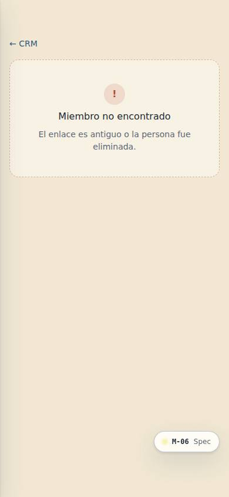
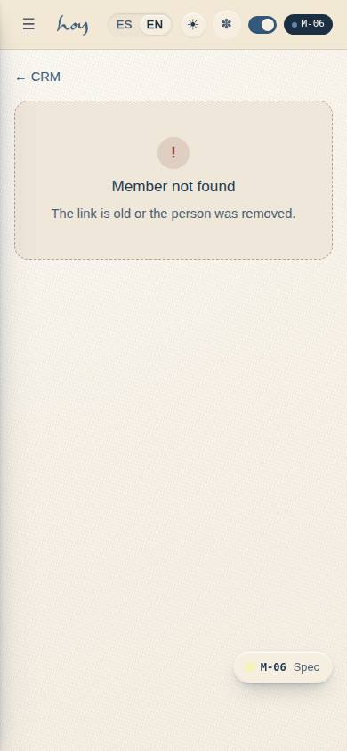

# M-06 — CRM · member 360

**Route** `/#/admin/crm` · `/#/admin/crm/:id` · **Roles** coordinator, front_desk, super_admin, finance · **Surface** admin · **Spec** `spec.code === 'M-06'` (see `/#/dev/specs`)

## Purpose
One record per person that the whole studio trusts: who they are, what they have paid, what they have attended, and every conversation across WhatsApp, email and the front desk — with staff notes on the same timeline.

## Screenshots
| ES · mobile | EN · mobile |
| --- | --- |
|  |  |

| ES · desktop | EN · desktop |
| --- | --- |
|  |  |

## Sections (layout order — `useLayout(spec)`)
1. `SegmentRail (all, at risk, new, no membership, birthdays)`
2. `MemberList (search, sort)`
3. `MemberDetail (IdentityHeader, MetricRow, Tabs, Timeline, NoteComposer)`

## Data
| Table | Read / write | Notes |
| --- | --- | --- |
| `users` | read / write | |
| `profiles` | read / write | |
| `memberships` | read / write | |
| `plans` | read | |
| `bookings` | read / write | |
| `class_sessions` | read | |
| `payments` | read / write | |
| `credits` | read / write | |
| `message_log` | read / write | |
| `consents` | read / write | |
| `audit_log` | read / write | |

## Logic and integrations
- The timeline merges every channel in one chronological stream — WhatsApp, email, in-app thread, staff notes and system events.
- Staff notes are internal and never visible to the member; health flags surface to teachers as a marker only.
- Churn risk is derived from visit cadence against the member's own baseline, not a global average.
- Front desk sees the timeline but cannot edit payments; Finance sees payments but not health notes.
- Every view of a member record is itself written to the activity log.
- Integrations: WhatsApp, Wompi, Email

## States
- Loading: list skeleton
- Empty segment: 'nobody matches yet'
- No consent: channels shown as unavailable
- Merged duplicate: banner with the merge history

## Real vs mock
- Real: the page renders from the data layer (`useData()` / `useTable`) over the tables above; every write goes through the `DataProvider` so the Supabase provider replaces the mock unchanged.
- Mock / pending: WhatsApp, Wompi, Email are simulated or deferred; data is the browser-local `MockProvider` seed.
- Note: At risk = member with plan or credits and no check-in in 21 days.
- Note: Staff notes are audit_log rows (member.note) — internal, never visible to the member.
- Note: Opening a record writes member.view to audit_log (Ley 1581).

## Changelog
- `docs/changelog/0019-app-store-readiness.md` — *Eliminaciones* (M-11) nav entry under CRM; the member header links there from a request (v0.7.0)
- `docs/changelog/0005-final-integration.md` — screenshots and this page doc (v0.3.0)

---
**Resumen (ES).** CRM · miembro 360. Ficha 360 del miembro: membresía, créditos, asistencia, pagos, conversaciones y notas.
