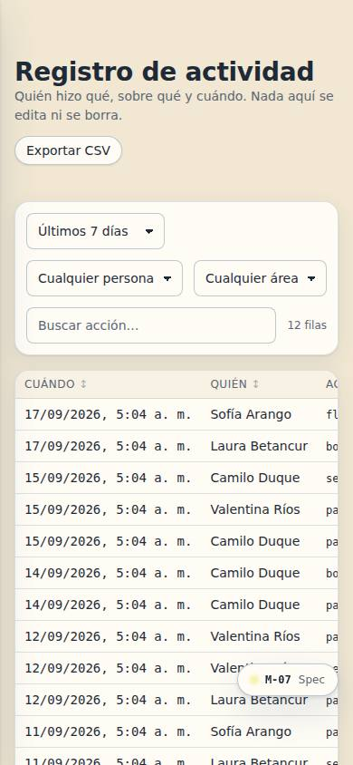
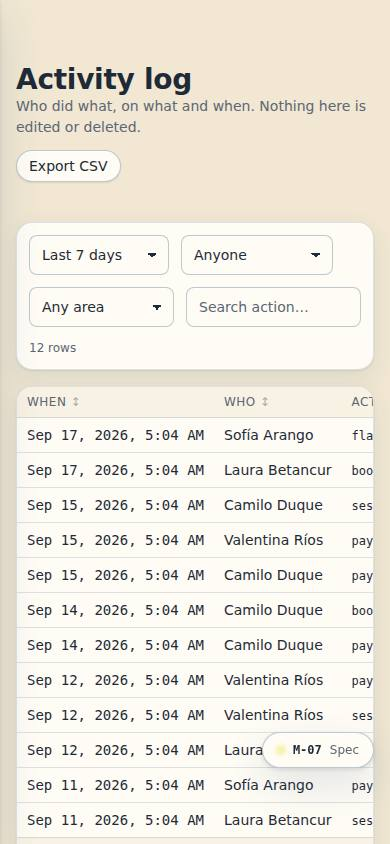

# M-07 — All activity log

**Route** `/#/admin/activity` · **Roles** super_admin, coordinator, finance · **Surface** admin · **Spec** `spec.code === 'M-07'` (see `/#/dev/specs`)

## Purpose
An immutable record of everything anyone did, so a disputed refund, a deleted class or a changed price can always be traced to a person and a moment. Nothing on this page can be edited.

## Screenshots
| ES · mobile | EN · mobile |
| --- | --- |
|  |  |

| ES · desktop | EN · desktop |
| --- | --- |
|  |  |

## Sections (layout order — `useLayout(spec)`)
1. `FilterBar (range, actor, entity, action)`
2. `SortableTable (When · Who · Action · Object · Source)`
3. `DetailDrawer (before / after)`
4. `ExportButton (CSV)`
5. `RetentionNotice`

## Data
| Table | Read / write | Notes |
| --- | --- | --- |
| `audit_log` | read / write | |
| `users` | read / write | |
| `profiles` | read / write | |
| `user_roles` | read | |

## Logic and integrations
- Append-only: no row can be edited or deleted by any role, including super admin.
- Every entry records actor, role, action, object, before and after values, source (app, admin, front desk, automation) and timestamp.
- Automations and system events are logged with the same shape as human actions.
- Retained 24 months, then archived to cold storage; export produces a signed CSV.
- Reading a member record is logged, so data access is auditable under Ley 1581.
- Integrations: Wompi, Email, Supabase Auth

## States
- Loading: table skeleton
- Empty: 'no activity in this range'
- Large range: paginated with a count
- Export running: progress + email on completion

## Real vs mock
- Real: the page renders from the data layer (`useData()` / `useTable`) over the tables above; every write goes through the `DataProvider` so the Supabase provider replaces the mock unchanged.
- Mock / pending: Wompi, Email, Supabase Auth are simulated or deferred; data is the browser-local `MockProvider` seed.
- Note: Append-only: the page has no write path.

## Changelog
- `docs/changelog/0005-final-integration.md` — screenshots and this page doc (v0.3.0)

---
**Resumen (ES).** Registro de actividad. Registro de toda la actividad del sistema con filtros por entidad, rol y fecha.
