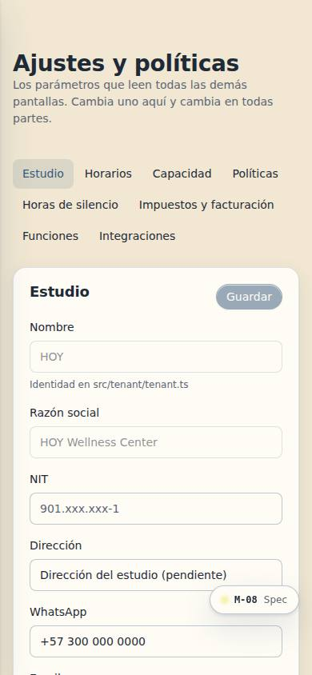
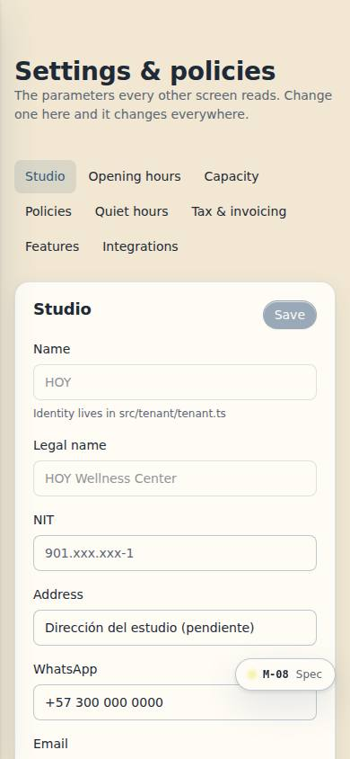
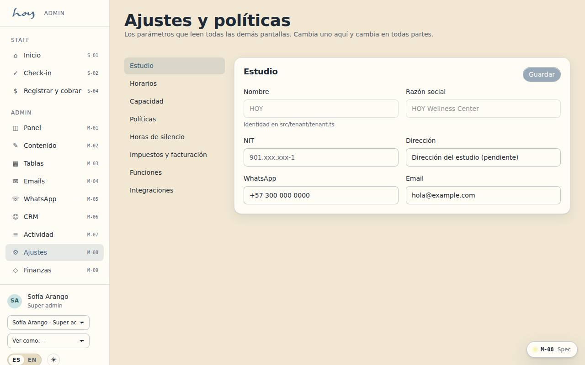
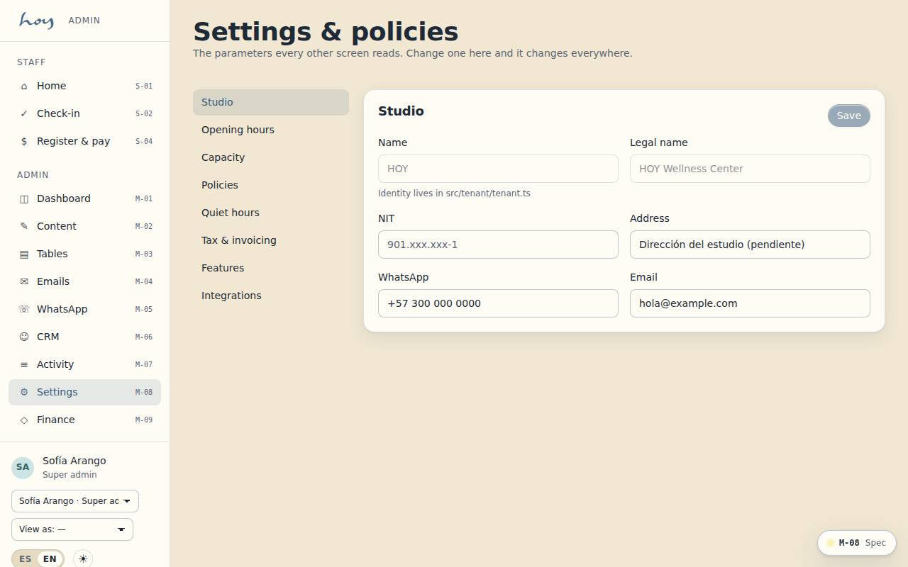

# M-08 — Studio settings & policies

**Route** `/#/admin/settings` · **Roles** super_admin, coordinator, finance · **Surface** admin · **Spec** `spec.code === 'M-08'` (see `/#/dev/specs`)

## Purpose
The operating parameters every other screen reads from: identity, hours, rooms, the cancellation and waitlist rules quoted across the app, tax and invoicing, and the third parties the studio depends on.

## Screenshots
| ES · mobile | EN · mobile |
| --- | --- |
|  |  |

| ES · desktop | EN · desktop |
| --- | --- |
|  |  |

## Sections (layout order — `useLayout(spec)`)
1. `SectionRail`
2. `StudioProfile`
3. `OpeningHours`
4. `Capacity`
5. `Policies`
6. `QuietHours`
7. `TaxAndInvoicing`
8. `FeatureFlags`
9. `Integrations`

## Data
| Table | Read / write | Notes |
| --- | --- | --- |
| `tenants` | read / write | |
| `feature_flags` | read | |
| `rooms` | read | |
| `audit_log` | read / write | |

## Logic and integrations
- Policy values are read at runtime by C-08, C-18 and E-02 — changing one here changes the copy everywhere, never a hardcoded string.
- A policy change applies to future bookings only; bookings already made keep the terms they were made under.
- Locations exist in the model even with one site, so a second sede needs no migration.
- DIAN resolution number and range are required before electronic invoicing can be switched on.
- Integration credentials are write-only in the UI and never displayed back.
- Integrations: WhatsApp, Wompi, Email, Supabase Realtime, DIAN e-invoicing

## States
- Saving: section-level confirmation
- Validation: DIAN range exhausted warning
- Integration down: amber status with last check
- No permission: section renders read-only

## Real vs mock
- Real: the page renders from the data layer (`useData()` / `useTable`) over the tables above; every write goes through the `DataProvider` so the Supabase provider replaces the mock unchanged.
- Mock / pending: WhatsApp, Wompi, Email, Supabase Realtime, DIAN e-invoicing are simulated or deferred; data is the browser-local `MockProvider` seed.
- Note: Stored in tenants.settings (json) via useSettings(); defaults from src/tenant/tenant.ts.
- Note: S-02 reads lateGraceMin, S-04 reads tax, M-05 reads quietHours.

## Changelog
- `docs/changelog/0005-final-integration.md` — screenshots and this page doc (v0.3.0)

---
**Resumen (ES).** Ajustes y políticas del estudio. Perfil del estudio, sedes, salas, horarios, políticas, impuestos e integraciones.
