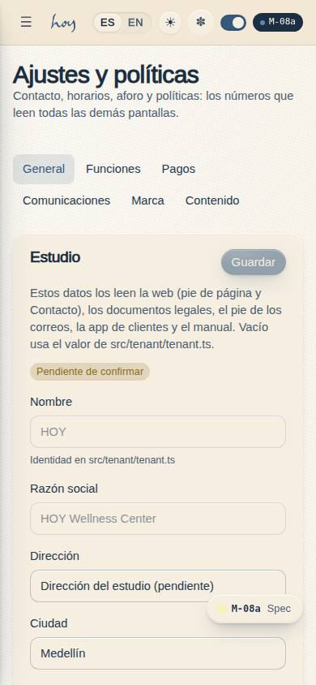
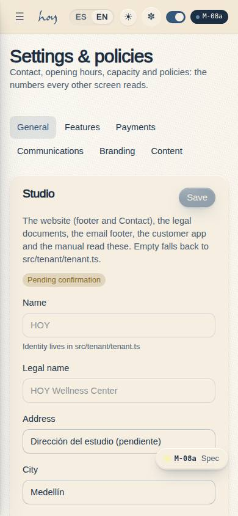
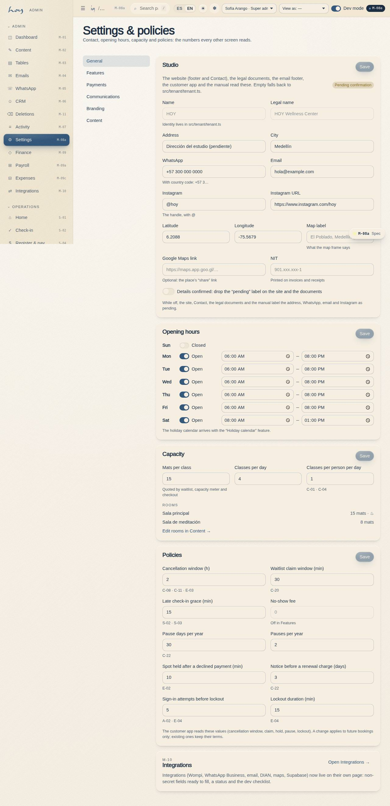

# M-08a — Settings · General

**Route** `/#/admin/settings` · **Roles** super_admin, coordinator, finance · **Surface** admin · **Spec** `spec.code === 'M-08a'` (see `/#/dev/specs`)

## Purpose
Contact identity, opening hours, capacity and policies: the numbers every other screen reads.

## Screenshots
| ES · mobile | EN · mobile |
| --- | --- |
|  |  |

| ES · desktop | EN · desktop |
| --- | --- |
|  |  |

## Sections (layout order — `useLayout(spec)`)
1. `SettingsSubNav`
2. `StudioProfile`
3. `OpeningHours`
4. `Capacity`
5. `Policies`
6. `Integrations`

## Data
| Table | Read / write | Notes |
| --- | --- | --- |
| `tenants` | read / write | |
| `feature_flags` | read | |
| `rooms` | read | |
| `audit_log` | read / write | |

## Logic and integrations
- Policy values are read at runtime by C-08, C-18 and E-02 — changing one here changes the copy everywhere, never a hardcoded string.
- A policy change applies to future bookings only; bookings already made keep the terms they were made under.
- Locations exist in the model even with one site, so a second sede needs no migration.
- DIAN resolution number and range are required before electronic invoicing can be switched on.
- Integration credentials are write-only in the UI and never displayed back.
- Integrations: WhatsApp, Wompi, Email, Supabase Realtime, DIAN e-invoicing

## States
- Saving: section-level confirmation
- Validation: DIAN range exhausted warning
- Integration down: amber status with last check
- No permission: section renders read-only

## Real vs mock
- Real: the page renders from the data layer (`useData()` / `useTable`) over the tables above; every write goes through the `DataProvider` so the Supabase provider replaces the mock unchanged.
- Mock / pending: WhatsApp, Wompi, Email, Supabase Realtime, DIAN e-invoicing are simulated or deferred; data is the browser-local `MockProvider` seed.
- Note: Stored in tenants.settings (json) via useSettings(); defaults from src/tenant/tenant.ts.
- Note: S-02 reads lateGraceMin, S-04 reads tax, M-05 reads quietHours.
- Note: usePolicy() (src/modules/admin/settings.ts) re-renders consumers when a section is saved.
- Note: Sub-page of M-08; the sub-navigation is shared by all five.

## 0018 — contact identity as settings
The `StudioProfile` card now holds address, **city**, WhatsApp, email, **Instagram (handle + URL)**, **map coordinates, label and Google Maps link**, NIT and a **“Datos confirmados”** switch. `useContact()` (`src/modules/admin/settings.ts`) is the one reader — M-08a first, `src/tenant/tenant.ts` as the default for every empty field — and the site footer, W-06, `MapSlot`, the legal `{{tenant.*}}` tokens, the email footer, the customer contact rows and the manual's `{{tenant:contact}}` label the values as pending until the switch is on. The `Integrations` section became a pointer to **M-10**.

## Changelog
- `docs/changelog/0018-decisions-as-settings.md` — contact identity fields, confirmed switch, M-10 pointer (v0.7.0)
- `docs/changelog/0007-admin-shell.md` — M-08 split into five routed sub-pages (v0.5.0)
- `docs/changelog/0010-final-pass-0.5.0.md` — screenshots and this page doc (v0.5.0)

---
**Resumen (ES).** Ajustes · General. Identidad de contacto, horario de apertura, aforo y políticas: los números que todas las demás pantallas leen.
