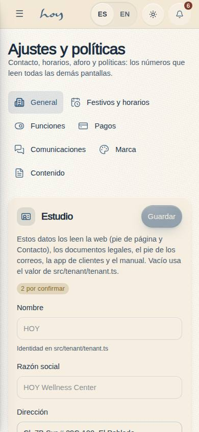
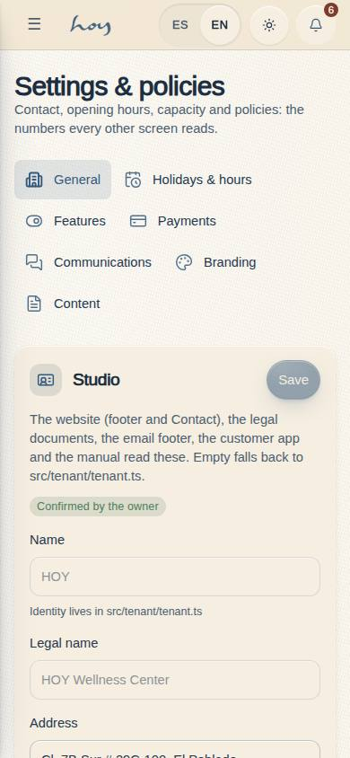

# M-08a — Settings · General

**Route** `/#/admin/settings` · **Roles** super_admin, coordinator, finance · **Surface** admin · **Spec** `spec.code === 'M-08a'` (see `/#/dev/specs`)

## Purpose
Contact identity, opening hours, capacity and policies: the numbers every other screen reads.

## Screenshots
| ES · mobile | EN · mobile |
| --- | --- |
|  |  |

| ES · desktop | EN · desktop |
| --- | --- |
|  |  |

## Sections (layout order — `useLayout(spec)`)
1. `SettingsSubNav`
2. `StudioProfile`
3. `WhatsappContacts` (0047)
4. `OpeningHours`
5. `Capacity`
6. `Policies`
7. `Integrations`

## Data
| Table | Read / write | Notes |
| --- | --- | --- |
| `tenants` | read / write | |
| `feature_flags` | read | |
| `rooms` | read | |
| `audit_log` | read / write | |

## Logic and integrations
- Policy values are read at runtime by C-08, C-18 and E-02 — changing one here changes the copy everywhere, never a hardcoded string.
- A policy change applies to future bookings only; bookings already made keep the terms they were made under.
- Locations exist in the model even with one site, so a second sede needs no migration.
- DIAN resolution number and range are required before electronic invoicing can be switched on.
- Integration credentials are write-only in the UI and never displayed back.
- Integrations: WhatsApp, Wompi, Email, Supabase Realtime, DIAN e-invoicing

## States
- Saving: section-level confirmation
- Validation: DIAN range exhausted warning
- Integration down: amber status with last check
- No permission: section renders read-only

## Real vs mock
- Real: the page renders from the data layer (`useData()` / `useTable`) over the tables above; every write goes through the `DataProvider` so the Supabase provider replaces the mock unchanged.
- Mock / pending: WhatsApp, Wompi, Email, Supabase Realtime, DIAN e-invoicing are simulated or deferred; data is the browser-local `MockProvider` seed.
- Note: Stored in tenants.settings (json) via useSettings(); defaults from src/tenant/tenant.ts.
- Note: S-02 reads lateGraceMin, S-04 reads tax, M-05 reads quietHours.
- Note: usePolicy() (src/modules/admin/settings.ts) re-renders consumers when a section is saved.
- Note: Sub-page of M-08; the sub-navigation is shared by all five.

## 0018 — contact identity as settings
The `StudioProfile` card now holds address, **city**, WhatsApp, email, **Instagram (handle + URL)**, **map coordinates, label and Google Maps link**, NIT and a **“Datos confirmados”** switch. `useContact()` (`src/modules/admin/settings.ts`) is the one reader — M-08a first, `src/tenant/tenant.ts` as the default for every empty field — and the site footer, W-06, `MapSlot`, the legal `{{tenant.*}}` tokens, the email footer, the customer contact rows and the manual's `{{tenant:contact}}` label the values as pending until the switch is on. The `Integrations` section became a pointer to **M-10**.

## 0036 — confirmed per field
The single “Datos confirmados” switch is now four (**WhatsApp · Dirección · Correo · Instagram**, `profile.confirmedFields`),
and the badge counts what is left (“2 por confirmar”). Defaults come from `tenant.contact.confirmed`: WhatsApp
(+57 312 776 5000) and the address (Cl. 7B Sur # 29C-100, El Poblado, 6.19281 / -75.56535) are confirmed from the owner
(2026-09-29); email and Instagram stay pending. Each consumer labels only the unconfirmed fields. A stored pre-0036
`confirmed: true` still confirms all four. The Google Maps link field stays empty: `tenant.location.link` (a search
for the address) is the default until the owner pastes a share link.

## 0041 — the hours are the source
The `OpeningHours` card is no longer a dead field: what the owner saves here (`tenants.settings.openingHours`) is what
the site footer, W-06, C-25, the manual's `{{tenant:hours}}`, the website's `LocalBusiness` JSON-LD and the Google
Business Profile body (M-10a) show, through `useOpeningHours()` (D-0016). The card gains today's line
(“Hoy: 06:00–20:00”, computed in America/Bogota with the M-08g exceptions), per-day labels on the time inputs
(“Lun: abre / cierra”), a Save that stays disabled while a closing time is not after its opening time, and two links
where the “holiday calendar arrives later” note used to be: **Festivos y horarios especiales** (M-08g) and **Google
Business Profile** (M-10a, admins). Action (WebMCP): `settings.hours.update` (day, open | closed, close).

## 0047 — WhatsApp contacts by topic (D-0022)
A new card, **Contactos de WhatsApp por tema**, sits under the studio profile: one row per intent — `frontDesk`, `sales`,
`specials`, `support`, `finance`, `payroll`, `legal`, `coordinator`, `owner` — with the topic, where it is used (page
codes), what it resolves to *right now* (from the draft, so the owner sees the effect before saving), a name, a WhatsApp
number, a staff role and an hours rule (`always` · `studioHours` · `businessDays`) with its explanation. A row with no
number says "Sin número: recae en recepción"; the `frontDesk` row with no number uses the studio WhatsApp from the card
above. Save stays disabled while a number has fewer than 10 digits. Stored in `tenants.settings.contacts`; read everywhere
through `useWhatsappLink()` → `resolveContact()` (`src/tenant/contacts.ts`): no number → front desk; off duty → front desk
while the studio is open, else the contact's number with the note "Respondemos el próximo día hábil (…)" computed from the
hours here, the M-08g exceptions and Colombia's holidays. Ships with roles and hours but **no numbers** (ROADMAP §E 48).
Layout: five columns on tokens (`.settings-contact`), two at 1280, one at 600; every control 44 px, keyboard-reachable.
Action (WebMCP): `settings.contacts.update` (intent, name?, whatsapp?, role?, hours?; `settings.write`).

## Changelog
- `docs/changelog/0047-whatsapp-contact-routing.md` — the "Contactos de WhatsApp por tema" card, `tenants.settings.contacts`, `settings.contacts.update` (v0.21.0, 2026-09-30)
- `docs/changelog/0041-hours-google-keys.md` — hours read everywhere, today line, links to M-08g / M-10a, `settings.hours.update` (v0.17.0, 2026-09-29)
- `docs/changelog/0036-real-contact.md` — per-field confirmation, real WhatsApp and address defaults (v0.13.1, 2026-09-29)
- `docs/changelog/0018-decisions-as-settings.md` — contact identity fields, confirmed switch, M-10 pointer (v0.7.0)
- `docs/changelog/0007-admin-shell.md` — M-08 split into five routed sub-pages (v0.5.0)
- `docs/changelog/0010-final-pass-0.5.0.md` — screenshots and this page doc (v0.5.0)
- `docs/changelog/0030-icons.md` — icon system: lucide glyphs behind the `Icon` atom (rail glyphs; section cards Studio (identity), Hours (clock), Capacity, Policies, Integrations) (v0.12.0, 2026-09-29)

---
**Resumen (ES).** Ajustes · General. Identidad de contacto, horario de apertura, aforo y políticas: los números que todas las demás pantallas leen.
