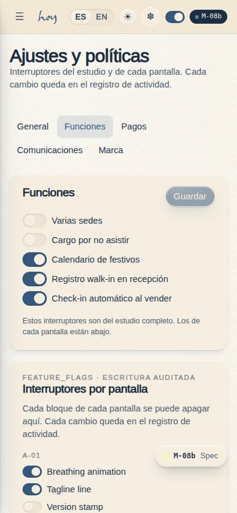
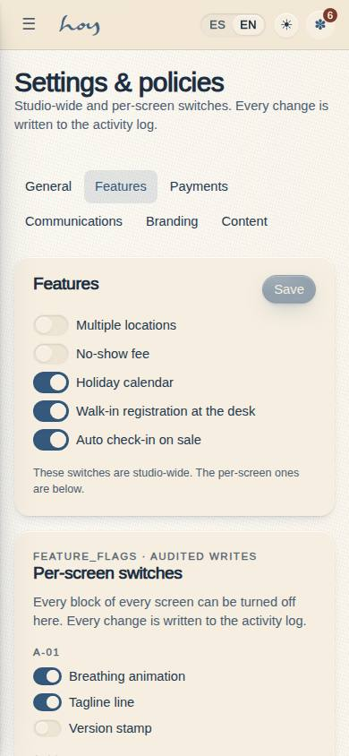
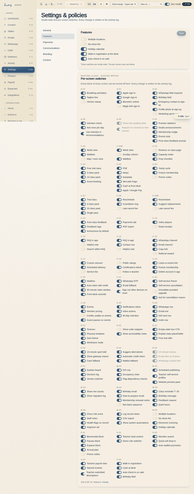

# M-08b — Settings · Features

**Route** `/#/admin/settings/features` · **Roles** super_admin, coordinator, finance · **Surface** admin · **Spec** `spec.code === 'M-08b'` (see `/#/dev/specs`)

## Purpose
Studio and per-page feature switches (feature_flags) with audited writes. They lived on the M-01 dashboard until 0.5.0.

## Screenshots
| ES · mobile | EN · mobile |
| --- | --- |
|  |  |

| ES · desktop | EN · desktop |
| --- | --- |
|  |  |

## Sections (layout order — `useLayout(spec)`)
1. `SettingsSubNav`
2. `StudioFeatures`
3. `FeatureFlagsByPage`

## Data
| Table | Read / write | Notes |
| --- | --- | --- |
| `tenants` | read / write | |
| `feature_flags` | read | |
| `rooms` | read | |
| `audit_log` | read / write | |

## Logic and integrations
- features.write gates every switch; without it the toggles render disabled.
- A-06 and E-04 flags are locked: the demo needs them on.
- Each flip writes audit_log flag.toggle with before/after.
- Integrations: WhatsApp, Wompi, Email, Supabase Realtime, DIAN e-invoicing

## States
- Loading
- Read-only (sin features.write)
- Flag bloqueado
- Guardado

## Real vs mock
- Real: the page renders from the data layer (`useData()` / `useTable`) over the tables above; every write goes through the `DataProvider` so the Supabase provider replaces the mock unchanged.
- Mock / pending: WhatsApp, Wompi, Email, Supabase Realtime, DIAN e-invoicing are simulated or deferred; data is the browser-local `MockProvider` seed.
- Note: Stored in tenants.settings (json) via useSettings(); defaults from src/tenant/tenant.ts.
- Note: S-02 reads lateGraceMin, S-04 reads tax, M-05 reads quietHours.
- Note: usePolicy() (src/modules/admin/settings.ts) re-renders consumers when a section is saved.
- Note: Sub-page of M-08; the sub-navigation is shared by all five.

## Changelog
- `docs/changelog/0007-admin-shell.md` — M-08 split into five routed sub-pages (v0.5.0)
- `docs/changelog/0010-final-pass-0.5.0.md` — screenshots and this page doc (v0.5.0)

---
**Resumen (ES).** Ajustes · Funciones. Interruptores de funciones del estudio y de página (feature_flags), con escritura auditada. Vivían en el panel M-01 hasta 0.5.0.
