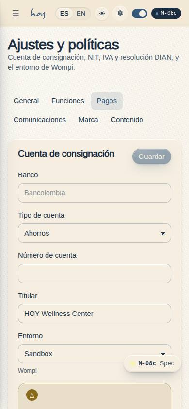
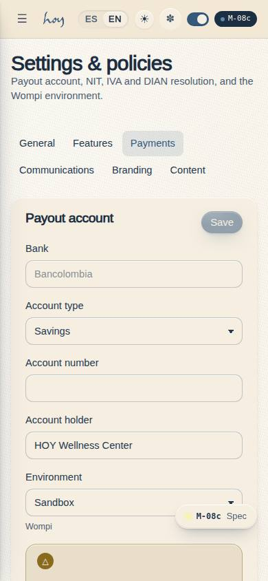
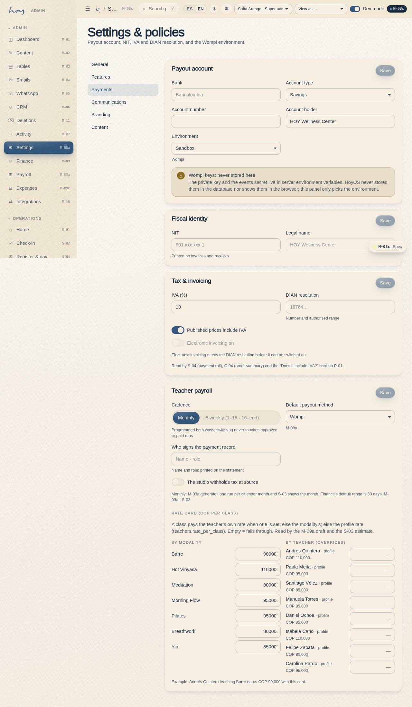

# M-08c — Settings · Payments

**Route** `/#/admin/settings/payments` · **Roles** super_admin, coordinator, finance · **Surface** admin · **Spec** `spec.code === 'M-08c'` (see `/#/dev/specs`)

## Purpose
Payout account, NIT, IVA and DIAN resolution, and the Wompi environment. Secret keys are never stored here.

## Screenshots
| ES · mobile | EN · mobile |
| --- | --- |
|  |  |

| ES · desktop | EN · desktop |
| --- | --- |
|  |  |

## Sections (layout order — `useLayout(spec)`)
1. `SettingsSubNav`
2. `PayoutAccount`
3. `WompiEnvironment + SecretNotice`
4. `FiscalIdentity (NIT)`
5. `TaxAndInvoicing (pricesIncludeIva)` — drives `splitTax()` on S-04, `OrderSummary` on C-04 and the P-01 “¿Incluye IVA?” card
6. `Payroll + RateCard` (0018) — cadence `monthly | biweekly` (both programmed: `payrollCalc.periodsFor()`, M-09a one or two runs per month, S-03 by period, Finance default range 30 / 15 d), default payout method, who signs the payment record, withholding flag, and the rate card by modality with per-teacher overrides (`payrollCalc.rateFor()`: teacher → modality → `teachers.rate_per_class`)

## Data
| Table | Read / write | Notes |
| --- | --- | --- |
| `tenants` | read / write | |
| `feature_flags` | read | |
| `rooms` | read | |
| `audit_log` | read / write | |

## Logic and integrations
- Policy values are read at runtime by C-08, C-18 and E-02 — changing one here changes the copy everywhere, never a hardcoded string.
- A policy change applies to future bookings only; bookings already made keep the terms they were made under.
- Locations exist in the model even with one site, so a second sede needs no migration.
- DIAN resolution number and range are required before electronic invoicing can be switched on.
- Integration credentials are write-only in the UI and never displayed back.
- Integrations: Wompi, DIAN e-invoicing

## States
- Saving: section-level confirmation
- Validation: DIAN range exhausted warning
- Integration down: amber status with last check
- No permission: section renders read-only

## Real vs mock
- Real: the page renders from the data layer (`useData()` / `useTable`) over the tables above; every write goes through the `DataProvider` so the Supabase provider replaces the mock unchanged.
- Mock / pending: Wompi, DIAN e-invoicing are simulated or deferred; data is the browser-local `MockProvider` seed.
- Note: Stored in tenants.settings (json) via useSettings(); defaults from src/tenant/tenant.ts.
- Note: S-02 reads lateGraceMin, S-04 reads tax, M-05 reads quietHours.
- Note: usePolicy() (src/modules/admin/settings.ts) re-renders consumers when a section is saved.
- Note: Sub-page of M-08.
- Note: Wompi private keys live in server environment variables, never in tenants.settings nor in the browser.

## Changelog
- `docs/changelog/0018-decisions-as-settings.md` — payroll cadence switch, rate card, payout method, signer (v0.7.0)
- `docs/changelog/0007-admin-shell.md` — M-08 split into five routed sub-pages (v0.5.0)
- `docs/changelog/0010-final-pass-0.5.0.md` — screenshots and this page doc (v0.5.0)

---
**Resumen (ES).** Ajustes · Pagos. Cuenta de consignación, NIT, IVA y resolución DIAN, y el entorno de Wompi. Las llaves secretas nunca se guardan aquí.
