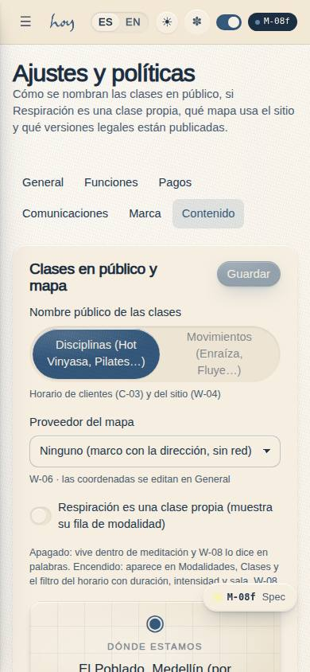
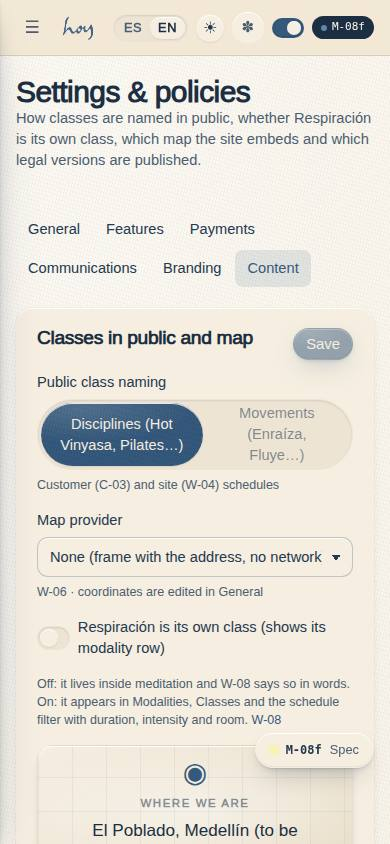
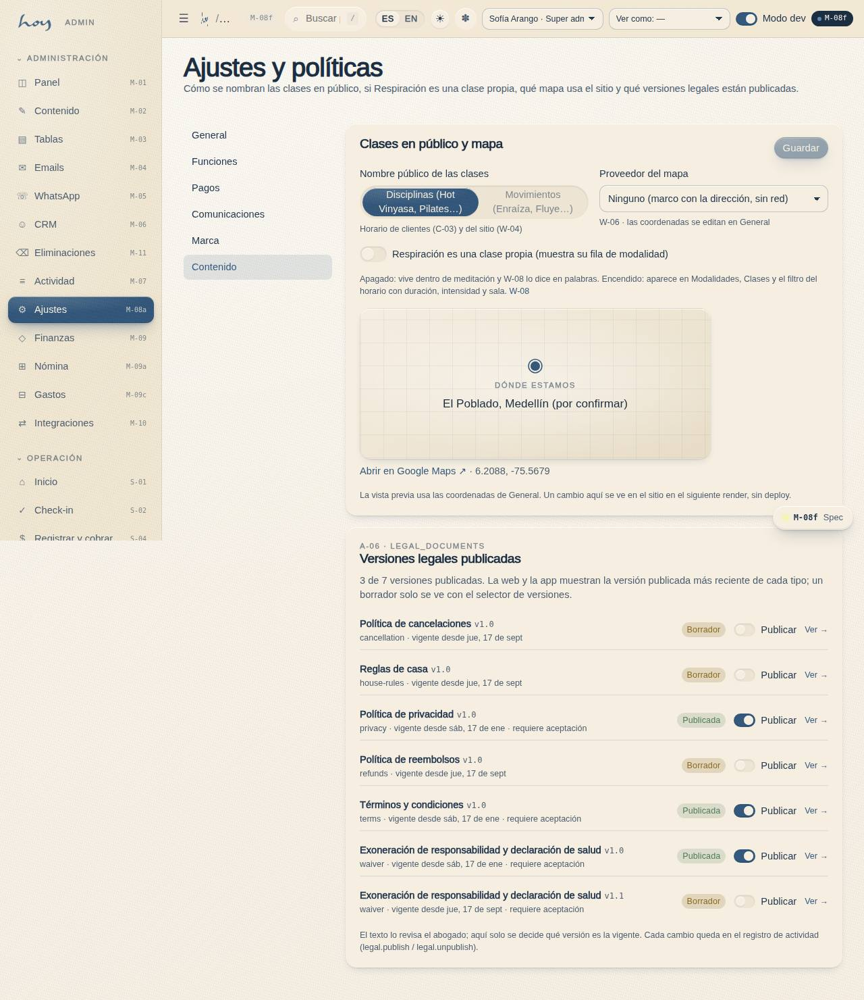
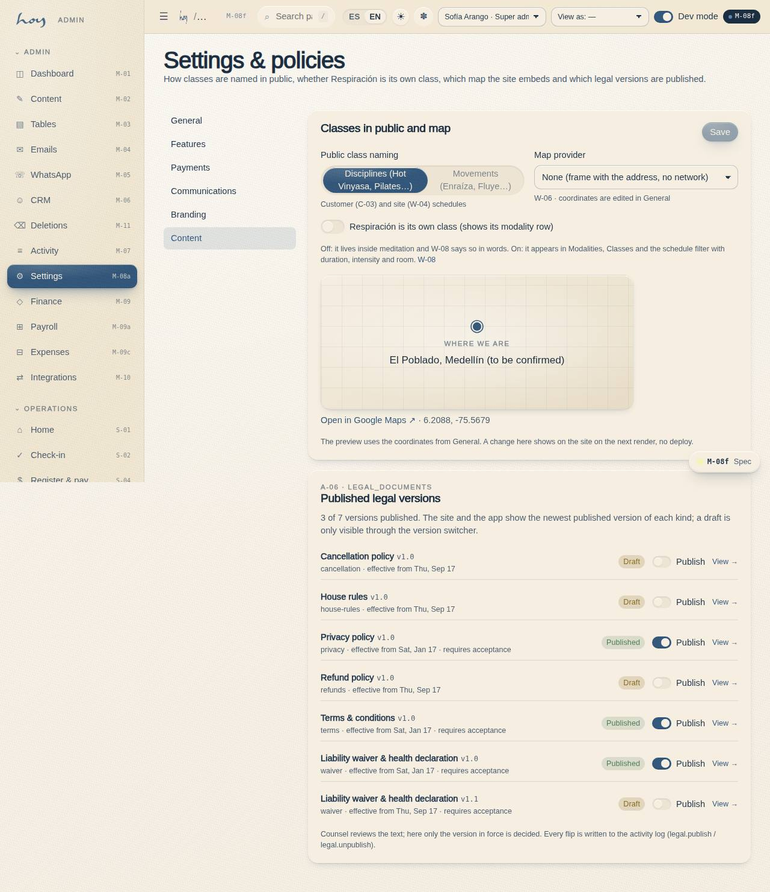

# M-08f — Settings · Content

**Route** `/#/admin/settings/content` · **Roles** super_admin, admin, coordinator · **Surface** admin · **Spec** `src/modules/admin/specs.ts` (`M08f`)

## Purpose
The owner's content decisions as settings (0018): how classes are named in public (disciplines or movements), whether Respiración is its own class or lives inside meditation, which map provider the site embeds, and which legal versions are published. Each one used to be a ROADMAP §E question; now it is a field.

## Screenshots
| ES · mobile | EN · mobile |
| --- | --- |
|  |  |

| ES · desktop | EN · desktop |
| --- | --- |
|  |  |

## Sections (layout order — `useLayout(spec)`)
1. `SettingsSubNav` — shared by the six M-08 pages
2. `PublicNaming` — `SegmentedControl` disciplines | movements; `classDisplay()` applies it on C-03 and W-04
3. `BreathworkOwnClass` — toggle; `visibleModalities()` shows or hides the `respiracion` modality row on W-03 / W-07 / W-08 / the C-03 filter
4. `MapProvider + MapSlot preview` — none | osm | google; `MapSlot` reads it when no prop is passed; the preview uses M-08a's coordinates
5. `LegalVersions` — every `legal_documents` row with status badge, effective date, "requires acceptance" and a publish toggle; A-06 shows the newest published version per kind

## Data
| Table | Read / write | Notes |
| --- | --- | --- |
| `tenants` | read / write | `settings.content` section, saved as one card |
| `legal_documents` | read / write | `status` + `published_at` flipped by the toggle |
| `media_assets` | read | the map preview honours a drawn map flipped to `ready` |
| `audit_log` | write | `settings.update` (content), `legal.publish` / `legal.unpublish` |

## Logic and integrations
- `settings.write` gates the card and the legal toggles; without it everything renders disabled.
- Breathwork off (default) keeps W-08 `/site/classes/respiracion` on its "lives inside the guided classes" sentence; on, the page prints duration, intensity, room and movement from the modality row.
- Integrations: Maps (OSM / Google key-less embeds) — the embed is live once the provider is not `none`.

## Real vs mock
- Real: every field is a `tenants.settings` value read live through `useSettings()`; the legal toggle writes real rows.
- Mock / pending: the map embed makes a network request only when a provider is chosen; screenshots stay on `none`.

## Changelog
- `docs/changelog/0018-decisions-as-settings.md` — first version (v0.7.0)

---
**Resumen (ES).** Ajustes · Contenido: cómo se nombran las clases en público, si Respiración es una clase propia, qué mapa incrusta el sitio y qué versiones legales están publicadas. Decisiones del owner convertidas en campos.
