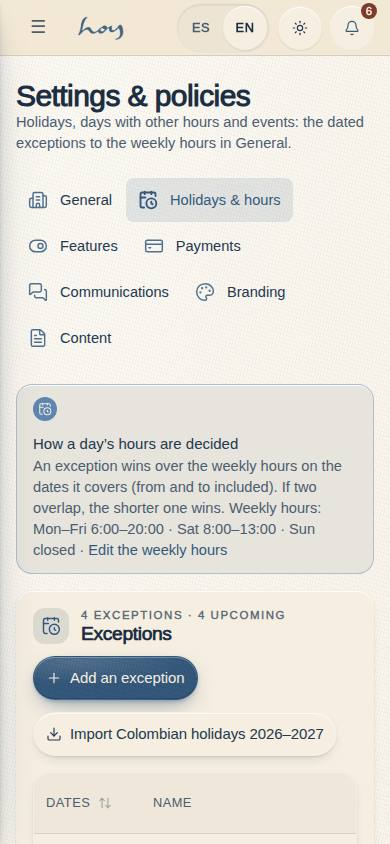
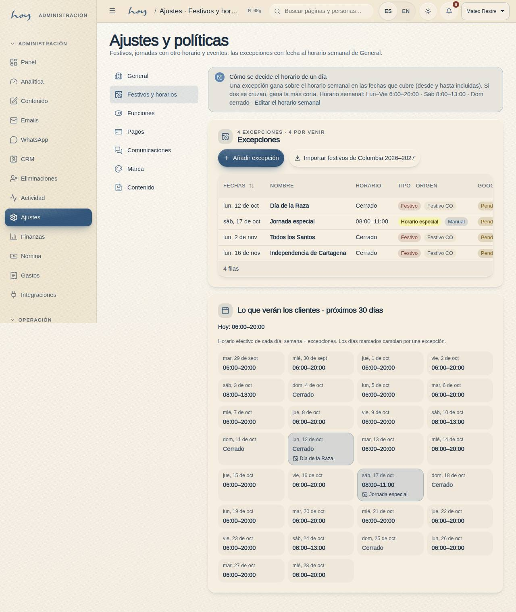
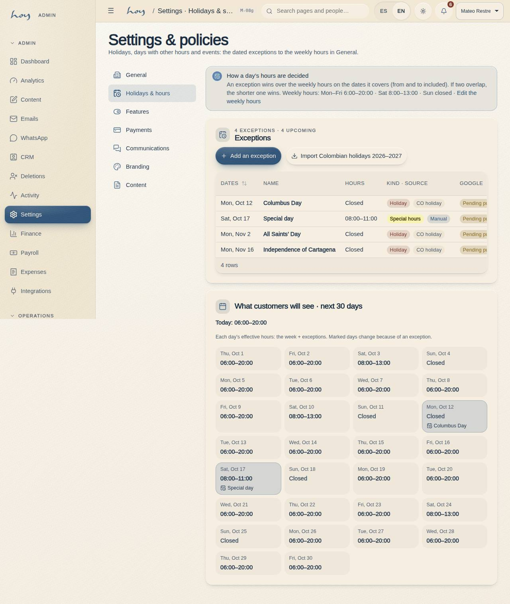

# M-08g — Settings · Holidays & special hours

**Route** `/#/admin/settings/hours` · **Roles** super_admin, admin, coordinator · **Surface** admin · **Spec** `spec.code === 'M-08g'` (see `/#/dev/specs`)

## Purpose
Dated exceptions to the weekly hours: closed holidays, days with other hours and events. Imports the Colombian holidays (Ley Emiliani) in one click, edits each exception in a panel and previews what customers will see over the next 30 days.

## Screenshots
| ES · mobile | EN · mobile |
| --- | --- |
|  |  |

| ES · desktop | EN · desktop |
| --- | --- |
|  |  |

## Sections (layout order — `useLayout(spec)`)
1. `SettingsSubNav` — the shared M-08 rail (new group `hours`, icon `calendar-clock`)
2. `PrecedenceNotice` — `Notice`: an exception wins on its dates, the narrowest wins on overlap, the weekly sentence, link back to M-08a
3. `Overrides` — `Card` with Add + “Import Colombian holidays {year}–{next}” and a `DataTable` (dates · name · hours or Closed · kind + source `Badge`s · Google state `Badge`); `EmptyState` when there are none
4. `Upcoming30Days` — today’s line and a grid of the next 30 days with the effective hours; override days are marked with their label
5. `OverrideDrawer` — `Drawer` form: from / to (`Input type=date`), name ES / EN, “Closed all day” `Toggle`, open / close (`Input type=time`), kind `Select`, note; Save / Delete (two-step)

## Data
| Table | Read / write | Notes |
| --- | --- | --- |
| `hours_overrides` | read / write | `useOpeningHours()` reads every row; the drawer and the import insert / update / remove (hours.write) |
| `tenants` | read | the weekly hours (`settings.openingHours`) for the precedence notice and the 30-day grid |
| `audit_log` | write | `hours.import_holidays`, `hours.override.save`, `hours.override.delete` |

## Logic and integrations
- An override covering a date wins over the weekly hours for that date (ranges inclusive; on overlap the narrowest range wins) — effectiveHoursFor() in src/tenant/hours.ts. An open override with empty times keeps the weekly times.
- Import: colombianHolidays() (src/tenant/holidays.co.ts, Ley 51/1983 with Meeus Easter) for the rest of this year and all of next; each holiday not already present on its date is inserted closed with source colombia. Audit hours.import_holidays with the count.
- Save / delete write audit_log hours.override.save / hours.override.delete with before and after. hours.write gates every write (admin, super_admin, coordinator).
- Validation: end ≥ start; when both times are set, close > open; one time without the other is refused; the Spanish label is required.
- The Google column reads google_synced_at: empty or older than updated_at = pending push. Only the server sets it (no server yet, D-0015).
- Integrations: Google Business Profile (specialHours, via M-10a)

## States
- Loading
- Empty (no exceptions yet)
- Seed: three holidays + one special Saturday
- Drawer new / edit
- Validation error
- Import done (n added) / nothing new
- Read-only (no hours.write)

## Real vs mock
- Real: the rows, the import, the validation, the audit entries and every reader (site footer, W-06, C-25, the manual’s {{tenant:hours}}, JSON-LD, M-10a) through `useOpeningHours()`.
- Mock / pending: the Google push. `google_synced_at` stays empty until the server exists, so every row shows “Pending push”.
- Actions (WebMCP): `settings.hours.override.add`, `settings.hours.override.remove`, `settings.hours.holidays.import`.

## Changelog
- `docs/changelog/0040-hours-google-keys.md` — first version (v0.16.0)

---
**Resumen (ES).** Ajustes · Festivos y horarios especiales. Excepciones con fecha al horario semanal: festivos cerrados, jornadas con otro horario y eventos. Importa los festivos de Colombia (Ley Emiliani) con un clic, edita cada excepción en un panel y muestra lo que verán los clientes los próximos 30 días.
